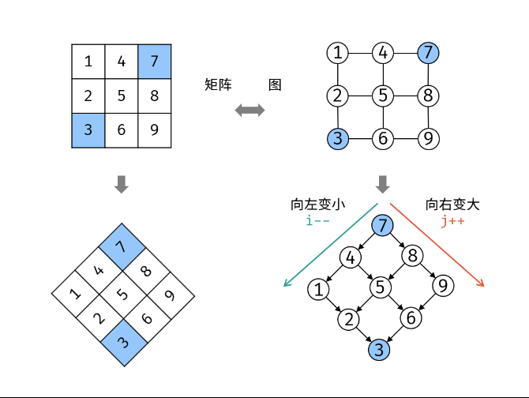

#### [剑指 Offer 03. 数组中重复的数字 - 力扣（Leetcode）](https://leetcode.cn/problems/shu-zu-zhong-zhong-fu-de-shu-zi-lcof/description/?favorite=xb9nqhhg)

最简单  嵌套两个for

```js
var findRepeatNumber = function(nums) {
    let len = nums.length;
    let left = 0, right = len-1;

    for(left; left < len; left++) {
        right = len-1;
        while(left < right) {
            if(nums[left] === nums[right]) {
                return nums[left]
            }
            right--
        }
    }
};
```

set+遍历  一个for

```js
var findRepeatNumber = function(nums) {
    let len = nums.length;
    const set = new Set();

    for(let i = 0; i < len; i++) {
        if(set.has(nums[i])) {
            return nums[i]
        }
        set.add(nums[i])
    }
};
```

#### [剑指 Offer 04. 二维数组中的查找 - 力扣（Leetcode）](https://leetcode.cn/problems/er-wei-shu-zu-zhong-de-cha-zhao-lcof/?favorite=xb9nqhhg)

两个维度上进行二分？不好确定

旋转后类似于二叉搜索树，牛马了



```js
var findNumberIn2DArray = function(matrix, target) {
    let m = matrix.length || 0, n = matrix.length===0?0:matrix[0].length
    let i = 0, j = n-1;

    while(i < m && j >= 0) {
        if(matrix[i][j] === target) {
            return true;
        }
        if(matrix[i][j] > target) {
            j--
        } else {
            i++
        }
    }
    return false
};
```

这道题真的巧妙啊！

#### [剑指 Offer 07. 重建二叉树 - 力扣（Leetcode）](https://leetcode.cn/problems/zhong-jian-er-cha-shu-lcof/?favorite=xb9nqhhg)

根据前序遍历和中序遍历重建二叉树

比如preorder = [3,9,20,15,7], inorder = [9,3,15,20,7]

前序确定中间结点3, 中序确定左子树9，右子树 3，15，20，7，并统计子树长度

就可以在前序中获得响应左右子树的前序遍历

然后继续9只有一个节点

右子树20为根节点，依次

```js
var buildTree = function(preorder, inorder) {
    if (!preorder.length || !inorder.length) {
        return null;
    }

    const root = new TreeNode(preorder[0]);
    const index = inorder.indexOf(preorder[0]);

    root.left = buildTree(preorder.slice(1, index + 1), inorder.slice(0, index));
    root.right = buildTree(preorder.slice(index + 1), inorder.slice(index + 1));

    return root;
};
```

#### [剑指 Offer 10- II. 青蛙跳台阶问题 - 力扣（Leetcode）](https://leetcode.cn/problems/qing-wa-tiao-tai-jie-wen-ti-lcof/?favorite=xb9nqhhg)

注意处理数据溢出

```js
var numWays = function(n) {
    let dp1 = 1, dp2=1;
    for(let i = 2; i<=n; i++) {
        [dp1, dp2] = [dp2, (dp1 + dp2)%(Math.pow(10,9)+7)]
    }
    return dp2
};
```

#### [剑指 Offer 11. 旋转数组的最小数字 - 力扣（Leetcode）](https://leetcode.cn/problems/xuan-zhuan-shu-zu-de-zui-xiao-shu-zi-lcof/?favorite=xb9nqhhg)

最简单

```js
var minArray = function(numbers) {
    return Math.min(...numbers)
};
```

或者暴力for直接找最小值，

优化，若在升序则继续 一点下一个小于上一个则最小

但如果全程有序则会多判断很多。

二分法：

比如[3,4,5,1,2]

left为0， right为n-1

翻转后的数组分界点右边的元素应该比左边小。

中间元素若比右边大，则翻转点在中间元素与右指针之间

否则在左边

更新left right

当 nums[m]=nums[j] 时： 无法判断 m在哪个排序数组中，即无法判断旋转点 x 在 \[i,m]还是 \[m+1,j] 区间中。解决方案： 执行right-- 缩小判断范围，分析见下文。

```js
var minArray = function(numbers) {
    const n = numbers.length;
    let left = 0, right = n-1;

    while(left < right) {
        let mid = (left+right) >> 1;
        if(numbers[mid] > numbers[right]) {
            left = mid + 1
        }else if(numbers[mid] < numbers[right]){
            right = mid
        } else {
            right--
        }
    }

    return numbers[left]
};
```

#### [剑指 Offer 29. 顺时针打印矩阵 - 力扣（Leetcode）](https://leetcode.cn/problems/shun-shi-zhen-da-yin-ju-zhen-lcof/description/)

模拟，四个边界

```js
var spiralOrder = function(matrix) {
    let m = matrix.length, n = 0
    if(matrix.length>0) {
        n = matrix[0].length;
    }
    let res = []
    let top =0, bottom = m-1, left = 0, right = n-1;
    while(true) {
        for(let i = left; i<=right; i++) {
            res.push(matrix[top][i]);
        }
        top++;
        if(top>bottom) break;
        for(let i = top; i<= bottom; i++) {
            res.push(matrix[i][right]);
        }
        right--;
        if(right<left) break;
        for(let i = right; i>=left; i--) {
            res.push(matrix[bottom][i])
        }
        bottom--;
        if(top>bottom) break;
        for(let i = bottom; i>=top; i--) {
            res.push(matrix[i][left])
        }
        left++;
         if(right<left) break;
    }
    return res
};
```

比较值得注意的边界条件

#### [剑指 Offer 12. 矩阵中的路径 - 力扣（Leetcode）](https://leetcode.cn/problems/ju-zhen-zhong-de-lu-jing-lcof/?favorite=xb9nqhhg)

模拟+回溯？

```js
var exist = function(board, word) {
    const h = board.length, w = board[0].length;
    const directions = [[0, 1], [0, -1], [1, 0], [-1, 0]];
    const visited = new Array(h).fill().map(()=>new Array(w).fill(false));

    const check = (i, j, s, k) => {
        if (board[i][j] != s.charAt(k)) {
            return false;
        } else if (k == s.length - 1) {
            return true;
        }
        visited[i][j] = true;
        let result = false;
        for (const [dx, dy] of directions) {
            let newi = i + dx, newj = j + dy;
            if (newi >= 0 && newi < h && newj >= 0 && newj < w) {
                if (!visited[newi][newj]) {
                    const flag = check(newi, newj, s, k + 1);
                    if (flag) {
                        result = true;
                        break;
                    }
                }
            }
        }
        visited[i][j] = false;
        return result;
    }

    for (let i = 0; i < h; i++) {
        for (let j = 0; j < w; j++) {
            const flag = check(i, j, word, 0);
            if (flag) {
                return true;
            }
        }
    }
    return false;
};
```

#### [剑指 Offer 14- I. 剪绳子 - 力扣（Leetcode）](https://leetcode.cn/problems/jian-sheng-zi-lcof/?favorite=xb9nqhhg)

动态规划 

```js
var cuttingRope = function(n) {
    const dp = new Array(n+1).fill(0);
    dp[2] = 1;
    for(let i = 3; i <= n; i++) {
        for(let j = 1; j <= i/2; j++) {
            dp[i] = Math.max(dp[i], dp[i-j]*j, (i-j)*j)
        }
    }
    return dp[n]
};
```

#### [剑指 Offer 14- II. 剪绳子 II - 力扣（Leetcode）](https://leetcode.cn/problems/jian-sheng-zi-ii-lcof/solutions/)

会有数据溢出问题

```js
var cuttingRope = function(n) {
    if(n===2) return 1;
    if(n === 3) return 2;
    if(n === 4) return 4;

    let res = 1
    while(n > 4) {
        res = (res*3)%(1e9+7)
        n -= 3
    }
    return (res*n)%(1e9+7)
};
```

这里贪心  尽量为3  但前几项需要注意  因为必须要切分

#### [剑指 Offer 20. 表示数值的字符串 - 力扣（Leetcode）](https://leetcode.cn/problems/biao-shi-shu-zhi-de-zi-fu-chuan-lcof/?favorite=xb9nqhhg)

状态转移自动机

#### [剑指 Offer 21. 调整数组顺序使奇数位于偶数前面 - 力扣（Leetcode）](https://leetcode.cn/problems/diao-zheng-shu-zu-shun-xu-shi-qi-shu-wei-yu-ou-shu-qian-mian-lcof/?favorite=xb9nqhhg)

```js
var exchange = function(nums) {
    let len = nums.length
    let left=0, right = len-1;

    while(left < right) {
        while(nums[left] % 2 !== 0 && left<right) {
            left++;
        } 
        while(nums[right]%2 === 0 && left<right) {
            right--;
        }
        [nums[left], nums[right]] = [nums[right], nums[left]]
        left++;
        right--;
    }
    return nums
};
```

