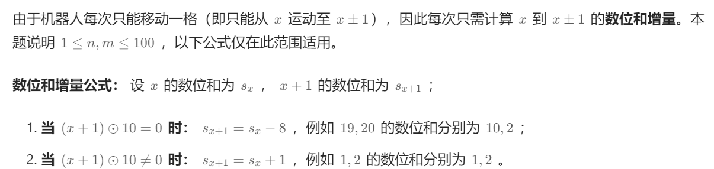

#### [剑指 Offer 03. 数组中重复的数字 - 力扣（Leetcode）](https://leetcode.cn/problems/shu-zu-zhong-zhong-fu-de-shu-zi-lcof/description/?favorite=xb9nqhhg)

最简单  嵌套两个for

```js
var findRepeatNumber = function(nums) {
    let len = nums.length;
    let left = 0, right = len-1;

    for(left; left < len; left++) {
        right = len-1;
        while(left < right) {
            if(nums[left] === nums[right]) {
                return nums[left]
            }
            right--
        }
    }
};
```

set+遍历  一个for

```js
var findRepeatNumber = function(nums) {
    let len = nums.length;
    const set = new Set();

    for(let i = 0; i < len; i++) {
        if(set.has(nums[i])) {
            return nums[i]
        }
        set.add(nums[i])
    }
};
```

#### [剑指 Offer 04. 二维数组中的查找 - 力扣（Leetcode）](https://leetcode.cn/problems/er-wei-shu-zu-zhong-de-cha-zhao-lcof/?favorite=xb9nqhhg)

两个维度上进行二分？不好确定

旋转后类似于二叉搜索树，牛马了


```js
var findNumberIn2DArray = function(matrix, target) {
    let m = matrix.length || 0, n = matrix.length===0?0:matrix[0].length
    let i = 0, j = n-1;

    while(i < m && j >= 0) {
        if(matrix[i][j] === target) {
            return true;
        }
        if(matrix[i][j] > target) {
            j--
        } else {
            i++
        }
    }
    return false
};
```

这道题真的巧妙啊！

#### [剑指 Offer 07. 重建二叉树 - 力扣（Leetcode）](https://leetcode.cn/problems/zhong-jian-er-cha-shu-lcof/?favorite=xb9nqhhg)

根据前序遍历和中序遍历重建二叉树

比如preorder = [3,9,20,15,7], inorder = [9,3,15,20,7]

前序确定中间结点3, 中序确定左子树9，右子树 3，15，20，7，并统计子树长度

就可以在前序中获得响应左右子树的前序遍历

然后继续9只有一个节点

右子树20为根节点，依次

```js
var buildTree = function(preorder, inorder) {
    if (!preorder.length || !inorder.length) {
        return null;
    }

    const root = new TreeNode(preorder[0]);
    const index = inorder.indexOf(preorder[0]);

    root.left = buildTree(preorder.slice(1, index + 1), inorder.slice(0, index));
    root.right = buildTree(preorder.slice(index + 1), inorder.slice(index + 1));

    return root;
};
```

#### [剑指 Offer 10- II. 青蛙跳台阶问题 - 力扣（Leetcode）](https://leetcode.cn/problems/qing-wa-tiao-tai-jie-wen-ti-lcof/?favorite=xb9nqhhg)

注意处理数据溢出

```js
var numWays = function(n) {
    let dp1 = 1, dp2=1;
    for(let i = 2; i<=n; i++) {
        [dp1, dp2] = [dp2, (dp1 + dp2)%(Math.pow(10,9)+7)]
    }
    return dp2
};
```

#### [剑指 Offer 11. 旋转数组的最小数字 - 力扣（Leetcode）](https://leetcode.cn/problems/xuan-zhuan-shu-zu-de-zui-xiao-shu-zi-lcof/?favorite=xb9nqhhg)

最简单

```js
var minArray = function(numbers) {
    return Math.min(...numbers)
};
```

或者暴力for直接找最小值，

优化，若在升序则继续 一点下一个小于上一个则最小

但如果全程有序则会多判断很多。

二分法：

比如[3,4,5,1,2]

left为0， right为n-1

翻转后的数组分界点右边的元素应该比左边小。

中间元素若比右边大，则翻转点在中间元素与右指针之间

否则在左边

更新left right

当 nums[m]=nums[j] 时： 无法判断 m在哪个排序数组中，即无法判断旋转点 x 在 \[i,m]还是 \[m+1,j] 区间中。解决方案： 执行right-- 缩小判断范围，分析见下文。

```js
var minArray = function(numbers) {
    const n = numbers.length;
    let left = 0, right = n-1;

    while(left < right) {
        let mid = (left+right) >> 1;
        if(numbers[mid] > numbers[right]) {
            left = mid + 1
        }else if(numbers[mid] < numbers[right]){
            right = mid
        } else {
            right--
        }
    }

    return numbers[left]
};
```

#### [剑指 Offer 29. 顺时针打印矩阵 - 力扣（Leetcode）](https://leetcode.cn/problems/shun-shi-zhen-da-yin-ju-zhen-lcof/description/)

模拟，四个边界

```js
var spiralOrder = function(matrix) {
    let m = matrix.length, n = 0
    if(matrix.length>0) {
        n = matrix[0].length;
    }
    let res = []
    let top =0, bottom = m-1, left = 0, right = n-1;
    while(true) {
        for(let i = left; i<=right; i++) {
            res.push(matrix[top][i]);
        }
        top++;
        if(top>bottom) break;
        for(let i = top; i<= bottom; i++) {
            res.push(matrix[i][right]);
        }
        right--;
        if(right<left) break;
        for(let i = right; i>=left; i--) {
            res.push(matrix[bottom][i])
        }
        bottom--;
        if(top>bottom) break;
        for(let i = bottom; i>=top; i--) {
            res.push(matrix[i][left])
        }
        left++;
         if(right<left) break;
    }
    return res
};
```

比较值得注意的边界条件

#### [剑指 Offer 12. 矩阵中的路径 - 力扣（Leetcode）](https://leetcode.cn/problems/ju-zhen-zhong-de-lu-jing-lcof/?favorite=xb9nqhhg)

模拟+回溯？

```js
var exist = function(board, word) {
    const h = board.length, w = board[0].length;
    const directions = [[0, 1], [0, -1], [1, 0], [-1, 0]];
    const visited = new Array(h).fill().map(()=>new Array(w).fill(false));

    const check = (i, j, s, k) => {
        if (board[i][j] != s.charAt(k)) {
            return false;
        } else if (k == s.length - 1) {
            return true;
        }
        visited[i][j] = true;
        let result = false;
        for (const [dx, dy] of directions) {
            let newi = i + dx, newj = j + dy;
            if (newi >= 0 && newi < h && newj >= 0 && newj < w) {
                if (!visited[newi][newj]) {
                    const flag = check(newi, newj, s, k + 1);
                    if (flag) {
                        result = true;
                        break;
                    }
                }
            }
        }
        visited[i][j] = false;
        return result;
    }

    for (let i = 0; i < h; i++) {
        for (let j = 0; j < w; j++) {
            const flag = check(i, j, word, 0);
            if (flag) {
                return true;
            }
        }
    }
    return false;
};
```

#### [剑指 Offer 14- I. 剪绳子 - 力扣（Leetcode）](https://leetcode.cn/problems/jian-sheng-zi-lcof/?favorite=xb9nqhhg)

动态规划 

```js
var cuttingRope = function(n) {
    const dp = new Array(n+1).fill(0);
    dp[2] = 1;
    for(let i = 3; i <= n; i++) {
        for(let j = 1; j <= i/2; j++) {
            dp[i] = Math.max(dp[i], dp[i-j]*j, (i-j)*j)
        }
    }
    return dp[n]
};
```

#### [剑指 Offer 14- II. 剪绳子 II - 力扣（Leetcode）](https://leetcode.cn/problems/jian-sheng-zi-ii-lcof/solutions/)

会有数据溢出问题

```js
var cuttingRope = function(n) {
    if(n===2) return 1;
    if(n === 3) return 2;
    if(n === 4) return 4;

    let res = 1
    while(n > 4) {
        res = (res*3)%(1e9+7)
        n -= 3
    }
    return (res*n)%(1e9+7)
};
```

这里贪心  尽量为3  但前几项需要注意  因为必须要切分

#### [剑指 Offer 20. 表示数值的字符串 - 力扣（Leetcode）](https://leetcode.cn/problems/biao-shi-shu-zhi-de-zi-fu-chuan-lcof/?favorite=xb9nqhhg)

状态转移自动机

#### [剑指 Offer 21. 调整数组顺序使奇数位于偶数前面 - 力扣（Leetcode）](https://leetcode.cn/problems/diao-zheng-shu-zu-shun-xu-shi-qi-shu-wei-yu-ou-shu-qian-mian-lcof/?favorite=xb9nqhhg)

```js
var exchange = function(nums) {
    let len = nums.length
    let left=0, right = len-1;

    while(left < right) {
        while(nums[left] % 2 !== 0 && left<right) {
            left++;
        } 
        while(nums[right]%2 === 0 && left<right) {
            right--;
        }
        [nums[left], nums[right]] = [nums[right], nums[left]]
        left++;
        right--;
    }
    return nums
};
```

#### [剑指 Offer 52. 两个链表的第一个公共节点 - 力扣（Leetcode）](https://leetcode.cn/problems/liang-ge-lian-biao-de-di-yi-ge-gong-gong-jie-dian-lcof/description/?envType=study-plan-v2&id=coding-interviews)

k神的解太妙了

[剑指 Offer 52. 两个链表的第一个公共节点 - 力扣（Leetcode）](https://leetcode.cn/problems/liang-ge-lian-biao-de-di-yi-ge-gong-gong-jie-dian-lcof/solutions/627084/jian-zhi-offer-52-liang-ge-lian-biao-de-gcruu/)

```js
 // 两者一起走 遍历到最后一定会走到相同的点  否则就是null
 var getIntersectionNode = function(headA, headB) {
    let A = headA;
    let B = headB;
    while (A !== B) {
      A = A ? A.next : headB;
      B = B ? B.next : headA;
    }
    return A;
 };
```

#### [剑指 Offer 31. 栈的压入、弹出序列 - 力扣（Leetcode）](https://leetcode.cn/problems/zhan-de-ya-ru-dan-chu-xu-lie-lcof/?envType=study-plan-v2&id=coding-interviews)

对比压入和弹出顺序

两个指针i, j分别指向它们  模拟入栈

当vlue i != j   判断是否与栈顶元素相等  相等出栈 j++  否则  i++  并入栈

value i = j  j++ 

```js
var validateStackSequences = function(pushed, popped) {
    let i=0, j =0, n = pushed.length;
    let stack = []
    while ((i<n || stack.length) && j < n) {
        if (i<n && pushed[i] === popped[j]) {
            i++;
            j++;
        } else {
            if(stack && stack[stack.length - 1] === popped[j]) {
                j++;
                stack.pop();
            } else {
                if(i<n) {
                    stack.push(pushed[i])
                    i++;
                } else {
                    return false;
                }
            }
        }
    }
    return j === n
};
```

只用一个栈就可以判断，简化下上面代码                                                                        

模拟入栈，然后每次与出栈表对比 看是否相同，相同则出栈，最后判断栈能否清空

```js
var validateStackSequences = function (pushed, popped) {
    let stack = [];
    let i = 0;
    for (let num of pushed) {
        stack.push(num); // num 入栈
        while (stack.length && stack[stack.length - 1] === popped[i]) {
            // 循环判断与出栈
            stack.pop();
            i += 1;
        }
    }
    return !stack.length;
};
```

#### [剑指 Offer 53 - II. 0～n-1中缺失的数字 - 力扣（Leetcode）](https://leetcode.cn/problems/que-shi-de-shu-zi-lcof/?envType=study-plan-v2&id=coding-interviews)

```js
var missingNumber = function(nums) {
    // 二分法  mid看是大于一半还是小于一半  说明左边缺少 还是右边缺少
    
    let n = nums.length;
    let l = 0, r = n-1;
    while (l <= r) {
        let mid = l + Math.ceil((r-l)/2);
        if (nums[mid] > mid) {
            r = mid-1
        } else {
            l = mid+1
        }
    } 
    return l
};
```

#### [剑指 Offer 50. 第一个只出现一次的字符 - 力扣（Leetcode）](https://leetcode.cn/problems/di-yi-ge-zhi-chu-xian-yi-ci-de-zi-fu-lcof/?envType=study-plan-v2&id=coding-interviews)

hash?

```js
var firstUniqChar = function(s) {
    let map = new Map()
    for (let item of s) {
        map.set(item, map.get(item)+1 || 1)
    }
    for(let [key, value] of map.entries()) {
        if(value === 1) return key
    }
    return ' '
};
```

#### [剑指 Offer 32 - I. 从上到下打印二叉树 - 力扣（Leetcode）](https://leetcode.cn/problems/cong-shang-dao-xia-da-yin-er-cha-shu-lcof/?envType=study-plan-v2&id=coding-interviews)

层序遍历，队列模拟

```js
var levelOrder = function(root) {
    if(!root) return [];
    const quene = [root];
    const result = [];
    while (quene.length) {
        let tmp = quene.shift();
        result.push(tmp.val);

        tmp.left && quene.push(tmp.left);
        tmp.right && quene.push(tmp.right);
    }
    return result;
};  
```

#### [剑指 Offer 32 - III. 从上到下打印二叉树 III - 力扣（Leetcode）](https://leetcode.cn/problems/cong-shang-dao-xia-da-yin-er-cha-shu-iii-lcof/?envType=study-plan-v2&id=coding-interviews)

最简单

```js
var levelOrder = function(root) {
    if(!root) return [];
    let queen = [root];
    let res = [];
    let deep = 1 
    while(queen.length !== 0) {
        const len = queen.length
        let tmp = []
        for(let i = 0; i<len; i++) {
            let node = queen.shift()
            tmp.push(node.val)
            node.left && queen.push(node.left)
            node.right && queen.push(node.right)
        }
        if(deep %2) {
            res.push(tmp)
        } else {
            res.push(tmp.reverse())
        }
        deep++
    }
    return res
};
```

或者：

```js
var levelOrder = function(root) {
    if(!root) return [];
    let queen = [root];
    let res = [];
    let deep = 1 
    while(queen.length !== 0) {
        const len = queen.length
        let tmp = []
        for(let i = 0; i<len; i++) {
        let node = queen.shift()
        node.left && queen.push(node.left)
        node.right && queen.push(node.right)
        if(deep %2 === 0) {
            tmp.unshift(node.val)
        } else {
            tmp.push(node.val)
        }
        }
        deep++
        res.push(tmp)
    }
    return res
};
```

#### [剑指 Offer 26. 树的子结构 - 力扣（Leetcode）](https://leetcode.cn/problems/shu-de-zi-jie-gou-lcof/?envType=study-plan-v2&id=coding-interviews)

```js
var isSubStructure = function (A, B) {
    if (!B) return false;
    function isSub(a, b) {
        if (b == null) return true;
        if (a == null) return false;
        if (a.val === b.val) {
            if(isSub(a.left, b.left) && isSub(a.right, b.right))
                return true;
        } 
        return isSub(a.left, B) || isSub(a.right, B);
    }

    return isSub(A, B)
};
```

有空看下其它解法

#### [剑指 Offer 13. 机器人的运动范围 - 力扣（Leetcode）](https://leetcode.cn/problems/ji-qi-ren-de-yun-dong-fan-wei-lcof/?envType=study-plan-v2&id=coding-interviews)



```js
function movingCount(m, n, k) {
    function dfs(i, j, si, sj) {
        if (i >= m || j >= n || k < si + sj || visited.has(`${i},${j}`)) return 0;
        visited.add(`${i},${j}`);
        return 1 + dfs(i + 1, j, (i + 1) % 10 ? si + 1 : si - 8, sj) + dfs(i, j + 1, si, (j + 1) % 10 ? sj + 1 : sj - 8);
    }

    let visited = new Set();
    return dfs(0, 0, 0, 0);
}
```

#### [剑指 Offer 34. 二叉树中和为某一值的路径 - 力扣（Leetcode）](https://leetcode.cn/problems/er-cha-shu-zhong-he-wei-mou-yi-zhi-de-lu-jing-lcof/?envType=study-plan-v2&envId=coding-interviews)

回溯

```js
var pathSum = function(root, target) {
    const result = [];
    const path = [];

    function backTrack(root, target) {
        if(!root) {
            return
        }

        target -= root.val
        path.push(root.val)
        if(target === 0 && !root.left && !root.right) {
            result.push([...path])
        }
        backTrack(root.left, target)
        backTrack(root.right, target)
        path.pop()
    }

    backTrack(root, target);
    return result;
};
```

#### [剑指 Offer 36. 二叉搜索树与双向链表 - 力扣（Leetcode）](https://leetcode.cn/problems/er-cha-sou-suo-shu-yu-shuang-xiang-lian-biao-lcof/?envType=study-plan-v2&envId=coding-interviews)

中序遍历

```js
var treeToDoublyList = function(root) {
    if (!root) return
    let head = null
    let pre = null

    function dfs(root) {
        if(!root) return

        dfs(root.left)
        if (pre) {
            pre.right = root
            root.left = pre
        } else {
            head = root
        }
        pre = root
        dfs(root.right)
    }

    dfs(root)
    head.left = pre
    pre.right = head
    return head
};
```

#### [剑指 Offer 54. 二叉搜索树的第k大节点 - 力扣（Leetcode）](https://leetcode.cn/problems/er-cha-sou-suo-shu-de-di-kda-jie-dian-lcof/?envType=study-plan-v2&envId=coding-interviews)

```js
var kthLargest = function(root, k) {
    let count = 0;
    let res = 0;
    function dfs(root) {
        if(!root) return
        dfs(root.right)
        if(count === k) return
        count++
        if(count === k) {
           res = root.val
        }
        dfs(root.left)
    }
    dfs(root)
    return res
};
```

提前返回
