# 基础刷题

#### [278. 第一个错误的版本](https://leetcode-cn.com/problems/first-bad-version/)

```python
class Solution:
    def firstBadVersion(self, n):
        """
        :type n: int
        :rtype: int
        """
        L = 1
        R = n
        while L <= R:
            flag = (R - L) //2 + L
            if isBadVersion(flag):
                R = flag -1
            else:
                L = flag + 1
        return L if L>R else R
```

```js
var solution = function(isBadVersion) {
    /**
     * @param {integer} n Total versions
     * @return {integer} The first bad version
     */
    return function(n) {
        let left = 1, right = n;
        while (left < right) { // 循环直至区间左右端点相同
        const mid = Math.floor(left + (right - left) / 2); // 防止计算时溢出
        if (isBadVersion(mid)) {
            right = mid; // 答案在区间 [left, mid] 中
        } else {
            left = mid + 1; // 答案在区间 [mid+1, right] 中
            }
        }
        // 此时有 left == right，区间缩为一个点，即为答案
        return left;
    };
};
```

####  [189. 轮转数组](https://leetcode-cn.com/problems/rotate-array/)

最容易想到的是用一个新数组存放移动后的数组    移动后的位置是  （ i（当前位置）+k（移动距离））% n  对总长度取模

```js
var rotate = function(nums, k) {
    const n = nums.length;
    const newArr = new Array(n);
    for (let i = 0; i < n; ++i) {
        newArr[(i + k) % n] = nums[i];
    }
    for (let i = 0; i < n; ++i) {
        nums[i] = newArr[i];
    }
};

```

另一种做法是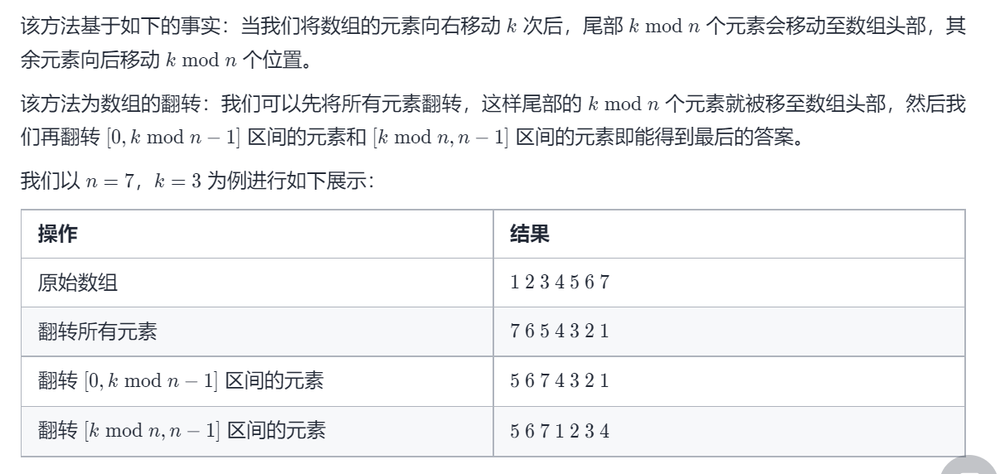

```js
const reverse = (nums, start, end) => {
    while (start < end) {
        const temp = nums[start];
        nums[start] = nums[end];
        nums[end] = temp;
        start += 1;
        end -= 1;
    }
}

var rotate = function(nums, k) {
    k %= nums.length;
    reverse(nums, 0, nums.length - 1);
    reverse(nums, 0, k - 1);
    reverse(nums, k, nums.length - 1);
};

```

#### [两数之和 II - 输入有序数组](https://leetcode-cn.com/problems/two-sum-ii-input-array-is-sorted/)

```python
class Solution:
    def twoSum(self, numbers: List[int], target: int) -> List[int]:
        n = len(numbers)
        i = 0
        while i < n-1:
            want = target - numbers[i]
            j = i+1
            while j < n:
                if numbers[j] == want:
                    return [i+1, j+1]
                j += 1
            i += 1
```

最简单的o(n^2)算法 超时

```python
class Solution:
    def twoSum(self, numbers: List[int], target: int) -> List[int]:
        l = 0
        r = len(numbers)-1
        
        while l < r:
            if(numbers[l] + numbers[r] == target):
                return [l+1, r+1]
            elif(numbers[l] + numbers[r] > target):
                r -= 1
            else:
                l += 1
```

改成双指针过了 


#### [557. 反转字符串中的单词 III](https://leetcode-cn.com/problems/reverse-words-in-a-string-iii/)

最简单 利用python的切片功能  python和js中字符串是不可变

```python
class Solution:
    def reverseWords(self, s: str) -> str:
        return " ".join(word[::-1] for word in s.split(" "))
```

#### [876. 链表的中间结点](https://leetcode-cn.com/problems/middle-of-the-linked-list/)

```python
class Solution:
    def middleNode(self, head: ListNode) -> ListNode:
        n, cur = 0, head
        while cur:
            n += 1
            cur = cur.next
        k, cur = 0, head
        while k < n // 2:
            k += 1
            cur = cur.next
        return cur
```

另一种快慢指针法

我们可以继续优化方法，用两个指针 slow 与 fast 一起遍历链表。slow 一次走一步，fast 一次走两步。那么当 fast 到达链表的末尾时，slow 必然位于中间。

```python
class Solution:
    def middleNode(self, head: ListNode) -> ListNode:
        slow = fast = head
        while fast and fast.next:
            slow = slow.next
            fast = fast.next.next
        return slow
```

#### [19. 删除链表的倒数第 N 个结点](https://leetcode-cn.com/problems/remove-nth-node-from-end-of-list/)

最简单想法

```python
class Solution:
    def removeNthFromEnd(self, head: ListNode, n: int) -> ListNode:
        def getLength(head: ListNode) -> int:
            length = 0
            while head:
                length += 1
                head = head.next
            return length
        
        # 添加一个亚节点，方便对头节点删除操作
        dummy = ListNode(0, head)
        length = getLength(head)
        cur = dummy
        for i in range(1, length - n + 1):
            cur = cur.next
        cur.next = cur.next.next
        return dummy.next
```

或者栈的思想 先把链表入栈 然后弹出第n个就位要删除的  

```python
class Solution:
    def removeNthFromEnd(self, head: ListNode, n: int) -> ListNode:
        dummy = ListNode(0, head)
        stack = list()
        cur = dummy
        while cur:
            stack.append(cur)
            cur = cur.next
        
        for i in range(n):
            stack.pop()

        prev = stack[-1]
        prev.next = prev.next.next
        return dummy.next
```

还可以双指针  一个比第二个快n个  当快的指针到末尾 慢的刚好在删除节点的前一个

```python
class Solution:
    def removeNthFromEnd(self, head: ListNode, n: int) -> ListNode:
        dummy = ListNode(0, head)
        first = head
        second = dummy
        for i in range(n):
            first = first.next

        while first:
            first = first.next
            second = second.next
        
        second.next = second.next.next
        return dummy.next
```


#### [3. 无重复字符的最长子串](https://leetcode-cn.com/problems/longest-substring-without-repeating-characters/)

最简单想法 一个一个移动 abcabc  从a开始找到以每个char作为开头存在的最长子串

```python
class Solution:
    def lengthOfLongestSubstring(self, s: str) -> int:
        n = len(s)
        find_s = {}
        ans = 0
        i = 0
        while i < n:
            temp = 1
            find_s[s[i]] = 1
            j = i + 1
            while j < n:
                # 当出现重复 跳出去 换下一个char作为开头
                if s[j] in find_s:
                    ans = temp if temp > ans else ans
                    temp = 0
                    find_s = {}
                    break
                else:
                    find_s[s[j]] = 1
                    temp += 1
                j += 1
            i += 1
            ans = temp if temp > ans else ans
        return ans
```

但以上代码太冗余 优化下： 左指针指向以该字符开头  有志者表示开头字符后当前遍历的字符

```python
    def lengthOfLongestSubstring(self, s: str) -> int:
        # 哈希集合，记录每个字符是否出现过
        occ = set()
        n = len(s)
        # 右指针，初始值为 -1，相当于我们在字符串的左边界的左侧，还没有开始移动
        rk, ans = -1, 0
        for i in range(n):
            if i != 0:
                # 左指针向右移动一格，移除一个字符
                occ.remove(s[i - 1])
            while rk + 1 < n and s[rk + 1] not in occ:
                # 不断地移动右指针
                occ.add(s[rk + 1])
                rk += 1
            # 第 i 到 rk 个字符是一个极长的无重复字符子串
            ans = max(ans, rk - i + 1)
        return ans
```

#### [567. 字符串的排列](https://leetcode-cn.com/problems/permutation-in-string/)

记s1的长度为n,我们可以遍历s2中的每个长度为n的子串，判断子串和s1中每个字符的个数是否相等，若相等则说明该子串是s1的一个排列。

该题重点是 滑动窗口遍历 每次改变的只有新加进来的和第一个字符串  其它相同

```python
class Solution:
    def checkInclusion(self, s1: str, s2: str) -> bool:
        # 遍历s2中的每个长度为n的子串，判断子串和s1中每个字符的个数是否相等，若相等则说明该子串是s1的一个排列。
        n = len(s1)
        n2 = len(s2)
        if n > n2:
            return False
        dic1 = [0]*26
        dic2 = [0]*26
        # 先判断前n个是否相等
        for i in range(n):
            dic1[ord(s1[i])-ord('a')] += 1
            dic2[ord(s2[i])-ord('a')] += 1
        if dic1 == dic2:
            return True

        # 然后开始滑动窗口 尾巴从第n+1个(序号为n)直到最后一个
        # 每次滑动 从开始的字符要减去一个 新加进来的增加一个
        for i in range(n, n2):
            dic2[ord(s2[i-n])-ord('a')] -= 1
            dic2[ord(s2[i])-ord('a')] += 1
            if dic1 == dic2:
                return True
        return False
```

#### [733. 图像渲染](https://leetcode-cn.com/problems/flood-fill/)

们可以这样利用 队列 实现 广度优先搜索。

我们设置一个队列，先把初始点添加进去
规定每次从队列取出一个坐标
对这个坐标染色，并且把这个坐标的邻居（符合要求且不重复的好邻居），放到队列中。
当这个队列为空的时候，说明染色完成

```python
from queue import Queue

class Solution:
    def floodFill(self, image: List[List[int]], sr: int, sc: int, newColor: int) -> List[List[int]]:
        # 起始颜色和目标颜色相同，则直接返回原图
        if newColor == image[sr][sc]:
            return image
        # 设置四个方向偏移量，一种常见的省事儿技巧
        directions = {(1, 0), (-1, 0), (0, 1), (0, -1)}
        # 构造一个队列，先把起始点放进去
        que = Queue()
        que.put((sr, sc))
        # 记录初始颜色
        originalcolor = image[sr][sc]
        # 当队列不为空                              
        while not que.empty():
            # 取出队列的点并染色
            point = que.get()
            image[point[0]][point[1]] = newColor
            # 遍历四个方向
            for direction in directions:
                # 新点是(new_i,new_j)
                new_i = point[0] + direction[0]
                new_j = point[1] + direction[1]
                # 如果这个点在定义域内并且它和原来的颜色相同
                if 0 <= new_i < len(image) and 0 <= new_j < len(image[0]) and image[new_i][new_j] == originalcolor:
                    que.put((new_i, new_j))
        return image
```

我们可以这样利用堆栈实现深度优先搜索。

我们设置一个栈，先把初始点添加进去
规定每次从栈中取出一个坐标
对这个坐标染色，并且把这个坐标的一个方向上的邻居（符合要求且不重复的好邻居），放到栈中。
当这个方向没有复合要求的邻居的时候，进入下一个方向
当这个栈为空的时候，说明染色完成

```python
class Solution:
    def floodFill(self, image: List[List[int]], sr: int, sc: int, newColor: int) -> List[List[int]]:
        if newColor == image[sr][sc]: return image
        stack, old = [(sr, sc)], image[sr][sc]
        while stack:
            point = stack.pop()
            image[point[0]][point[1]] = newColor
            for new_i, new_j in zip((point[0], point[0], point[0] + 1, point[0] - 1), (point[1] + 1, point[1] - 1, point[1], point[1])): 
                if 0 <= new_i < len(image) and 0 <= new_j < len(image[0]) and image[new_i][new_j] == old:
                    stack.append((new_i, new_j))
        return image

```

或者直接递归

```python
class Solution:
    def floodFill(self, image: List[List[int]], sr: int, sc: int, newColor: int) -> List[List[int]]:
        if image[sr][sc] != newColor:
            old, image[sr][sc] = image[sr][sc], newColor
            for i, j in zip((sr, sr+1, sr, sr-1), (sc+1, sc, sc-1, sc)):
                if 0 <= i < len(image) and 0 <= j < len(image[0]) and image[i][j] == old:
                    self.floodFill(image, i, j, newColor)
        return image
```

#### [695. 岛屿的最大面积](https://leetcode-cn.com/problems/max-area-of-island/)

和上题类似  

```python
from queue import Queue

class Solution:
    def maxAreaOfIsland(self, grid: List[List[int]]) -> int:
        ans = 0
        # 设置四个方向偏移量，一种常见的省事儿技巧
        directions = {(1, 0), (-1, 0), (0, 1), (0, -1)}
        # 构造一个队列，先把起始点放进去
        for i in range(len(grid)):
            for j in range(len(grid[0])):
                if grid[i][j] == 1:
                    que = Queue()
                    que.put((i, j))
                    # 访问过变为0
                    temp = 0
                    while not que.empty():
                        point = que.get()
                        grid[point[0]][point[1]] = 0
                        temp += 1
                        # 遍历四个方向
                        for direction in directions:
                            # 新点是(new_i,new_j)
                            new_i = point[0] + direction[0]
                            new_j = point[1] + direction[1]
                            # 如果这个点在定义域内并且为1
                            if 0 <= new_i < len(grid) and 0 <= new_j < len(grid[0]) and grid[new_i][new_j] == 1:
                                que.put((new_i, new_j))
                                # 防止多次添加 立即置为0
                                grid[new_i][new_j] = 0
                    ans = temp if temp > ans else ans
        return ans


```

#### [617. 合并二叉树](https://leetcode-cn.com/problems/merge-two-binary-trees/)

最容易想到的是递归 深度优先合并

```python
class Solution:
    def mergeTrees(self, t1: TreeNode, t2: TreeNode) -> TreeNode:
        if not t1:
            return t2
        if not t2:
            return t1

        merged = TreeNode(t1.val + t2.val)
        merged.left = self.mergeTrees(t1.left, t2.left)
        merged.right = self.mergeTrees(t1.right, t2.right)
        return merged

```


python 二维数组

```python
aList = [[0] * cols for i in range(rows)]
```

不要直接[[0] \*n]*m  因为这是引用相同的行 改变一行其他行都会变

#### [542. 01 矩阵](https://leetcode-cn.com/problems/01-matrix/)

想到的是层次遍历 但超时了

```python
from queue import Queue


class Solution:
    def updateMatrix(self, mat):
        n = len(mat)
        m = len(mat[0])
        ans = [[0]*m for i in range(n)]
        # 设置四个方向偏移量，一种常见的省事儿技巧
        directions = {(1, 0), (-1, 0), (0, 1), (0, -1)}
        for i in range(n):
            for j in range(m):
                if mat[i][j] == 0:
                    continue
                else:
                    que = Queue()
                    que.put((i, j))
                    dis = -1
                    flag = True
                    while (not que.empty()) and flag:
                        size = que.qsize()
                        dis += 1
                        for k in range(size):
                            point = que.get()
                            if mat[point[0]][point[1]] == 0:
                                flag = False
                                break
                            for direction in directions:
                                # 新点是(new_i,new_j)
                                new_i = point[0] + direction[0]
                                new_j = point[1] + direction[1]
                                # 如果这个点在定义域内并且为1
                                if 0 <= new_i < n and 0 <= new_j < m:
                                    que.put((new_i, new_j))
                    ans[i][j] = dis
        return ans
```

这里可以抽象为多个起始点的BFS  从0访问1

```python
import collections


class Solution:
    def updateMatrix(self,matrix):
        M, N = len(matrix), len(matrix[0])
        queue = collections.deque()
        visited = [[0] * N for _ in range(M)]
        res = [[0] * N for _ in range(M)]
        for i in range(M):
            for j in range(N):
                # 找到所有为0的坐标并入队 标记为已访问
                if matrix[i][j] == 0:
                    queue.append((i, j))
                    visited[i][j] = 1
        dirs = [(0, 1), (0, -1), (1, 0), (-1, 0)]
        step = 0
        # 多起点 用所有的0去访问1 访问的层数就是距离
        while queue:
            # 层次
            size = len(queue)
            # 层次代表0经过几步能访问到该节点 第一轮是0
            for i in range(size):
                x, y = queue.popleft()
                if matrix[x][y] == 1:
                    # 成功访问到0 距离就是访问的层数
                    res[x][y] = step
                # 访问坐标的四个方向 找还没被访问到的1 入队 
                for dx, dy in dirs:
                    newx, newy = x + dx, y + dy
                    # 若坐标不合法 或者已被访问 访问下一个节点
                    if newx < 0 or newx >= M or newy < 0 or newy >= N or visited[newx][newy] == 1:
                        continue
                    queue.append((newx, newy))
                    visited[newx][newy] = 1
            step += 1
        return res
```

#### [994. 腐烂的橘子](https://leetcode-cn.com/problems/rotting-oranges/)

和上提类似 多源BFS

刚开始想反了  用好橘子访问烂橘子 得到的是烂橘子距离最近好橘子的距离   应该烂橘子访问好橘子这样得到的才是好句子距离最近烂橘子的距离   (烂橘子经过几轮四方扩散能扩散到好句子 取最快扩散的的)

```python
import collections


class Solution:
    def orangesRotting(self, grid):
        M, N = len(grid), len(grid[0])
        queue = collections.deque()
        visited = [[0] * N for _ in range(M)]
        res = [[0] * N for _ in range(M)]
        for i in range(M):
            for j in range(N):
                # 找到所有为2的坐标(烂橘子)并入队 标记为已访问
                if grid[i][j] == 2:
                    queue.append((i, j))
                    visited[i][j] = 1
                if grid[i][j] == 0:
                    visited[i][j] = 1
        dirs = [(0, 1), (0, -1), (1, 0), (-1, 0)]
        step = 0
        # 多起点 用所有的2去访问1 访问的层数就是距离
        while queue:
            # 层次
            size = len(queue)
            # 层次代表1经过几步能访问到该节点 第一轮是0
            for i in range(size):
                x, y = queue.popleft()
                if grid[x][y] == 1:
                    # 成功访问到1 距离就是第一次访问的层数
                    res[x][y] = step
                # 访问坐标的四个方向 找还没被访问到的1 入队
                for dx, dy in dirs:
                    newx, newy = x + dx, y + dy
                    # 若坐标不合法 或者已被访问 访问下一个节点
                    if newx < 0 or newx >= M or newy < 0 or newy >= N or visited[newx][newy] == 1:
                        continue
                    queue.append((newx, newy))
                    visited[newx][newy] = 1
            step += 1
        for i in range(M):
            for j in range(N):
                if visited[i][j] == 0:
                    return -1

        return max(value for i in res for value in i)


find = Solution()
print(find.orangesRotting( [[2,1,1],[0,1,1],[1,0,1]]))

```

#### [21. 合并两个有序链表](https://leetcode-cn.com/problems/merge-two-sorted-lists/)

最容易 递归

```python
class Solution:
    def mergeTwoLists(self, l1, l2):
        if l1 is None:
            return l2
        elif l2 is None:
            return l1
        elif l1.val < l2.val:
            l1.next = self.mergeTwoLists(l1.next, l2)
            return l1
        else:
            l2.next = self.mergeTwoLists(l1, l2.next)
            return l2
```

或者迭代

```python
class Solution:
    def mergeTwoLists(self, l1: ListNode, l2: ListNode) -> ListNode:
        prehead = ListNode(-1)

        prev = prehead
        while l1 and l2:
            if l1.val <= l2.val:
                prev.next = l1
                l1 = l1.next
            else:
                prev.next = l2
                l2 = l2.next            
            prev = prev.next

        # 合并后 l1 和 l2 最多只有一个还未被合并完，我们直接将链表末尾指向未合并完的链表即可
        prev.next = l1 if l1 is not None else l2

        return prehead.next

```

#### [77. 组合](https://leetcode-cn.com/problems/combinations/)

```python
class Solution(object):
    def combine(self, n, k):
        if k == 1:
            result = []
            for i in range(1, n+1):
                result.append([i])
            return result
        result = []
        # 以i为开头从后面选 必须要满足本生加后面有k个数
        for i in range(1, n - k+2):
            # 从该位置后面选k-1个  这里将i位置看做0  后面加回来
            a = self.combine(n - i, k - 1)
            for j in range(len(a)):
                result.append(a[j] + [n + 1 - i])
        return result

```

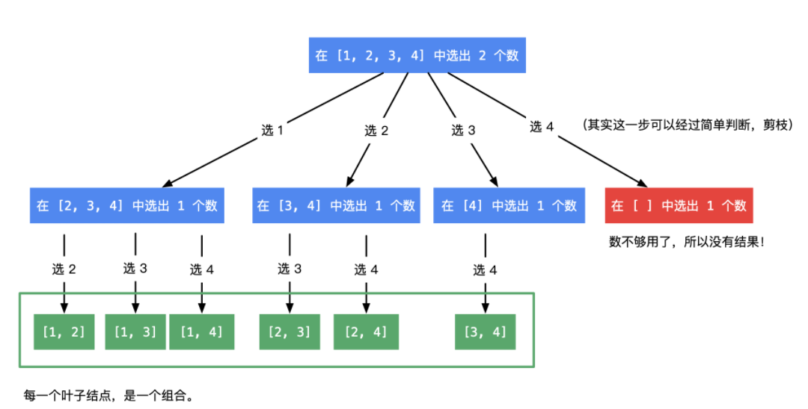

#### [46. 全排列](https://leetcode-cn.com/problems/permutations/)

```python
class Solution:
    def permute(self, nums):
        if len(nums) == 1:
            return [nums]
        if len(nums) == 2:
            return [[nums[0], nums[1]], [nums[1], nums[0]]]
        result = []
        for i in range(len(nums)):
            a = self.permute(nums[:i] + nums[i + 1:])
            for j in range(len(a)):
                result.append([nums[i]] + a[j])
        return result
```

官方答案

```python
class Solution:
    def permute(self, nums):
        """
        :type nums: List[int]
        :rtype: List[List[int]]
        """
        def backtrack(first = 0):
            # 所有数都填完了
            if first == n:  
                res.append(nums[:])
            for i in range(first, n):
                # 动态维护数组
                nums[first], nums[i] = nums[i], nums[first]
                # 继续递归填下一个数
                backtrack(first + 1)
                # 撤销操作
                nums[first], nums[i] = nums[i], nums[first]
        
        n = len(nums)
        res = []
        backtrack()
        return res
```

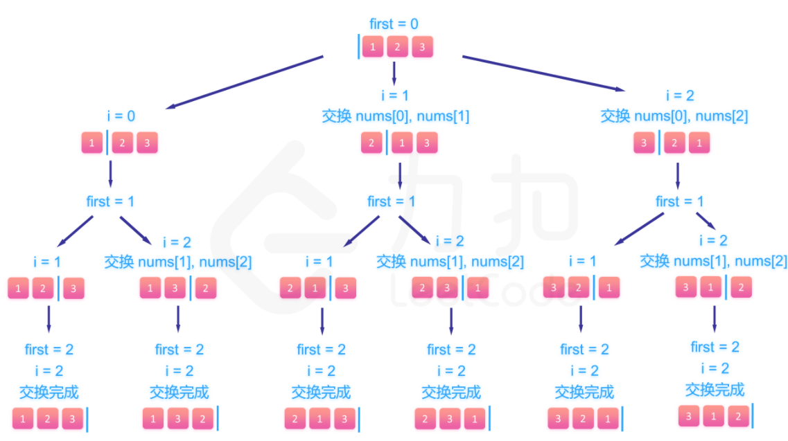

#### [70. 爬楼梯](https://leetcode-cn.com/problems/climbing-stairs/)

动态规划

```python
class Solution:
    def climbStairs(self, n: int) -> int:
        f1 = 1
        f2 = 1
        for i in range(n):
            f1, f2 = f2, f1+f2
        return f1;
```

#### [198. 打家劫舍](https://leetcode-cn.com/problems/house-robber/)

动态规划  以当前位置截止能抢到的最大值为fn  f(n) =f(n-2)+nums[n] 和 f(n-1)的最大值

```python
class Solution:
    def rob(self, nums):
        n = len(nums)
        if n == 1:
            return nums[0]
        f0 = 0
        f1 = nums[0]
        for i in range(1, n):
            f0, f1 = f1, (f0+nums[i]) if (f0+nums[i]) > f1 else f1
        return f1
```

#### [120. 三角形最小路径和](https://leetcode-cn.com/problems/triangle/)

```python
class Solution:
    def minimumTotal(self, triangle: List[List[int]]) -> int:
        n = len(triangle)
        f = [[0] * n for _ in range(n)]
        f[0][0] = triangle[0][0]

        for i in range(1, n):
            f[i][0] = f[i - 1][0] + triangle[i][0]
            for j in range(1, i):
                f[i][j] = min(f[i - 1][j - 1], f[i - 1][j]) + triangle[i][j]
            f[i][i] = f[i - 1][i - 1] + triangle[i][i]

        return min(f[n - 1])
```

动态规划 但是太费空间了   只需要存储两排的就行

```python
class Solution:
    def minimumTotal(self, triangle: List[List[int]]) -> int:
        n = len(triangle)
        f = [[0] * n for _ in range(2)]
        f[0][0] = triangle[0][0]

        for i in range(1, n):
            curr, prev = i % 2, 1 - i % 2
            f[curr][0] = f[prev][0] + triangle[i][0]
            for j in range(1, i):
                f[curr][j] = min(f[prev][j - 1], f[prev][j]) + triangle[i][j]
            f[curr][i] = f[prev][i - 1] + triangle[i][i]
        
        return min(f[(n - 1) % 2])
```

其实也可以从底到上 


## 数组

#### [704. 二分查找](https://leetcode-cn.com/problems/binary-search/)

```python
class Solution:
    def search(self, nums: List[int], target: int) -> int:
        L = 0
        R = len(nums) - 1
        flag = (L+R) // 2
        res = -1
        while L <= R:
            if nums[flag] == target:
                return flag
            elif nums[flag] < target:
                L = flag + 1
                flag = (L+R) // 2
            else:
                R = flag - 1
                flag = (L+R) // 2
        return res
```

重点是左右界限，每次左右界限更新时，以前的flag肯定不是target 所以+-1，这样还可以判断终止条件，若不加减1会会很难判断

单以上代码有点冗余，比如flag = (l+r)/2可以提到前面去，最开始的flag定义也可以去掉。 res变量不需要

```js
var search = function(nums, target) {
    let L = 0, R = nums.length - 1;
     while (L <= R) {
        const mid = Math.floor((L+R) / 2);
        const num = nums[mid];
        if (num === target) {
            return mid;
        } else if (num > target) {
            R = mid - 1;
        } else {
            L = mid + 1;
        }
    }
    return -1;
};
```

此题注意的是区间界限，可以左闭右开或者左右都闭合，两种版本。

```python
    def search2(self, nums, target):
        L_index = 0
        R_index = len(nums)
        # 左闭右开
        while L_index < R_index:
            M_index = (L_index + R_index) // 2
            num = nums[M_index]
            if num == target:
                return M_index
            elif num > target:
                R_index = M_index
            else:
                L_index = M_index + 1
        return -1
```


#### [35. 搜索插入位置](https://leetcode-cn.com/problems/search-insert-position/)

当数组中存在目标值时，与二分查找相同。区别在于查询目标不存在于数组中时的返回结果。

这种情况一定会是在L=R时仍然查询不到，此时按顺序插入就该在L(R)右边，而在本轮循环中，无论L+1还是R-1一定是L跑到了右边，所以我们返回L就行。此题的目的是返回大于等于target的第一个数的序号。

Python:

```python
class Solution:
    def searchInsert(self, nums, target):
        L = 0
        R = len(nums)-1
        while L <= R:
            mid = (L+R) // 2
            num = nums[mid]
            if num == target:
                return mid
            elif num < target:
                L += 1
            else:
                R -= 1
        return L
```

JS:

```js
var searchInsert = function(nums, target) {
    let l = 0, r = nums.length;
    while(l <= r){
        mid = l + Math.floor((r - l)/2);
        //if(nums[mid] ==target )
        //    return mid;
        if(nums[mid]<target)
            l = mid + 1;
        else
            r = mid - 1;
    }
    return l
};
```

取消等于判断 对于大于等于的都让r-1  因为最后l总会逐渐+1到正确位置 。这样看着虽然简单，但实际上运行时间变高了，因为一定会运行到最后。

**只要看到面试题里给出的数组是有序数组，都可以想一想是否可以使用二分法。**

#### [34. 在排序数组中查找元素的第一个和最后一个位置](https://leetcode.cn/problems/find-first-and-last-position-of-element-in-sorted-array/)

Python：

```python
# 最简单，左右同时搜索 L=0 R=len(nums) 每轮+-1 直到L>R或者找到  时间复杂度O(n)
class Solution:
    def searchRange(self, nums, target):
        L = 0
        R = len(nums)-1
        result = [-1, -1]
        while L <= R:
            # 左边找到
            if nums[L] == target:
                result[0] = L
            # 右边找到
            if nums[R] == target:
                result[1] = R
            # 找到后不再移动坐标
            if result[0] == -1:
                L += 1
            if result[1] == -1:
                R -= 1
            if result[0] != -1 and result[1] != -1:
                return result

        return result

    # 时间复杂度O(logn)版本
    def searchRange2(self, nums, target):
        # 用两次二分法 找到左右边界 左边界为target 右边界为target+1
        def left_func(nums, target):
            n = len(nums)-1
            left = 0
            right = n
            while(left <= right):
                mid = (left+right)//2
                # 注意这里大于等于都要减一 才能找到最左边的target
                if nums[mid] >= target:
                    right = mid-1
                if nums[mid] < target:
                    left = mid+1
            return left
        a = left_func(nums, target)
        b = left_func(nums, target+1)
        if a == len(nums) or nums[a] != target:
            return [-1, -1]
        else:
            return [a, b-1]
```

JS：

```js
var findL = (nums, target) => {
    let l = 0, r = nums.length - 1;
    while (l <= r) {
        mid = l + Math.floor((r - l) / 2);
        if (nums[mid] >= target)
            r = mid - 1;
        else
            l = mid + 1;
    }
    console.log(l)
    return l;
}

var searchRange = function (nums, target) {
    l = findL(nums, target);
    r = findL(nums, target + 1);
    if (l < nums.length && nums[l] === target)
        return [l, r - 1]
    else
        return [-1, -1]
};
```

#### [69. x 的平方根 ](https://leetcode.cn/problems/sqrtx/)

二分查找 + 判断平方是否为X

```js
import math
class Solution:
    def mySqrt(self, x):
        L = 0
        R = math.ceil(x / 2)
        while L <= R:
            num = (L + R) // 2
            if num * num == x:
                return num
            elif num * num < x:
                L = num + 1
            else:
                R = num - 1
        return L if L < R else R
```

#### [367. 有效的完全平方数](https://leetcode.cn/problems/valid-perfect-square/)

和69几乎一模一样

```python
import math


class Solution:
    def isPerfectSquare(self, x):
        L = 0
        R = math.ceil(x / 2)
        while L <= R:
            num = (L + R) // 2
            if num * num == x:
                return True
            elif num * num < x:
                L = num + 1
            else:
                R = num - 1
        return False
```

#### [27. 移除元素](https://leetcode.cn/problems/remove-element/)

```python
# 给你一个数组 nums 和一个值 val，你需要 原地 移除所有数值等于 val 的元素，并返回移除后数组的新长度。
# 设置左右index 若等于val交换 交换后R-1 否则L+1
class Solution:
    def removeElement(self, nums, val):
        L = 0
        R = len(nums) - 1
        while(L <= R):
            tmp = nums[L]
            if tmp == val:
                nums[L], nums[R] = nums[R], nums[L]
                R -= 1
            else:
                L += 1
        return L
```

#### [26. 删除有序数组中的重复项](https://leetcode.cn/problems/remove-duplicates-from-sorted-array/)

```python
# 你一个 升序排列 的数组 nums ，请你 原地 删除重复出现的元素，使每个元素 只出现一次 ，返回删除后数组的新长度。元素的 相对顺序 应该保持 一致 。
# 快慢指针 左右指针相等 右指针继续右移直到不相等的下一个 然后左指针右移并将右指针数值赋予左指针 右指针继续右移
class Solution:
    def removeDuplicates(self, nums):
        L = 0
        R = 1
        while R < len(nums):
            if nums[L] != nums[R]:
                nums[L+1] = nums[R]
                L += 1
            R += 1
        return L+1


```

上述代码重新赋值次数过多,而赋值操作很费时间，因此我们可以添加一个小判断，当 `R - L > 1` 时，才进行复制。

```python
class Solution:
    def removeDuplicates(self, nums):
        L = 0
        R = 1
        while R < len(nums):
            if nums[L] != nums[R]:
                if R - L > 1:
                    nums[L+1] = nums[R]
                L += 1
            R += 1
        return L+1
```

#### [283. 移动零](https://leetcode-cn.com/problems/move-zeroes/)

```python
class Solution:
    def moveZeroes(self, nums: List[int]) -> None:
        """
        Do not return anything, modify nums in-place instead.
        """
        # 统计目前遇到的0的数目
        zero_num = 0
        n = len(nums) - 1

        for i, val in enumerate(nums):
            if val == 0:
                zero_num += 1
            else:
                if zero_num != 0:
                    nums[i-zero_num] = val
        for i in range(zero_num):
            nums[n] = 0
            n -= 1
```

从头开始扫描 若为0则0个数加1  非0的话 向前面移动目前遇到的0的数目个位置

#### [844. 比较含退格的字符串](https://leetcode.cn/problems/backspace-string-compare/)

```python
# 给定 s 和 t 两个字符串，当它们分别被输入到空白的文本编辑器后，如果两者相等，返回 true 。# 代表退格字符。
# 用栈很好处理 普通字符串入栈 遇到#且栈不为空 则弹出栈顶 相当于退格操作
class Solution:
    def backspaceCompare(self, s, t):
        def clear(s):
            res = list()
            for i in s:
                if i != '#':
                    res.append(i)
                elif res:
                    res.pop()
            return "".join(res)

        return clear(s) == clear(t)


solution = Solution()
print(solution.backspaceCompare("ab#c",  "ad#c"))
```

可以双指针优化空间复杂度

```js
// 只对前面的字符生效 所以可以采用逆序遍历 设置双指针分别遍历s与t的末尾
// 实际是在找有效字母对比
// 如果是# 则skip加1 向前遍历，否则判断skip是否大于0 若大于则抵消当前指针所指的字母 继续向前遍历  直到不为#且skip=0无法抵消，此时与另一字符串当前指针所指字母比较 不相等则false
var backspaceCompare = function (S, T) {
    let i = S.length - 1,
        j = T.length - 1,
        skipS = 0,
        skipT = 0;
    // 大循环
    while (i >= 0 || j >= 0) {
        // S 循环
        while (i >= 0) {
            if (S[i] === '#') {
                skipS++;
                i--;
            } else if (skipS > 0) {
                skipS--;
                i--;
            } else break;
        }
        // T 循环
        while (j >= 0) {
            if (T[j] === '#') {
                skipT++;
                j--;
            } else if (skipT > 0) {
                skipT--;
                j--;
            } else break;
        }
        if (S[i] !== T[j]) return false;
        i--;
        j--;
    }
    return true;
};
```


#### [977. 有序数组的平方](https://leetcode-cn.com/problems/squares-of-a-sorted-array/)

可以先找到大于等于0的位置 然后从中间向两边比较

```python
class Solution:
    def sortedSquares(self, nums: List[int]) -> List[int]:
        ans = list()
        mid = 0
        n = len(nums)
        while mid < n:
            if nums[mid] >= 0:
                break
            mid += 1
        l = mid - 1
        r = mid
        while l >= 0 or r < n:
            if l < 0:
                ans.append(nums[r] * nums[r])
                r += 1
            elif r == n:
                ans.append(nums[l] * nums[l])
                l -= 1
            elif -nums[l] < nums[r]:
                ans.append(nums[l] * nums[l])
                l -= 1
            else:
                ans.append(nums[r] * nums[r])
                r += 1
        return ans
```


```python
# 也可以考虑从两边向中间比较 
class Solution:
    def sortedSquares(self, nums: List[int]) -> List[int]:
        n = len(nums)
        # 注意这里要提前指定列表大小 因为会用到最后一位
        ans = [0]*n
        
        # 从两边比较 因为最大的一定在两边
        l, r, pos = 0, n - 1, n - 1
        while l <= r:
            if nums[l] * nums[l] > nums[r] * nums[r]:
                ans[pos] = nums[l] * nums[l]
                l += 1
            else:
                ans[pos] = nums[r] * nums[r]
                r -= 1
            pos -= 1
        return ans
```

很明显先找大的比找小的容易  因为最大的一定在两边


#### [209. 长度最小的子数组](https://leetcode.cn/problems/minimum-size-subarray-sum/)

最容易想到暴力解法 遍历每个字符开头满足条件的最小长度O(n^2)

```python
class Solution:
    def minSubArrayLen(self, target, nums):
        if not nums:
            return 0

        n = len(nums)
        # 结果不可能大于n+1
        ans = n + 1
        for i in range(n):
            total = 0
            for j in range(i, n):
                total += nums[j]
                if total >= s:
                    ans = min(ans, j - i + 1)
                    break

        return 0 if ans == n + 1 else ans
```

可以使用滑动窗口

所谓滑动窗口，**就是不断的调节子序列的起始位置和终止位置，从而得出我们要想的结果**。

在暴力解法中，是一个for循环滑动窗口的起始位置，一个for循环为滑动窗口的终止位置，用两个for循环 完成了一个不断搜索区间的过程。


可以每次有重叠窗口 这些重叠窗口可以不用重新判断

指针走法  先右指针当走到序列和大于target时 右指针停止 左指针走 直到小于target 期间更新最小序列长度

```python
class Solution:
    def minSubArrayLen(self, target, nums):
        L = 0
        R = 0
        n = len(nums)
        res = n+1
        total = nums[0]
        while L < n:
            if total < target:
                if R < n-1:
                    R += 1
                    total += nums[R]
                else:
                    break
            else:
                res = min(res, R-L+1)
                total = total - nums[L]
                L += 1
        return 0 if res == n+1 else res
# 判断j
   class Solution:
    def minSubArrayLen(self, target, nums):
        if nums is None or len(nums) == 0:
            return 0
        lenf = len(nums) + 1
        total = 0
        i = j = 0
        while j < len(nums):
            total = total + nums[j]
            j += 1
            while total >= target:
                lenf = min(lenf, j - i)
                total = total - nums[i]
                i += 1
        if lenf == len(nums) + 1:
            return 0
        else:
            return lenf
```

**为什么时间复杂度是O(n)**。

不要以为for里放一个while就以为是O(n^2)， 主要是看每一个元素被操作的次数，每个元素在滑动窗后进来操作一次，出去操作一次，每个元素都是被操作两次，所以时间复杂度是 2 × n 也就是O(n)。

#### [904. 水果成篮](https://leetcode.cn/problems/fruit-into-baskets/)

要做的是找到序列中两数连续出现的最大次数(比如1234334234)最大是34334


第一映像：初始化个二位窗口（需要不同）  右窗口右移并判断下一位是否能纳入窗口  若能则纳入 窗口扩大1  否则左窗口移动到右窗口 右窗口右移一位  开启新的二位窗口  中间记录当前最大值

```python
class Solution:
    def totalFruit(self, fruits):
        N = len(fruits)
        if N <= 2:
            return N
        L = 0
        R = 1
        result = 2
        i = R+1
        while i < N:
            if fruits[R] == fruits[L]:
                R += 1
                i += 1
                if i == N:
                    result = i - L if i - L > result else result
                continue
            elif fruits[R] == fruits[i] or fruits[L] == fruits[i]:
                i += 1
                if i == N:
                    result = i - L if i - L > result else result
                continue
            else:
                result = i - L if i - L > result else result
                L = R
                R += 1
                i = R + 1
        return result
```

官方解答：

```js
var totalFruit = function (fruits) {
    const n = fruits.length;
    const cnt = new Map();

    let left = 0, ans = 0;
    for (let right = 0; right < n; ++right) {
        cnt.set(fruits[right], (cnt.get(fruits[right]) || 0) + 1);
        while (cnt.size > 2) {
            cnt.set(fruits[left], cnt.get(fruits[left]) - 1);
            if (cnt.get(fruits[left]) == 0) {
                cnt.delete(fruits[left]);
            }
            ++left;
        }
        ans = Math.max(ans, right - left + 1);
    }
    return ans;
};
```


#### [76. 最小覆盖子串]([76. 最小覆盖子串 - 力扣（Leetcode）](https://leetcode.cn/problems/minimum-window-substring/))

初见想法

用一个hash存字符串t的字符出现情况  利用窗口检测 

初始L，R为0    不断移动R 每次对照hash表是否存在R坐标所对应字母  是 的话 对应value-1  直到所有值为0   记录当前字符串

然后将L移动到下一个在t中count>-1的字符对应索引  且原始L的字母hash表对应位置需要+1  然后继续以上操作  直到R到末尾

```python
class Solution:
    def minWindow(self, s, t):
        t_Count = {}
        for i in t:
            if i not in t_Count:
                t_Count[i] = 1
            else:
                t_Count[i] += 1
        # print(t_Count)

        L = 0

        while L < len(s) and s[L] not in t_Count.keys():
            L += 1
        R = L
        res = ""
        len_res = len(s)+1
        while R < len(s):
            if s[R] in t_Count:
                t_Count[s[R]] -= 1
            if all(v <= 0 for v in t_Count.values()):
                res = s[L:R+1] if len(s[L:R+1]) < len_res else res
                len_res = len(res)
                while all(v <= 0 for v in t_Count.values()):
                    if s[L] in t_Count.keys():
                        t_Count[s[L]] += 1
                    res = s[L:R+1] if len(s[L:R+1]) < len_res else res
                    len_res = len(res)
                    L += 1
            R += 1
        return res
```

下面不需要每次都判断

```python
                while all(v <= 0 for v in t_Count.values()):
                    if s[L] in t_Count.keys():
                        t_Count[s[L]] += 1
                    L += 1
                res = s[L-1:R+1] if len(s[L:R+1]) < len_res else res
                len_res = len(res)
```


#### [59. 螺旋矩阵 II](https://leetcode.cn/problems/spiral-matrix-ii/)

第一映像：

如何确定坐标顺序很重要

行不变 列先从1-n  然后 列不变  行从1-n 然后继续行不变 列从n-1  列不变  行从n-2  开始下一次循环

终止条件到math.ceil(n/2)

```python
import math


class Solution:
    def generateMatrix(self, n):
        res = [[0]*n for i in range(n)]
        i = 0
        tmp = 1
        while i <= math.ceil(n/2):
            j = i
            while j <= n-i-1:
                res[i][j] = tmp
                tmp += 1
                j += 1
            j = i+1
            while j < n-i-1:
                res[j][n-i-1] = tmp
                tmp += 1
                j += 1
            j = n-i-1
            while j > i:
                res[n-i-1][j] = tmp
                tmp += 1
                j -= 1
            j = n-i-1
            while j > i:
                res[j][i] = tmp
                tmp += 1
                j -= 1
            i += 1
        return res
```

还有一种模拟方法：

```python
class Solution {
public:
    vector<vector<int>> generateMatrix(int n) {
        int t = 0;      // top
        int b = n-1;    // bottom
        int l = 0;      // left
        int r = n-1;    // right
        vector<vector<int>> ans(n,vector<int>(n));
        int k=1;
        while(k<=n*n){
            for(int i=l;i<=r;++i,++k) ans[t][i] = k;
            ++t;
            for(int i=t;i<=b;++i,++k) ans[i][r] = k;
            --r;
            for(int i=r;i>=l;--i,++k) ans[b][i] = k;
            --b;
            for(int i=b;i>=t;--i,++k) ans[i][l] = k;
            ++l;
        }
        return ans;
    }
};
```


#### [54. 螺旋矩阵]([54. 螺旋矩阵 - 力扣（Leetcode）](https://leetcode.cn/problems/spiral-matrix/))

```python
import math


class Solution:
    def spiralOrder(self, List):
        n = len(List[0])
        m = len(List)
        res = []
        i = 0
        total = n*m
        while total > 0 and i <= math.ceil(n/2):
            j = i
            while total > 0 and j <= n-i-1:
                res.append(List[i][j])
                total -= 1
                j += 1
            j = i+1
            while total > 0 and j < m-i-1:
                res.append(List[j][n-i-1])
                total -= 1
                j += 1
            j = n-i-1
            while total > 0 and j > i:
                res.append(List[m-i-1][j])
                total -= 1
                j -= 1
            j = m-i-1
            while total > 0 and j > i:
                res.append(List[j][i])
                total -= 1
                j -= 1
            i += 1
        return res
```


#### [剑指 Offer 29. 顺时针打印矩阵]([剑指 Offer 29. 顺时针打印矩阵 - 力扣（Leetcode）](https://leetcode.cn/problems/shun-shi-zhen-da-yin-ju-zhen-lcof/))

```python
class Solution:
    def spiralOrder(self, matrix: List[List[int]]) -> List[int]:
        if len(matrix) == 0:
            return []
        n = len(matrix[0])
        m = len(matrix)
        res = []
        i = 0
        total = n*m
        while total > 0 and i <= math.ceil(n/2):
            j = i
            while total > 0 and j <= n-i-1:
                res.append(matrix[i][j])
                total -= 1
                j += 1
            j = i+1
            while total > 0 and j < m-i-1:
                res.append(matrix[j][n-i-1])
                total -= 1
                j += 1
            j = n-i-1
            while total > 0 and j > i:
                res.append(matrix[m-i-1][j])
                total -= 1
                j -= 1
            j = m-i-1
            while total > 0 and j > i:
                res.append(matrix[j][i])
                total -= 1
                j -= 1
            i += 1
        return res
```


## 链表

#### [203. 移除链表元素](https://leetcode.cn/problems/remove-linked-list-elements/)

```js
var removeElements = function(head, val) {
    const dummyHead = new ListNode(0);
    dummyHead.next = head;
    let temp = dummyHead;
    while (temp.next !== null) {
        if (temp.next.val == val) {
            temp.next = temp.next.next;
        } else {
            temp = temp.next;
        }
    }
    return dummyHead.next;
};
```

#### [707. 设计链表]([707. 设计链表 - 力扣（Leetcode）](https://leetcode.cn/problems/design-linked-list/))

链表 与 链表节点都需定义

```js
var MyLinkedList = function () {
    this.size = 0;
    this.head = new ListNode(0);
};

MyLinkedList.prototype.get = function (index) {
    if (index < 0 || index >= this.size) {
        return -1;
    }
    let cur = this.head;
    for (let i = 0; i <= index; i++) {
        cur = cur.next;
    }
    return cur.val;
};

MyLinkedList.prototype.addAtHead = function (val) {
    this.addAtIndex(0, val);
};

MyLinkedList.prototype.addAtTail = function (val) {
    this.addAtIndex(this.size, val);
};

MyLinkedList.prototype.addAtIndex = function (index, val) {
    if (index > this.size) {
        return;
    }
    index = Math.max(0, index);
    this.size++;
    let pred = this.head;
    for (let i = 0; i < index; i++) {
        pred = pred.next;
    }
    let toAdd = new ListNode(val);
    toAdd.next = pred.next;
    pred.next = toAdd;
};

MyLinkedList.prototype.deleteAtIndex = function (index) {
    if (index < 0 || index >= this.size) {
        return;
    }
    this.size--;
    let pred = this.head;
    for (let i = 0; i < index; i++) {
        pred = pred.next;
    }
    pred.next = pred.next.next;
};

function ListNode(val, next) {
    this.val = (val === undefined ? 0 : val)
    this.next = (next === undefined ? null : next)
}
```

#### [206. 反转链表]([206. 反转链表 - 力扣（Leetcode）](https://leetcode.cn/problems/reverse-linked-list/))

定义一个空节点  然后让当前遍历链表next指向他  同时要记录下一个节点  然后右移

```js
var reverseList = function (head) {
    let l = null;
    let c = head;
    while (c !== null) {
        let r = c.next;
        c.next = l;
        l = c;
        c = r;
    }
    return l
};
```

#### [24. 两两交换链表中的节点]([24. 两两交换链表中的节点 - 力扣（Leetcode）](https://leetcode.cn/problems/swap-nodes-in-pairs/))

```js
var swapPairs = function (head) {
  let ret = new ListNode(0, head), temp = ret;
  while (temp.next && temp.next.next) {
    let cur = temp.next.next, pre = temp.next;
    temp.next = cur;
    pre.next = cur.next;
    cur.next = pre;
    temp = pre;
  }
  return ret.next;
};
```

#### [19. 删除链表的倒数第 N 个结点](https://leetcode.cn/problems/remove-nth-node-from-end-of-list/)

最简单是二次扫描  先确定长度 n   再删除n-N+1个节点

全部入栈 再弹出N个？  费空间  时间也不行

快慢指针，快指针领先N个，它到结尾时 慢指针刚好再删除位置前一个

```js
var removeNthFromEnd = function(head, n) {
    let ret = new ListNode(0, head),
        slow = fast = ret;
    for (let i = 0; i < n; i++) {
        fast = fast.next
    }
    while (fast.next !== null) {
        fast = fast.next;
        slow = slow.next
    };
    slow.next = slow.next.next;
    return ret.next;
};
```

#### [160. 相交链表 - 力扣（Leetcode）](https://leetcode.cn/problems/intersection-of-two-linked-lists/)

最简单 嵌套遍历  两个for

这题要注意，**交点不是数值相等，而是指针相等。**

所以一定是以长度较短的为参考。  注意看题目的图，重合部分一定是在尾部。

尾部对齐  开始对比

```js
var getListLen = function(head) {
    let len = 0, cur = head;
    while(cur) {
       len++;
       cur = cur.next;
    }
    return len;
}
var getIntersectionNode = function(headA, headB) {
    let curA = headA,curB = headB,
        lenA = getListLen(headA),
        lenB = getListLen(headB);
    if(lenA < lenB) {
        // 下面交换变量注意加 “分号” ，两个数组交换变量在同一个作用域下时
        // 如果不加分号，下面两条代码等同于一条代码: [curA, curB] = [lenB, lenA]
        [curA, curB] = [curB, curA];
        [lenA, lenB] = [lenB, lenA];
    }
    let i = lenA - lenB;
    while(i-- > 0) {
        curA = curA.next;
    }
    while(curA && curA !== curB) {
        curA = curA.next;
        curB = curB.next;
    }
    return curA;
};
```

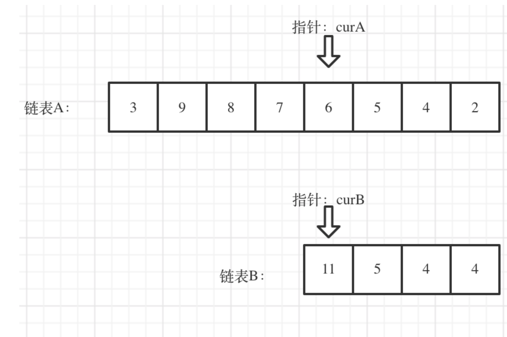

#### [142. 环形链表 II - 力扣（Leetcode）](https://leetcode.cn/problems/linked-list-cycle-ii/)

初印象：快慢指针可以确定有无环  但如何找到环所在入口？


1. 为何慢指针第一圈走不完一定会和快指针相遇? 可以认为快指针和慢指针是相对运动的，假设慢指针的速度是 1节点/秒，快指针的速度是 2节点/秒，当以慢指针为参考系的话（即慢指针静止），快指针的移动速度就是 1节点/秒，所以肯定会相遇。
2. 为什么在第一圈就会相遇呢？ 设环的长度为 L，当慢指针刚进入环时，慢指针需要走 L 步(即 L 秒)才能走完一圈，此时快指针距离慢指针的最大距离为 L-1，我们再次以慢指针为参考系，如上所说，快指针在按照1节点/秒的速度在追赶慢指针，所以肯定能在 L 秒内追赶到慢指针。


设环外长度为a，环的长度为b 

慢指针走了s个节点   快指针2s个  

则相遇时   快指针比慢指针多走n个环  才能相遇  2s = s + n(b)

则 s =nb     

而理所当然的是如果如果走a+nb个节点  节点将回到出口a，所以我们只需让满节点再走a步就会回到节点入口

 因此我们再在头结点穿凿一个慢指针 两个慢指针走a步后将会在入口节点相遇。  这样就得到了入口位置

```js
var detectCycle = function (head) {
    if (head === null) {
        return null;
    }
    let slow = head, fast = head;
    while (fast !== null) {
        slow = slow.next;
        if (fast.next !== null) {
            fast = fast.next.next;
        } else {
            return null;
        }
        if (fast === slow) {
            let ptr = head;
            while (ptr !== slow) {
                ptr = ptr.next;
                slow = slow.next;
            }
            return ptr;
        }
    }
    return null;
};
```


## 哈希表

**当我们遇到了要快速判断一个元素是否出现集合里的时候，就要考虑哈希法**。

#### [242. 有效的字母异位词 - 力扣（Leetcode）](https://leetcode.cn/problems/valid-anagram/)

```js
var isAnagram = function (s, t) {
    const hash = {};
    for (let i in s) hash[s[i]] ? hash[s[i]] += 1 : hash[s[i]] = 1;
    for (let i in t) hash[t[i]] ? hash[t[i]] -= 1 : hash[t[i]] = -1;
    for (let i in hash) {
        if (hash[i] !== 0)
            return false;
    }
    return true;
};
```

#### [1002. 查找共用字符 - 力扣（Leetcode）](https://leetcode.cn/problems/find-common-characters/)

主要问题是要包括重复字符

多个hash表记录  找同时存在最小值？

```js
var commonChars = function (words) {
    let res = []
    let size = 26
    let firstHash = new Array(size).fill(0)   // 初始化 hash 数组

    let a = "a".charCodeAt()
    let firstWord = words[0]
    for (let i = 0; i < firstWord.length; i++) { // 第 0 个单词的统计
        let idx = firstWord[i].charCodeAt()
        firstHash[idx - a] += 1
    }

    let otherHash = new Array(size).fill(0)    // 初始化 hash 数组
    for (let i = 1; i < words.length; i++) { // 1-n 个单词统计
        for (let j = 0; j < words[i].length; j++) {
            let idx = words[i][j].charCodeAt()
            otherHash[idx - a] += 1
        }

        for (let i = 0; i < size; i++) {
            firstHash[i] = Math.min(firstHash[i], otherHash[i])
        }
        otherHash.fill(0)
    }

    for (let i = 0; i < size; i++) {
        while (firstHash[i] > 0) {
            res.push(String.fromCharCode(i + a))
            firstHash[i]--
        }
    }
    return res
};

```

#### [349. 两个数组的交集 - 力扣（Leetcode）](https://leetcode.cn/problems/intersection-of-two-arrays/)

```js
var intersection = function (nums1, nums2) {
    const hash = {};
    let res = []
    for (let i of nums1) {
        hash[i] = 1;
    }
    for (let i of nums2) {
        if (hash[i]) {
            hash[i] = 0;
        }
    }
    for (let i in hash) {
        if (hash[i] === 0) {
            res.push(i);
        }
    }
    return res;
};
```

#### [202. 快乐数 - 力扣（Leetcode）](https://leetcode.cn/problems/happy-number/)

如果不是的话会无限循环  会有重复项出现  所以所有sum我们都记录检查是否出现过

递归   力扣作用域原因 全局变量出错

改为迭代

```js
var isHappy = function (n) {
    const s = new Set();

    while (n != 1) {
        let sum = 0, remaining = 0;
        while (n > 0) {
            remaining = n % 10
            n = Math.floor(n / 10);
            sum += remaining * remaining;
        }
        if (s.has(sum)) {
            return false;
        }
        else
            s.add(sum);
        n = sum
    }
    return true;
};
```

#### [1. 两数之和 - 力扣（Leetcode）](https://leetcode.cn/problems/two-sum/)

最简单 嵌套遍历o(n2)

```js
var twoSum = function (nums, target) {
    for (let i = 0; i < nums.length; i++) {
        tmp = target - nums[i]
        for (let j = i + 1; j < nums.length; j++) {
            if (nums[j] !== tmp)
                continue
            return [i, j]
        }
    }
    return false
};
```

```js
var twoSum = function (nums, target) {
    let hash = {};
    for (let i = 0; i < nums.length; i++) {
        if (hash[target - nums[i]] !== undefined) {
            return [i, hash[target - nums[i]]];
        }
        hash[nums[i]] = i;
    }
    return [];
};
```

#### [454. 四数相加 II - 力扣（Leetcode）](https://leetcode.cn/problems/4sum-ii/)

最简单 四层嵌套  太暴力了

其实每次有很多重复计算 考虑如何避免这些重复计算

因为不需要具体索引  可以分治  两个两层嵌套

```js
var fourSumCount = function (nums1, nums2, nums3, nums4) {
    const twoSumMap = new Map();
    let count = 0;

    for (const n1 of nums1) {
        for (const n2 of nums2) {
            const sum = n1 + n2;
            twoSumMap.set(sum, (twoSumMap.get(sum) || 0) + 1)
        }
    }

    for (const n3 of nums3) {
        for (const n4 of nums4) {
            const sum = n3 + n4;
            count += (twoSumMap.get(0 - sum) || 0)
        }
    }

    return count;
};
```

#### [383. 赎金信 - 力扣（Leetcode）](https://leetcode.cn/problems/ransom-note/)

一眼hash

```js
var canConstruct = function (ransomNote, magazine) {
    const newhash = new Map();
    for (const s of magazine) {
        newhash.set(s, (newhash.get(s) || 0) + 1);
    }
    for (const s of ransomNote) {
        if (newhash.has(s) && newhash.get(s) !== 0) {
            newhash.set(s, newhash.get(s) - 1)
        }
        else {
            return false;
        }
    }
    return true;
};
```

#### [15. 3Sum - 力扣（Leetcode）](https://leetcode.cn/problems/3sum/)

前面两数之和的升级版 现在是一个数组中了  当然还是可以暴力for嵌套

模仿前面两数之和 先双for记录 两数之和  再测试第三个数  不好去重

如何有效的遍历所有可能性？

双指针？ + 排序

```js
var threeSum = function (nums) {
    const res = [], len = nums.length
    // 将数组排序
    nums.sort((a, b) => a - b)
    for (let i = 0; i < len; i++) {
        let l = i + 1, r = len - 1, iNum = nums[i]
        // 数组排过序，如果第一个数(最小值)大于0直接返回res
        if (iNum > 0) return res
        // 去重
        if (iNum == nums[i - 1]) continue
        while (l < r) {
            let lNum = nums[l], rNum = nums[r], threeSum = iNum + lNum + rNum
            // 三数之和小于0，则左指针向右移动
            if (threeSum < 0) l++
            else if (threeSum > 0) r--
            else {
                res.push([iNum, lNum, rNum])
                // 去重
                while (l < r && nums[l] == nums[l + 1]) {
                    l++
                }
                while (l < r && nums[r] == nums[r - 1]) {
                    r--
                }
                l++
                r--
            }
        }
    }
    return res
};
```

#### [18. 4Sum - 力扣（Leetcode）](https://leetcode.cn/problems/4sum/)

考虑 双指针 3sum再加一层嵌套  返回值 要去重

```js
var fourSum = function (nums, target) {
    let nums_S = nums.sort((a, b) => a - b)
    let res = []
    for (let i = 0; i < nums_S.length - 3; i++) {
        // 去重i
        if (i > 0 && nums[i] === nums[i - 1]) continue
        for (let endindex = nums_S.length - 1; endindex > i + 2; endindex--) {
            // 去重 endindex
            if (endindex < nums_S.length - 1 && nums[endindex] === nums[endindex + 1]) continue;
            let l = i + 1, r = endindex - 1;
            while (l < r) {
                let sum = nums_S[l] + nums_S[r] + nums_S[i] + nums_S[endindex];
                if (sum > target) { r-- }
                else if (sum < target) l++
                else {
                    res.push([nums_S[i], nums_S[l], nums_S[r], nums_S[endindex]]);
                    // 去重
                    while (l < r && nums[l] == nums[l + 1]) {
                        l++
                    }
                    while (l < r && nums[r] == nums[r - 1]) {
                        r--
                    }
                    l++
                    r--
                }
            }
        }
    }
    return res
};
```


## 字符串

#### [344. 反转字符串 - 力扣（Leetcode）](https://leetcode.cn/problems/reverse-string/)

```js
var reverseString = function (s) {
    let len = s.length;
    let l = 0, r = len - 1;
    while (l < r) {
        let temp = s[l];
        s[l++] = s[r];
        s[r--] = temp;
    }
    return s;
};
```

#### [541. 反转字符串 II - 力扣（Leetcode）](https://leetcode.cn/problems/reverse-string-ii/)

每次移动2k 在判断是否超出len  翻转前k个

```js
var reverseStr = function (s, k) {
    const len = s.length;
    let resArr = s.split("");
    for (let i = 0; i < len; i += 2 * k) {
        let l = i - 1, r = i + k > len ? len : i + k;
        while (++l < --r) [resArr[l], resArr[r]] = [resArr[r], resArr[l]];
    }
    return resArr.join("");
};
```

#### [剑指 Offer 05. 替换空格 - 力扣（Leetcode）](https://leetcode.cn/problems/ti-huan-kong-ge-lcof/)

```js
var replaceSpace = function (s) {
    let sarray = s.split(' ');
    s = sarray.join('%20');
    return s
};
```

不调库 双指针

```js
 var replaceSpace = function(s) {
   // 字符串转为数组
  const strArr = Array.from(s);
  let count = 0;

  // 计算空格数量
  for(let i = 0; i < strArr.length; i++) {
    if (strArr[i] === ' ') {
      count++;
    }
  }

  let left = strArr.length - 1;
  let right = strArr.length + count * 2 - 1;

  while(left >= 0) {
    if (strArr[left] === ' ') {
      strArr[right--] = '0';
      strArr[right--] = '2';
      strArr[right--] = '%';
      left--;
    } else {
      strArr[right--] = strArr[left--];
    }
  }

  // 数组转字符串
  return strArr.join('');
};
```

#### [151. 反转字符串中的单词 - 力扣（Leetcode）](https://leetcode.cn/problems/reverse-words-in-a-string/)

```js
var reverseWords = function (s) {
    s = s.trim();
    sarray = s.split(/\s+/)
    return sarray.reverse().join(' ')
};
```

如何实现原地解法？

将整个字符串都反转过来，那么单词的顺序指定是倒序了，只不过单词本身也倒序了，那么再把单词反转一下，单词就正过来了。

```js
var reverseWords = function (s) {
    // 字符串转数组
    const strArr = Array.from(s);
    // 移除多余空格
    removeExtraSpaces(strArr);
    // 翻转
    reverse(strArr, 0, strArr.length - 1);

    let start = 0;

    for (let i = 0; i <= strArr.length; i++) {
        if (strArr[i] === ' ' || i === strArr.length) {
            // 翻转单词
            reverse(strArr, start, i - 1);
            start = i + 1;
        }
    }

    return strArr.join('');
};

// 删除多余空格
function removeExtraSpaces(strArr) {
    let slowIndex = 0;
    let fastIndex = 0;

    while (fastIndex < strArr.length) {
        // 移除开始位置和重复的空格
        if (strArr[fastIndex] === ' ' && (fastIndex === 0 || strArr[fastIndex - 1] === ' ')) {
            fastIndex++;
        } else {
            strArr[slowIndex++] = strArr[fastIndex++];
        }
    }

    // 移除末尾空格
    strArr.length = strArr[slowIndex - 1] === ' ' ? slowIndex - 1 : slowIndex;
}

// 翻转从 start 到 end 的字符
function reverse(strArr, start, end) {
    let left = start;
    let right = end;

    while (left < right) {
        // 交换
        [strArr[left], strArr[right]] = [strArr[right], strArr[left]];
        left++;
        right--;
    }
}

```

#### [剑指 Offer 58 - II. 左旋转字符串 - 力扣（Leetcode）](https://leetcode.cn/problems/zuo-xuan-zhuan-zi-fu-chuan-lcof/)

最简单copy一份 然后移动

还可以先全部翻转一次  在分别翻转前面的和 后k个

```js
var reverseLeftWords = function (s, n) {
    /** Utils */
    function reverseWords(strArr, start, end) {
        let temp;
        while (start < end) {
            temp = strArr[start];
            strArr[start] = strArr[end];
            strArr[end] = temp;
            start++;
            end--;
        }
    }
    /** Main code */
    let strArr = s.split('');
    let length = strArr.length;
    reverseWords(strArr, 0, length - 1);
    reverseWords(strArr, 0, length - n - 1);
    reverseWords(strArr, length - n, length - 1);
    return strArr.join('');
};
```

```js
var reverseLeftWords = function (s, n) {
    const length = s.length;
    let i = 0;
    while (i < length - n) {
        s = s[length - 1] + s;
        i++;
    }
    return s.slice(0, length);
};
```

#### ⭐KMP算法

假设我们现在有一段主串`S`（目标串）和子串`P`（模式串），此时的需求是在主串`S`中找到一个与子串`P`相等的子串，如果找到了就返回子串`P`在主串`S`中第一次出现的位置。

对于**KMP**算法来说，主要特点就是主串（目标串）不用回溯，主串指针`i`一直往后面移动，只有子串（模式串）的指针`j`在回溯。这就大大减少了模式匹配算法的比较次数以及回溯次数。**KMP**算法可以在$O(m+n)$的时间复杂度量级上完成串的模式匹配。

KMP可以总结为如下：

- 如果模式串和目标串匹配成功，长串短串都加一
- 如果模式串和目标串没有匹配成功：
- - 目标串不回溯
  - 模式串回溯到匹配未成功的字符前的子串的相同的真前缀和真后缀的最大长度

所以关键是获取最大长度：引入next表。


重点是next表的创建

**next表实际记录的是当前字符j前面的字符串的最大相同前后缀数目。**

如以下例子，刚开始next[0]前面没有字符串设为-1，next[1]前面字符串为单字符a，设为0。next[2]为序号2前面的字符串'ab'，最大相同前后缀数目为0，所以next[2]=0，next[3]为k前面的字符串'aba'，最大相同前后缀数目为1，所以next[3]=1。 同理 next[j] = 3，j前面字符串aba...aba，最大相同前后缀数目为3。

next表 ：-1 0 0 1,...,0 1 2 3,...

字符串

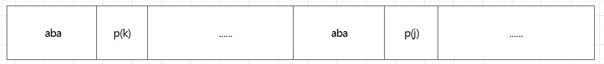

比如此时已经匹配了aba，k=3, next[j]=3。继续对比p[j]与p[k]。

若此时p[j] = p[k]，很明显，最大相同前后缀继续+1, next[j++]=k++ = 4。

而当p[j] != p[k]时，才是最关键的，这个时候k该如何回溯。

当不相等时，我们要找的就是j前面的最大相同前后缀('aba')的最大相同前后缀数目。这里就是‘’aba‘’的最大前后缀‘’a‘’，数目为1，其实就是next[k]的值1。

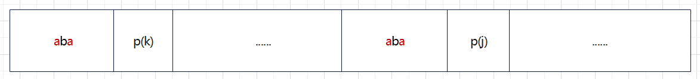

如下图，其实就是看字符串这两块是否有相同的(因为字符串是相同的，所以就是看p(k)的值），有则不用重复比较。k会回到d这个位置再与p(j)比较。

然后重复上面操作。

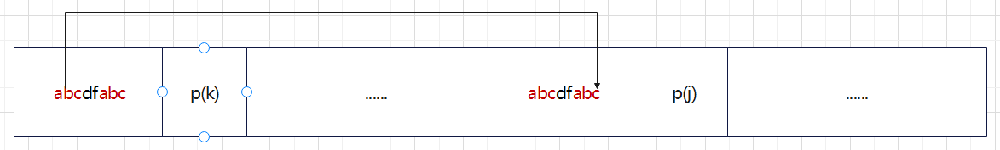

若没有相同字符串，即p(k)=0，

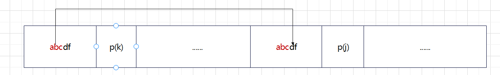

会回到开头位置k=0处，开始新的对比。

#### [28. 找出字符串中第一个匹配项的下标 - 力扣（Leetcode）](https://leetcode.cn/problems/find-the-index-of-the-first-occurrence-in-a-string/)

KMP字符串匹配  关键是索引的移动

```js
/**
 * @param {string} haystack
 * @param {string} needle
 * @return {number}
 */
var getNext = function (p) {
    const plen = p.length;
    let next = new Array(plen);
    next[0] = -1    // next[0]初始化为-1, 表示子串已经滑动到头  为入口
    let k = -1;     // p[k]表示前缀子串
    let j = 0;      // p[j]表示后缀子串
    while (j < plen - 1) {
        // next表next[j]记录的其实是j位置前（不包含j）的字符串所包含的最大相同前缀后缀
        // 相等则直接记录next[j++] = k+1
        if (k === -1 || p[j] === p[k]) {
            k++;
            j++;
            next[j] = k;
        }
        // 不相等 k回溯 直到相等或者回到起点
        // 重点是k的回溯位置  为当前最大相同前缀后缀的最大相同前缀后缀
        else {
            k = next[k];
        }
    }
    return next;
}

var strStr = function (haystack, needle) {
    const hlen = haystack.length, nlen = needle.length;
    // i,j 分别指向主串和子串串
    let i = 0, j = 0;
    const next = getNext(needle)
    while (i < hlen && j < nlen) {
        // 如果匹配 都指向下一位  j=-1相当于入口条件
        if (j === -1 || haystack[i] === needle[j]) {
            i++; j++;
            continue;
        }
        // 否则子串按照next表回溯
        else {
            j = next[j]
        }
    }
    // 匹配成功 返回第一个匹配字母索引
    if (j === nlen) {
        return i - j
    }
    // 否则匹配失败
    return -1;
};

console.log(strStr("sadbutsad", "sad"))
```

[459. 重复的子字符串 - 力扣（Leetcode）](https://leetcode.cn/problems/repeated-substring-pattern/)

给定一个非空的字符串 `s` ，检查是否可以通过由它的一个子串重复多次构成。

能重复构成，一定是前n项重复

```js
var repeatedSubstringPattern = function (s) {
    const slen = s.length;
    let i = 0;
    let temp = '';
    while (i < slen) {
        temp = temp + s[i];
        let stage = temp.length;
        let j = i + 1;
        while (j + stage <= slen) {
            let str = s.slice(j, j + stage);
            if (str === temp) {
                j += stage;
                if (j === slen) {
                    return true;
                }
            }
            else {
                break;
            }
        }
        i++;
    }
    return false;
};
```

上面的方法o(n2)

可以移动字符串匹配

我们将两个 s连在一起，并移除第一个和最后一个字符。如果 s是该字符串的子串，那么 s 就满足题目要求。

或者kmp

假设字符串s使用多个重复子串构成（这个子串是最小重复单位），重复出现的子字符串长度是x，所以s是由n * x组成。

因为字符串s的最长相同前后缀的的长度一定是不包含s本身，所以 最长相同前后缀长度必然是m * x，而且 n - m = 1

所以如果 nx % (n - m)x = 0，就可以判定有重复出现的子字符串。

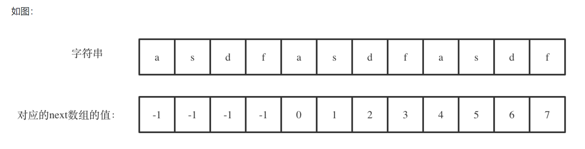

```js
var repeatedSubstringPattern = function (s) {
    if (s.length === 0)
        return false;

    const getNext = (s) => {
        let next = [];
        let j = -1;

        next.push(j);

        for (let i = 1; i < s.length; ++i) {
            while (j >= 0 && s[i] !== s[j + 1])
                j = next[j];
            if (s[i] === s[j + 1])
                j++;
            next.push(j);
        }

        return next;
    }

    let next = getNext(s);

    if (next[next.length - 1] !== -1 && s.length % (s.length - (next[next.length - 1] + 1)) === 0)
        return true;
    return false;
};
```


## 双指针法

#### [27. 移除元素 - 力扣（Leetcode）](https://leetcode.cn/problems/remove-element/)

元素的顺序可以改变，双指针

```js
var removeElement = function (nums, val) {
    let L = 0, R = nums.length - 1;
    while (L <= R) {
        if (nums[L] === val) {
            const tmp = nums[L];
            nums[L] = nums[R];
            nums[R] = tmp;
            R--;
        }
        else {
            L++;
        }
    }
    return L
};
```

这里需要注意的是边界条件，小于等于  否则会漏掉  比如只有一个数字的时候

不改变元素位置可以快慢指针 慢指针在遇到val时不移动

#### [26. 删除有序数组中的重复项 - 力扣（Leetcode）](https://leetcode.cn/problems/remove-duplicates-from-sorted-array/)

因为是有序数组 所以会简单很多  原地方法 所以不用hash

用快慢指针

```js
var removeDuplicates = function (nums) {
    const length = nums.length;
    if (length < 2) return length
    let L = 0, R = 1;
    while (R < nums.length) {
        if (nums[L] === nums[R]) {
            R++;
        }
        else {
            nums[++L] = nums[R++];
        }
    }
    return L + 1
};
```

#### [283. 移动零](https://leetcode-cn.com/problems/move-zeroes/)

从头开始扫描 若为0则0个数加1  非0的话 向前面移动目前遇到的0的数目个位置

```python
class Solution:
    def moveZeroes(self, nums: List[int]) -> None:
        """
        Do not return anything, modify nums in-place instead.
        """
        # 统计目前遇到的0的数目
        zero_num = 0
        n = len(nums) - 1

        for i, val in enumerate(nums):
            if val == 0:
                zero_num += 1
            else:
                if zero_num != 0:
                    nums[i-zero_num] = val
        for i in range(zero_num):
            nums[n] = 0
            n -= 1
```

双指针的话此题保持非零元素的相对顺序  快慢好一些 头尾会改变顺序

L找0  R找非0

```js
var moveZeroes = function (nums) {
    let L = 0, R = 0;
    while (R < nums.length) {
        if (nums[R] === 0) {
            R++;
            continue;
        }
        if (nums[L] === 0) {
            nums[L] = nums[R];
            nums[R] = 0;
        }
        L++;
        R++;
    }
    return nums;
};
```


## 栈与队列

#### [232. 用栈实现队列 - 力扣（Leetcode）](https://leetcode.cn/problems/implement-queue-using-stacks/)

栈实现队列 需要两个栈

一个控制进入 一个控制输入 就能实现先进先出

```js
var MyQueue = function () {
    this.inStack = [];  // 控制进入元素
    this.outStack = [];     // 控制输出元素
};

/** 
 * @param {number} x
 * @return {void}
 */
MyQueue.prototype.push = function (x) {
    this.inStack.push(x);
};

/**
 * @return {number}
 */
MyQueue.prototype.pop = function () {
    // 如果出栈有 则直接输出栈顶
    if (this.outStack.length) {
        return this.outStack.pop();
    }
    // 否则将入栈中的元素输入到出栈
    // 入栈中先进入的在底部  pop输入到出栈后 先进入的反而在顶部  符合要求
    while (this.inStack.length) {
        this.outStack.push(this.inStack.pop());
    }
    return this.outStack.pop();
};

/**
 * @return {number}
 */
MyQueue.prototype.peek = function () {
    // 直接调用pop  再push到出栈  减少代码书写
    const x = this.pop()
    this.outStack.push(x);
    return x
};

/**
 * @return {boolean}
 */
MyQueue.prototype.empty = function () {
    return !this.inStack.length && !this.outStack.length
};
```


#### [225. Implement Stack using Queues - 力扣（Leetcode）](https://leetcode.cn/problems/implement-stack-using-queues/)

队列实现栈 同样需要两个队列  

入栈正常入  出栈 需要将当前队列中除队尾元素全部出队到另一个队  然后再输出队尾元素作为栈的输出

此时再入栈就需要 入到另一个队

```js
// 入栈正常入  出栈 需要将当前队列中除队尾元素全部出队到另一个队  然后再输出队尾元素作为栈的输出

// 此时再入栈就需要 入到另一个队
var MyStack = function () {
    this.first_queue = [];
    this.second_queue = [];
};

/** 
 * @param {number} x
 * @return {void}
 */
MyStack.prototype.push = function (x) {
    if (this.first_queue.length)
        this.first_queue.push(x);
    else
        this.second_queue.push(x);
};

/**
 * @return {number}
 */
MyStack.prototype.pop = function () {
    if (this.first_queue.length) {
        while (this.first_queue.length > 1) {
            this.second_queue.push(this.first_queue.shift());
        }
        return this.first_queue.shift()
    }
    while (this.second_queue.length > 1) {
        this.first_queue.push(this.second_queue.shift())
    }
    return this.second_queue.shift()
};

/**
 * @return {number}
 */
MyStack.prototype.top = function () {
    const x = this.pop();
    this.push(x);
    return x;
};

/**
 * @return {boolean}
 */
MyStack.prototype.empty = function () {
    return !this.first_queue.length && !this.second_queue.length
};

```

其实一个队列就行  在pop时提前记录长度size  在队列自身中打乱顺序

```js
// 使用一个队列实现
/**
 * Initialize your data structure here.
 */
var MyStack = function() {
    this.queue = [];
};

/**
 * Push element x onto stack. 
 * @param {number} x
 * @return {void}
 */
MyStack.prototype.push = function(x) {
    this.queue.push(x);
};

/**
 * Removes the element on top of the stack and returns that element.
 * @return {number}
 */
MyStack.prototype.pop = function() {
    let size = this.queue.length;
    while(size-- > 1) {
        this.queue.push(this.queue.shift());
    }
    return this.queue.shift();
};

/**
 * Get the top element.
 * @return {number}
 */
MyStack.prototype.top = function() {
    const x = this.pop();
    this.queue.push(x);
    return x;
};

/**
 * Returns whether the stack is empty.
 * @return {boolean}
 */
MyStack.prototype.empty = function() {
    return !this.queue.length;
};
```

#### [20. Valid Parentheses - 力扣（Leetcode）](https://leetcode.cn/problems/valid-parentheses/)

经典栈的应用

左括号入栈 右括号与栈顶元素对比

```js
var isValid = function (s) {
    const stack = [];
    for (let i = 0; i < s.length; i++) {
        let c = s[i];
        switch (c) {
            case '(':
                stack.push(')');
                break;
            case '[':
                stack.push(']');
                break;
            case '{':
                stack.push('}');
                break;
            default:
                if (c !== stack.pop()) {
                    return false;
                }
        }
    }
    return stack.length === 0;
};
```

#### [1047. 删除字符串中的所有相邻重复项 - 力扣（Leetcode）](https://leetcode.cn/problems/remove-all-adjacent-duplicates-in-string/)

```js
var removeDuplicates = function (s) {
    let stack = [];
    for (var i = 0; i < s.length; i++) {
        let temp = 0
        if (stack.length) { temp = stack.pop(); }
        else { stack.push(s[i]); continue; }
        if (s[i] !== temp) { stack.push(temp); stack.push(s[i]); }
    }
    return stack.join('')
};
```

#### ⭐逆波兰表达式（后缀表达式）

我们平常所使用的表达式是中缀表达式。 中缀后缀其实就是计算符号的位置。

我们人能够识别括号，能够知道先乘除后加减，但是，计算机不能，所以引入了后缀表达式。而且后缀表达式 没有括号。

根据后缀表达式计算结果：

**1. 只要是数字，我们就放入栈中。**

**2. 遇到运算符（+ - \* /)后，取出栈顶两个元素进行计算。然后再将结果放入栈中。**

**3. 继续上述操作，直到后缀表达式遍历完成，然后就得到了结果。**

中缀表达式转后缀表达式:

**1.设定运算符栈；**

**2.从左到右遍历中缀表达式的每个数字和运算符；**

**3.若当前字符是数字，则直接输出成为后缀表达式的一部分；**

**4.若当前字符为运算符，则判断其与栈顶运算符的优先级，若优先级大于栈顶运算符，则进栈；若优先级小于等于栈顶运算符，退出栈顶运算符成为后缀表达式的一部分，然后将当前运算符放入栈中；**

**5.若当前字符为“(”，进栈；**

**6.若当前字符为“)”，则从栈顶起，依次将栈中运算符出栈成为后缀表达式的一部分，直到碰到“(”。将栈中“(”出栈，不需要成为后缀表达式的一部分，然后继续扫描表达式直到最终输出后缀表达式为止。**


#### [150. 逆波兰表达式求值 - 力扣（Leetcode）](https://leetcode.cn/problems/evaluate-reverse-polish-notation/)

通过这道题，更能理解计算机的思考模式。

```js
var evalRPN = function(tokens) {
    const stack = [];
    const n = tokens.length;
    for (let i = 0; i < n; i++) {
        const token = tokens[i];
        if (isNumber(token)) {
            stack.push(parseInt(token));
        } else {
            const num2 = stack.pop();
            const num1 = stack.pop();
            if (token === '+') {
                stack.push(num1 + num2);
            } else if (token === '-') {
                stack.push(num1 - num2);
            } else if (token === '*') {
                stack.push(num1 * num2);
            } else if (token === '/') {
                stack.push(num1 / num2 > 0 ? Math.floor(num1 / num2) : Math.ceil(num1 / num2));
            }
        }
    }
    return stack.pop();
};

const isNumber = (token) => {
    return !('+' === token || '-' === token || '*' === token || '/' === token );
}
```

用map可大大减少代码量

```js
var evalRPN = function (tokens) {
    const s = new Map([
        ["+", (a, b) => a * 1 + b * 1],
        ["-", (a, b) => b - a],
        ["*", (a, b) => b * a],
        ["/", (a, b) => (b / a) | 0]
    ]);
    const stack = [];
    for (const i of tokens) {
        if (!s.has(i)) {
            stack.push(i);
            continue;
        }
        stack.push(s.get(i)(stack.pop(), stack.pop()))
    }
    return stack.pop();
};
```

#### [239. 滑动窗口最大值 - 力扣（Leetcode）](https://leetcode.cn/problems/sliding-window-maximum/)

/** 
 * 每次只移动一位 则只需要注意新加入元素  与最大元素   记录最大值
 * 若新加入元素大于当前最大值  直接更新最大值
 * 否则 看删除的是否是最大元素  不是则不更新
 * 说是的话则又要将窗口内的元素进行对比，有点费时间
 * */

```js
var maxSlidingWindow = function (nums, k) {
    let maxValue = -9999;
    let res = [];
    for (let i = 0; i < nums.length; i++) {
        if (nums[i] > maxValue) {
            maxValue = nums[i];
        }
        if (i + 1 - k === 0) {
            res.push(maxValue)
        }
        if (i + 1 - k > 0) {
            if (nums[i - k] !== maxValue) {
                res.push(maxValue)
                continue
            }
            else {
                let j = i + 1 - k;
                maxValue = nums[j];
                for (j; j <= i; j++) {
                    if (nums[j] > maxValue) {
                        maxValue = nums[j];
                    }
                }
                res.push(maxValue)
            }
        }
    }
    return res
};
```

复杂度o(Kn)

其实我们可以记录最大值与次大值  因为移动后的最大值一定是从当前最大值与次大值，与新值三者之间产生。通过维护三者，可以减去可能的比较过程

仔细看 这个窗口很明显符合队列 数据结构

设计单调队列的时候，pop，和push操作要保持如下规则：

1. pop(value)：如果窗口移除的元素value等于单调队列的出口元素，那么队列弹出元素，否则不用任何操作
2. push(value)：如果push的元素value大于入口元素的数值，那么就将队列入口的元素弹出，直到push元素的数值小于等于队列入口元素的数值为止

保持如上规则，每次窗口移动的时候，只要问que.front()就可以返回当前窗口的最大值。

```js
var maxSlidingWindow = function (nums, k) {
    class MonoQueue {
        queue;
        constructor() {
            this.queue = [];
        }
        enqueue(value) {
            // 如果push的数值大于入口元素的数值，那么就将队列后端的数值弹出，直到push的数值小于等于队列入口元素的数值为止。
    		// 这样就保持了队列里的数值是单调从大到小的了。
            let back = this.queue[this.queue.length - 1];
            while (back !== undefined && back < value) {
                this.queue.pop();
                back = this.queue[this.queue.length - 1];
            }
            this.queue.push(value);
        }
        dequeue(value) {
            let front = this.front();
            // 每次弹出的时候，比较当前要弹出的数值是否等于队列出口元素的数值，如果相等则弹出。
            if (front === value) {
                this.queue.shift();
            }
        }
        front() {
            return this.queue[0];
        }
    }
    let helperQueue = new MonoQueue();
    let i = 0, j = 0;
    let resArr = [];
    while (j < k) {
        helperQueue.enqueue(nums[j++]);
    }
    resArr.push(helperQueue.front());
    while (j < nums.length) {
        helperQueue.enqueue(nums[j]);
        helperQueue.dequeue(nums[i]);
        resArr.push(helperQueue.front());
        i++, j++;
    }
    return resArr;
};
```

#### [347. 前 K 个高频元素 - 力扣（Leetcode）](https://leetcode.cn/problems/top-k-frequent-elements/)

初想法hash表 + 排序

```js
var topKFrequent = function (nums, k) {
    const numsMap = new Map();
    for (let i = 0; i < nums.length; i++) {
        numsMap.has(nums[i]) ? numsMap.set(nums[i], numsMap.get(nums[i]) + 1) : numsMap.set(nums[i], 1)
    }
    var arrayObj = Array.from(numsMap);
    arrayObj.sort(function (a, b) { return b[1] - a[1] });
    let res = [];
    for (let i = 0; i < k; i++)
        res.push(arrayObj[i][0])
    return res;
};
```

对频率进行排序，这里我们可以使用和239一样的一种容器适配器就是**优先级队列**。

 使用快排要将map转换为vector的结构，然后对整个数组进行排序， 而这种场景下，我们其实只需要维护k个有序的序列就可以了，所以使用优先级队列是最优的

**我们要用小顶堆，因为要统计最大前k个元素，只有小顶堆每次将最小的元素弹出，最后小顶堆里积累的才是前k个最大元素。**

```js
// js 没有堆 需要自己构造
class Heap {
    constructor(compareFn) {
        this.compareFn = compareFn;
        this.queue = [];
    }

    // 添加
    push(item) {
        // 推入元素
        this.queue.push(item);

        // 上浮
        let index = this.size() - 1; // 记录推入元素下标
        let parent = Math.floor((index - 1) / 2); // 记录父节点下标

        while (parent >= 0 && this.compare(parent, index) > 0) { // 注意compare参数顺序
            [this.queue[index], this.queue[parent]] = [this.queue[parent], this.queue[index]];

            // 更新下标
            index = parent;
            parent = Math.floor((index - 1) / 2);
        }
    }

    // 获取堆顶元素并移除
    pop() {
        // 堆顶元素
        const out = this.queue[0];

        // 移除堆顶元素 填入最后一个元素
        this.queue[0] = this.queue.pop();

        // 下沉
        let index = 0; // 记录下沉元素下标
        let left = 1; // left 是左子节点下标 left + 1 则是右子节点下标
        let searchChild = this.compare(left, left + 1) > 0 ? left + 1 : left;

        while (searchChild !== undefined && this.compare(index, searchChild) > 0) { // 注意compare参数顺序
            [this.queue[index], this.queue[searchChild]] = [this.queue[searchChild], this.queue[index]];

            // 更新下标
            index = searchChild;
            left = 2 * index + 1;
            searchChild = this.compare(left, left + 1) > 0 ? left + 1 : left;
        }

        return out;
    }

    size() {
        return this.queue.length;
    }

    // 使用传入的 compareFn 比较两个位置的元素
    compare(index1, index2) {
        // 处理下标越界问题
        if (this.queue[index1] === undefined) return 1;
        if (this.queue[index2] === undefined) return -1;

        return this.compareFn(this.queue[index1], this.queue[index2]);
    }

}

const topKFrequent = function (nums, k) {
    const map = new Map();

    for (const num of nums) {
        map.set(num, (map.get(num) || 0) + 1);
    }

    // 创建小顶堆
    const heap= new Heap((a, b) => a[1] - b[1]);

    // entry 是一个长度为2的数组，0位置存储key，1位置存储value
    for (const entry of map.entries()) {
        heap.push(entry);

        if (heap.size() > k) {
            heap.pop();
        }
    }

    // return heap.queue.map(e => e[0]);

    const res = [];

    for (let i = heap.size() - 1; i >= 0; i--) {
        res[i] = heap.pop()[0];
    }

    return res;
};
```


## 二叉树

#### [144. 二叉树的前序遍历 - 力扣（Leetcode）](https://leetcode.cn/problems/binary-tree-preorder-traversal/description/)

递归写法：

```js
var Traversal = function (root, arr) {
    if (root === null) return;
    arr.push(root.val);
    Traversal(root.left, arr);
    Traversal(root.right, arr);
}

var preorderTraversal = function (root) {
    let result = [];
    Traversal(root, result);
    return result;
};
```

跌代写法：

利用栈实现  因为栈和递归有天然的相似

```js
var preorderTraversal = function (root, res = []) {
    if (!root) return res;
    const stack = [root];
    let cur = null;
    while (stack.length) {
        cur = stack.pop();
        res.push(cur.val);
        cur.right && stack.push(cur.right);
        cur.left && stack.push(cur.left);
    }
    return res;
};
```

注意先右再左  因为后入的先出

迭代的难点在于 不同顺序差别很大 不能像递归简单的换顺序

#### [94. 二叉树的中序遍历 - 力扣（Leetcode）](https://leetcode.cn/problems/binary-tree-inorder-traversal/)

递归：

```js
var Traversal = function (root, arr) {
    if (root === null) return;
    Traversal(root.left, arr);
    arr.push(root.val);
    Traversal(root.right, arr);
}

var inorderTraversal = function (root) {
    let result = [];
    Traversal(root, result);
    return result;
};
```

迭代：

为了解释清楚，我说明一下 刚刚在迭代的过程中，其实我们有两个操作：

1. **处理：将元素放进result数组中**
2. **访问：遍历节点**

分析一下为什么刚刚写的前序遍历的代码，不能和中序遍历通用呢，因为前序遍历的顺序是中左右，先访问的元素是中间节点，要处理的元素也是中间节点，所以刚刚才能写出相对简洁的代码，**因为要访问的元素和要处理的元素顺序是一致的，都是中间节点。**

那么再看看中序遍历，中序遍历是左中右，先访问的是二叉树顶部的节点，然后一层一层向下访问，直到到达树左面的最底部，再开始处理节点（也就是在把节点的数值放进result数组中），这就造成了**处理顺序和访问顺序是不一致的。**

那么**在使用迭代法写中序遍历，就需要借用指针的遍历来帮助访问节点，栈则用来处理节点上的元素。**

```js
var inorderTraversal = function (root, res = []) {
    const stack = [];
    let cur = root;
    while (stack.length || cur) {
        if (cur) {
            stack.push(cur);
            // 左
            cur = cur.left;
        } else {
            // --> 弹出 中
            cur = stack.pop();
            res.push(cur.val);
            // 右
            cur = cur.right;
        }
    };
    return res;
};
```

#### [145. 二叉树的后序遍历 - 力扣（Leetcode）](https://leetcode.cn/problems/binary-tree-postorder-traversal/)

递归：

```js
var Traversal = function (root, arr) {
    if (root === null) return;
    Traversal(root.left, arr);
    Traversal(root.right, arr);
    arr.push(root.val);
}

var postorderTraversal = function (root) {
    let result = [];
    Traversal(root, result);
    return result;
};
```

迭代：

简单的方式是可以直接从前序得到，

再来看后序遍历，先序遍历是中左右，后续遍历是左右中，那么我们只需要调整一下先序遍历的代码顺序，就变成中右左的遍历顺序，然后在反转result数组，输出的结果顺序就是左右中了，如下图：

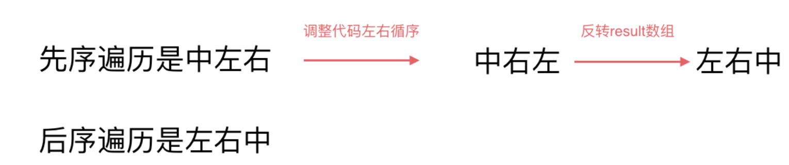


```js
var postorderTraversal = function (root, res = []) {
    if (!root) return res;
    const stack = [root];
    let cur = null;
    do {
        cur = stack.pop();
        res.push(cur.val);
        cur.left && stack.push(cur.left);
        cur.right && stack.push(cur.right);
    } while (stack.length);
    return res.reverse();
};
```

标记法：

```js
// 后续遍历：左右中
// 压栈顺序：中右左
var postorderTraversal = function (root, res = []) {
    const stack = [];
    if (root) stack.push(root);
    while (stack.length) {
        const node = stack.pop();
        // 旧栈顶为空 则说明现在的栈顶节点是应该被处理的节点  所以输出栈顶的值
        if (!node) {
            res.push(stack.pop().val);
            continue;
        }
        // 旧栈顶不为空  则旧栈顶为应该继续访问的节点 控制入栈顺序 方便后面处理
        stack.push(node); // 中
        stack.push(null);  // null方便后序的处理  标志着该节点可以被处理了
        // 它的左右子节点则为应该继续访问的节点 不用null标记
        if (node.right) stack.push(node.right); // 右
        if (node.left) stack.push(node.left); // 左
    };
    return res;
};
```

#### 二叉树的统一迭代法

**无法同时解决访问节点（遍历节点）和处理节点（将元素放进结果集）不一致的情况**。

**那我们就将访问的节点放入栈中，把要处理的节点也放入栈中但是要做标记。**

如何标记呢，**就是要处理的节点放入栈之后，紧接着放入一个空指针作为标记。** 这种方法也可以叫做标记法。

做二叉树的题一定要注意处理的节点总是将其视为中节点处理的。

```js
// 时间复杂度O(n),n为节点个树，空间复杂度O(n)，显示栈的空间开销

// 前序遍历：中左右
// 压栈顺序：右左中
var preorderTraversal = function(root, res = []) {
    const stack = [];
    if (root) stack.push(root);
    while(stack.length) {
        const node = stack.pop();
        if(!node) {
            res.push(stack.pop().val);
            continue;
        }
        if (node.right) stack.push(node.right); // 右
        if (node.left) stack.push(node.left); // 左
        stack.push(node); // 中
        stack.push(null);
    }; 
    return res;
};


//  中序遍历：左中右
//  压栈顺序：右中左
var inorderTraversal = function(root, res = []) {
    const stack = [];
    if (root) stack.push(root);
    while(stack.length) {
        const node = stack.pop();
        if(!node) {
            res.push(stack.pop().val);
            continue;
        }
        if (node.right) stack.push(node.right); // 右
        stack.push(node); // 中
        stack.push(null);
        if (node.left) stack.push(node.left); // 左
    };
    return res;
};

// 后续遍历：左右中
// 压栈顺序：中右左
var postorderTraversal = function(root, res = []) {
    const stack = [];
    if (root) stack.push(root);
    while(stack.length) {
        const node = stack.pop();
        if(!node) {
            res.push(stack.pop().val);
            continue;
        }
        stack.push(node); // 中
        stack.push(null);
        if (node.right) stack.push(node.right); // 右
        if (node.left) stack.push(node.left); // 左
    };
    return res;
};
```

除根节点，对于其它节点都是第一次入栈作为子节点被访入栈   第二次入栈作为父节点标记为可以处理了  若它是叶子节点则直接弹出   若有孩子则将孩子入栈  按要求顺序决定弹出还是先访问其子节点(比如先序则最后入栈直接弹出，否则按顺序前面入栈 先访问先要访问的子节点 子节点访问完 再弹出)


#### [102. 二叉树的层序遍历 - 力扣（Leetcode）](https://leetcode.cn/problems/binary-tree-level-order-traversal/)

对于层次遍历  是广度优先  不需要一路走到底  因此需要记录的只是当层的节点的子节点们  先进先出

选择使用队列数据结构   每一层的节点就是刚遍历到该层时队列长度 （上一层的父节点已经全部出债，他们的所有子节点就是这一层的所有节点）

```js
var levelOrder = function (root) {
    //二叉树的层序遍历
    const res = [], queue = [root];
    if (root === null) {
        return res;
    }
    while (queue.length) {
        // 记录当前层级节点数
        const length = queue.length;
        //存放每一层的节点 
        const curLevel = [];
        for (let i = 0; i < length; i++) {
            const node = queue.shift();
            curLevel.push(node.val);
            // 存放当前层下一层的节点
            node.left && queue.push(node.left);
            node.right && queue.push(node.right);
        }
        //把每一层的结果放到结果数组
        res.push(curLevel);
    }
    return res;
};
```

#### [107. 二叉树的层序遍历 II - 力扣（Leetcode）](https://leetcode.cn/problems/binary-tree-level-order-traversal-ii/)

**自底向上的层序遍历**   102的翻版 最简单直接将102结果reverse，哈哈   (官方解答居然就是这个。。。。。)


#### [199. 二叉树的右视图 - 力扣（Leetcode）](https://leetcode.cn/problems/binary-tree-right-side-view/)

层次遍历每层只记录最后一个

#### [637. 二叉树的层平均值 - 力扣（Leetcode）](https://leetcode.cn/problems/average-of-levels-in-binary-tree/)

层次遍历 记录每层平均值

```js
var averageOfLevels = function (root) {
    const res = [], queue = [root];
    if (root === null) {
        return res;
    }
    while (queue.length) {
        // 记录当前层级节点数
        const length = queue.length;
        //存放每一层的节点 
        const curLevel = [];
        for (let i = 0; i < length; i++) {
            const node = queue.shift();
            curLevel.push(node.val);
            // 存放当前层下一层的节点
            node.left && queue.push(node.left);
            node.right && queue.push(node.right);
        }
        //把每一层的结果放到结果数组
        res.push(curLevel.reduce((prev, cur) => {
            return (prev + cur)
        }) / length);
    }
    return res;
};
```

#### [429. N 叉树的层序遍历 - 力扣（Leetcode）](https://leetcode.cn/problems/n-ary-tree-level-order-traversal/)

不同的是存放下一层的节点  不再固定是两个

```js
var levelOrder = function (root) {
    if (!root) {
        return [];
    }

    const ans = [];
    const queue = [root];

    while (queue.length) {
        const cnt = queue.length;
        const level = [];
        for (let i = 0; i < cnt; ++i) {
            const cur = queue.shift();
            level.push(cur.val);
            for (const child of cur.children) {
                queue.push(child);
            }
        }
        ans.push(level);
    }

    return ans;
};
```

#### [515. 在每个树行中找最大值 - 力扣（Leetcode）](https://leetcode.cn/problems/find-largest-value-in-each-tree-row/)

层次遍历过程中记录每层最大值

```js
var largestValues = function (root) {
    const res = [], queue = [root];
    if (root === null) {
        return res;
    }
    while (queue.length) {
        // 记录当前层级节点数
        const length = queue.length;
        // 记录每层最大值
        let maxLev = -Infinity;
        for (let i = 0; i < length; i++) {
            const node = queue.shift();
            maxLev = node.val > maxLev ? node.val : maxLev;
            // 存放当前层下一层的节点
            node.left && queue.push(node.left);
            node.right && queue.push(node.right);
        }
        //把每一层的结果放到结果数组
        res.push(maxLev);
    }
    return res;
};
```


#### [116. 填充每个节点的下一个右侧节点指针](https://leetcode-cn.com/problems/populating-next-right-pointers-in-each-node/)

最容易想到层次遍历

层次遍历基于广度优先搜索，它与广度优先搜索的不同之处在于，广度优先搜索每次只会取出一个节点来拓展，而层次遍历会每次将队列中的所有元素都拿出来拓展，这样能保证每次从队列中拿出来遍历的元素都是属于同一层的

```python
import collections


class Solution:
    def connect(self, root: 'Node') -> 'Node':

        if not root:
            return root

        # 初始化队列同时将第一层节点加入队列中，即根节点
        Q = collections.deque([root])

        # 外层的 while 循环迭代的是层数
        while Q:

            # 记录当前队列大小
            size = len(Q)

            # 遍历这一层的所有节点
            for i in range(size):

                # 从队首取出元素
                node = Q.popleft()

                # 连接
                if i < size - 1:
                    node.next = Q[0]

                # 拓展下一层节点
                if node.left:
                    Q.append(node.left)
                if node.right:
                    Q.append(node.right)

        # 返回根节点
        return root
```

#### [117. 填充每个节点的下一个右侧节点指针 II - 力扣（Leetcode）](https://leetcode.cn/problems/populating-next-right-pointers-in-each-node-ii/)

与116的区别是，116完美二叉树 每层只有最后一个节点无next   其实一样

```js
var connect = function (root) {
    const queue = [root];
    if (root === null) {
        return root;
    }
    while (queue.length) {
        // 记录当前层级节点数
        const length = queue.length;
        for (let i = 0; i < length; i++) {
            const node = queue.shift();
            if (i < length - 1) {
                node.next = queue[0];
            }
            // 存放当前层下一层的节点
            node.left && queue.push(node.left);
            node.right && queue.push(node.right);
        }
    }
    return root;
};
```

#### [104. 二叉树的最大深度 - 力扣（Leetcode）](https://leetcode.cn/problems/maximum-depth-of-binary-tree/description/)

层次遍历 统计深度

```js
var maxDepth = function (root) {
    let depth = 0;
    if (!root) return null;
    const queue = [root];
    while (queue.length) {
        const len = queue.length;
        depth += 1;
        for (let i = 0; i < len; i++) {
            const node = queue.shift();
            node.left && queue.push(node.left);
            node.right && queue.push(node.right);
        }
    }
    return depth;
};
```

也可以深度遍历

```js
var maxDepth = function (root) {
    if (!root) return 0;
    return Math.max(maxDepth(root.left),maxDepth(root.right))+1
};
```


#### [111. 二叉树的最小深度 - 力扣（Leetcode）](https://leetcode.cn/problems/minimum-depth-of-binary-tree/)

深度遍历 记录最小值  重点是叶子节点的定义


叶子节点的定义是**左孩子和右孩子都为 null** 时叫做叶子节点
当 root 节点左右孩子都为空时，返回 1
当 root 节点左右孩子有一个为空时，返回**不为空的孩子节点的深度**
当 root 节点左右孩子都不为空时，返回左右孩子较小深度的节点值

```js
var minDepth = function (root) {
    if (!root) return 0;
    const minL = minDepth(root.left);
    const minR = minDepth(root.right);
    // 判断节点子节点是叶子节点  是的话为1(minL.minR为0) 否则为不为空的孩子节点的最小深度(因为叶子节点一点在这个方向的末尾)
    return root.left === null || root.right === null ? minL + minR + 1 : Math.min(minL, minR) + 1;
};
```

也可以广度  返回搜索到第一个叶子节点的层数

```js
var minDepth = function (root) {
    let depth = 0;
    if (!root) return null;
    const queue = [root];
    while (queue.length) {
        const len = queue.length;
        depth += 1;
        for (let i = 0; i < len; i++) {
            const node = queue.shift();
            if (!node.left && !node.right) return depth;
            node.left && queue.push(node.left);
            node.right && queue.push(node.right);
        }
    }
    return depth;
};
```

#### [226. 翻转二叉树 - 力扣（Leetcode）](https://leetcode.cn/problems/invert-binary-tree/)

```js
var invertTree = function (root) {
    if (!root) return null;
    let temp = root.left;
    root.left = invertTree(root.right);
    root.right = invertTree(temp);
    return root;
};
```

#### [101. 对称二叉树 - 力扣（Leetcode）](https://leetcode.cn/problems/symmetric-tree/)

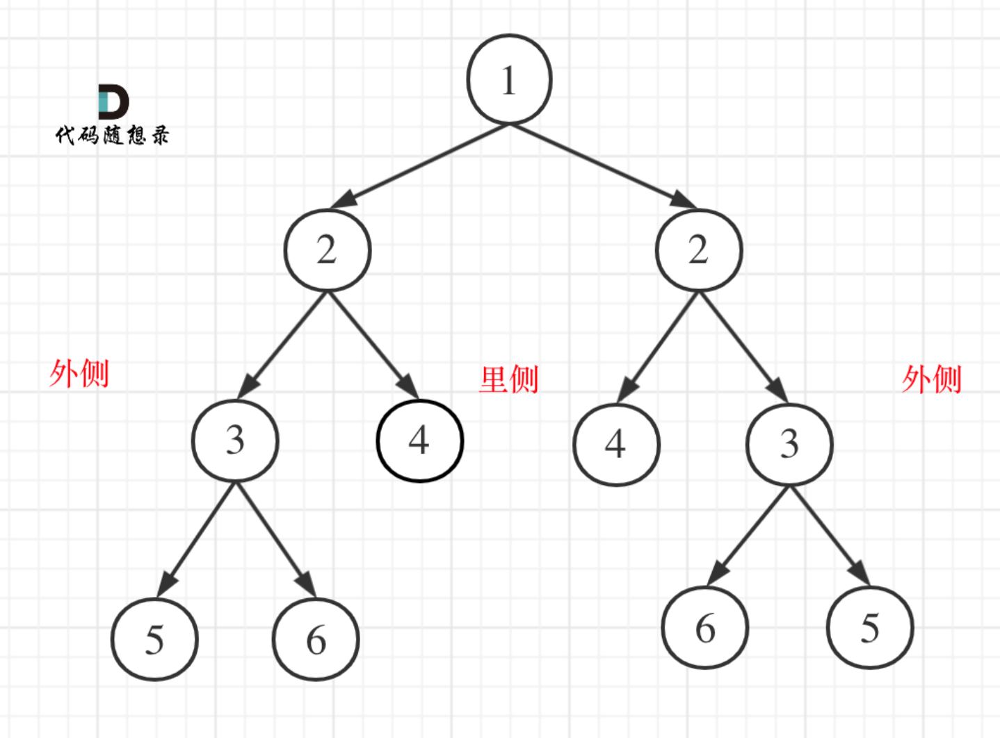

递归

对于对称的每个节点都应该满足  外部相等 内部相等

```js
var compare = function (left, right) {
    //终止条件
    if (left !== null && right == null) return false;
    else if (left === null && right !== null) return false;
    else if (left === null && right === null) return true;
    else if (left.val !== right.val) return false;

    // 若左右值相等 继续递归  外部与内部相等
    let outside = compare(left.left, right.right)
    let inside = compare(left.right, right.left)
    return outside && inside
}

var isSymmetric = function (root) {
    if (!root) return true;
    return compare(root.left, root.right)
};
```

队列迭代

```js
ar isSymmetric = function(root) {
  // 迭代方法判断是否是对称二叉树
  // 首先判断root是否为空
  if(root === null) {
      return true;
  }
  let queue = [];
  queue.push(root.left);
  queue.push(root.right);
  while(queue.length) {
      let leftNode = queue.shift();    //左节点
      let rightNode = queue.shift();   //右节点
      if(leftNode === null && rightNode === null) {
          continue;
      }
      if(leftNode === null || rightNode === null || leftNode.val !== rightNode.val) {
          return false;
      }
      queue.push(leftNode.left);     //左节点左孩子入队
      queue.push(rightNode.right);   //右节点右孩子入队
      queue.push(leftNode.right);    //左节点右孩子入队
      queue.push(rightNode.left);    //右节点左孩子入队
  }
  
  return true;
};
```

栈实现迭代

```js
var isSymmetric = function(root) {
  // 迭代方法判断是否是对称二叉树
  // 首先判断root是否为空
  if(root === null) {
      return true;
  }
  let stack = [];
  stack.push(root.left);
  stack.push(root.right);
  while(stack.length) {
      let rightNode = stack.pop();    //左节点
      let leftNode=stack.pop();       //右节点
      if(leftNode === null && rightNode === null) {
          continue;
      }
      if(leftNode === null || rightNode === null || leftNode.val !== rightNode.val) {
          return false;
      }
      stack.push(leftNode.left);      //左节点左孩子入队
      stack.push(rightNode.right);    //右节点右孩子入队
      stack.push(leftNode.right);     //左节点右孩子入队
      stack.push(rightNode.left);     //右节点左孩子入队
  }
  
  return true;
};
```


#### [559. N 叉树的最大深度 - 力扣（Leetcode）](https://leetcode.cn/problems/maximum-depth-of-n-ary-tree/)

迭代 层次遍历

```js
var maxDepth = function (root) {
    if (!root) return 0;
    const queue = [root];
    let maxD = 0
    while (queue.length) {
        let len = queue.length;
        maxD += 1
        for (let i = 0; i < len; i++) {
            const node = queue.shift();
            for (const child of node.children) {
                queue.push(child);
            }
        }
    }
    return maxD;
};
```

递归

```js
var maxDepth = function (root) {
    if (!root) return 0;
    let maxD = 0;
    for (const child of root.children) {
        maxD = Math.max(maxD, maxDepth(child));
    }
    return maxD+1
};
```

#### [222. 完全二叉树的节点个数 - 力扣（Leetcode）](https://leetcode.cn/problems/count-complete-tree-nodes/)

最简单 遍历统计  时间复杂度o(n)

递归版本

```js
var countNodes = function(root) {
    //递归法计算二叉树节点数
    // 1. 确定递归函数参数
    const getNodeSum = function(node) {
    //2. 确定终止条件
        if(node === null) {
            return 0;
        }
    //3. 确定单层递归逻辑
        let leftNum = getNodeSum(node.left);
        let rightNum = getNodeSum(node.right);
        return leftNum + rightNum + 1;
    }
    return getNodeSum(root);
};
```

迭代(层序遍历)版本

```js
var countNodes = function(root) {
    //层序遍历
    let queue = [];
    if(root === null) {
        return 0;
    }
    queue.push(root);
    let nodeNums = 0;
    while(queue.length) {
        let length = queue.length;
        while(length--) {
            let node = queue.shift();
            nodeNums++;
            node.left && queue.push(node.left);
            node.right && queue.push(node.right);
        }
    }
    return nodeNums;
};
```

作为完全二叉树 我们要利用其性质 

利用完全二叉树性质 

在完全二叉树中，如果递归向左遍历的深度等于递归向右遍历的深度，那说明就是满二叉树。


在完全二叉树中，如果递归向左遍历的深度不等于递归向右遍历的深度，则说明不是满二叉树，如图：


```js
var countNodes = function (root) {
    //利用完全二叉树的特点
    if (root === null) {
        return 0;
    }
    let left = root.left;
    let right = root.right;
    let leftDepth = 0, rightDepth = 0;
    while (left) {
        left = left.left;
        leftDepth++;
    }
    while (right) {
        right = right.right;
        rightDepth++;
    }
    // 完全二叉树如果递归向左遍历的深度等于递归向右遍历的深度，那说明就是满二叉树。用公式计算节点数目
    if (leftDepth == rightDepth) {
        return Math.pow(2, leftDepth + 1) - 1;
    }
    // 否则继续迭代
    return countNodes(root.left) + countNodes(root.right) + 1;
};
```

#### [110. 平衡二叉树 - 力扣（Leetcode）](https://leetcode.cn/problems/balanced-binary-tree/)

```js
var isBalanced = function(root) {
    //还是用递归三部曲 + 后序遍历 左右中 当前左子树右子树高度相差大于1就返回-1
    // 1. 确定递归函数参数以及返回值
    const getDepth = function(node) {
        // 2. 确定递归函数终止条件
        if(node === null) return 0;
        // 3. 确定单层递归逻辑
        let leftDepth = getDepth(node.left); //左子树高度
        // 当判定左子树不为平衡二叉树时,即可直接返回-1
        if(leftDepth === -1) return -1;
        let rightDepth = getDepth(node.right); //右子树高度
        // 当判定右子树不为平衡二叉树时,即可直接返回-1
        if(rightDepth === -1) return -1;
        if(Math.abs(leftDepth - rightDepth) > 1) {
            return -1;
        } else {
            return 1 + Math.max(leftDepth, rightDepth);
        }
    }
    return !(getDepth(root) === -1);
};
```

#### [257. 二叉树的所有路径 - 力扣（Leetcode）](https://leetcode.cn/problems/binary-tree-paths/)

用先序遍历就可以做到  

值得注意的是 递归完，要做回溯

```js
var binaryTreePaths = function (root) {
    let res = [];
    const findPath = function (node, curPath) {
        // 终止条件 为叶子节点时
        if (!node.left && !node.right) {
            curPath += node.val;
            // 访问到叶子节点直接添加  相当于先加到curPath在回溯
            res.push(curPath);
            return
        }

        curPath += node.val + '->';
        if (node.left) {
            findPath(node.left, curPath, res);
        }
        if (node.right) {
            findPath(node.right, curPath, res);
        }
        return
    }
    findPath(root, '');
    return res
};
```

迭代

```js
var binaryTreePaths = function(root) {
  if (!root) return [];
  const stack = [root], paths = [''], res = [];
  while (stack.length) {
    const node = stack.pop();
    let path = paths.pop();
    if (!node.left && !node.right) { // 到叶子节点终止, 添加路径到结果中
      res.push(path + node.val);
      continue;
    }
    path += node.val + '->';
    if (node.right) { // 右节点存在
      stack.push(node.right);
      paths.push(path);
    }
    if (node.left) { // 左节点存在
      stack.push(node.left);
      paths.push(path);
    }
  }
  return res;
};  
```

#### [100. 相同的树 - 力扣（Leetcode）](https://leetcode.cn/problems/same-tree/)

最简单同时深度遍历

```js
var isSameTree = function (p, q) {
    if (p === null && q !== null) return false;
    else if (p !== null && q === null) return false;
    else if (p === null && q === null) return true;
    else if (p.val !== q.val) return false;
    return isSameTree(p.left, q.left) && isSameTree(p.right, q.right)
};
```

#### [572. 另一棵树的子树 - 力扣（Leetcode）](https://leetcode.cn/problems/subtree-of-another-tree/)

```js
var isSameTree = function (p, q) {
    if (p === null && q !== null) return false;
    else if (p !== null && q === null) return false;
    else if (p === null && q === null) return true;
    else if (p.val !== q.val) return false;
    return isSameTree(p.left, q.left) && isSameTree(p.right, q.right)
};

var isSubtree = function (root, subRoot) {
    if (!root) return false;
    if (isSameTree(root, subRoot)) return true;
    return isSubtree(root.left, subRoot) || isSubtree(root.right, subRoot)
};
```

前序遍历 看是否是子树

#### [404. 左叶子之和 - 力扣（Leetcode）](https://leetcode.cn/problems/sum-of-left-leaves/)

标记是否是左叶子

```js
var sumOfLeftLeaves = function (root) {
    let res = 0;
    const isLeave = function (node, flag) {
        if (!node) return;
        if (!node.left && !node.right && flag) {
            res += node.val;
            return;
        }
        if (node.left) {
            isLeave(node.left, true);
        }
        if (node.right) {
            isLeave(node.right, false)
        }
        return;
    }
    isLeave(root, false)
    return res
};
```

#### [513. 找树左下角的值 - 力扣（Leetcode）](https://leetcode.cn/problems/find-bottom-left-tree-value/)

层次遍历最底层第一个

```js
var findBottomLeftValue = function (root) {
    const queue = [root];
    let res = 0
    while (queue.length) {
        let len = queue.length
        res = queue[0].val
        for (let i = 0; i < len; i++) {
            let node = queue.shift()
            node.left && queue.push(node.left)
            node.right && queue.push(node.right)
        }
    }
    return res
};
```

#### [112. 路径总和 - 力扣（Leetcode）](https://leetcode.cn/problems/path-sum/)

所有路径升级版

```js
var hasPathSum = function (root, targetSum) {
    if (!root) return false;
    if (!root.left && !root.right) {
        if (root.val === targetSum) return true;
    }
    return hasPathSum(root.left, targetSum - root.val) || hasPathSum(root.right, targetSum - root.val);
};
```

#### [113. 路径总和 II - 力扣（Leetcode）](https://leetcode.cn/problems/path-sum-ii/submissions/389848181/)

```js
var pathSum = function (root, targetSum) {
    // 递归法
    // 要遍历整个树找到所有路径，所以递归函数不需要返回值, 与112不同
    const res = [];
    const travelsal = (node, cnt, path) => {
        // 遇到了叶子节点且找到了和为sum的路径
        if (cnt === 0 && !node.left && !node.right) {
            res.push([...path]); // 不能写res.push(path), 要深拷贝
            return;
        }
        if (!node.left && !node.right) return; // 遇到叶子节点而没有找到合适的边，直接返回
        // 左 （空节点不遍历）
        if (node.left) {
            path.push(node.left.val);
            travelsal(node.left, cnt - node.left.val, path); // 递归
            path.pop(); // 回溯
        }
        // 右 （空节点不遍历）
        if (node.right) {
            path.push(node.right.val);
            travelsal(node.right, cnt - node.right.val, path); // 递归
            path.pop(); // 回溯
        }
        return;
    };
    if (!root) return res;
    travelsal(root, targetSum - root.val, [root.val]); // 把根节点放进路径
    return res;
};
// 简洁写法
var pathsum = function(root, targetsum) {
    //递归方法
    let respath = [],curpath = [];
    // 1. 确定递归函数参数
    const traveltree = function(node,count) {
        curpath.push(node.val);
        count -= node.val;
        if(node.left === null && node.right === null && count === 0) {
            respath.push([...curpath]);
        }
        node.left && traveltree(node.left, count);
        node.right && traveltree(node.right, count);
        let cur = curpath.pop();
        count -= cur;
    }
    if(root === null) {
        return respath;
    }
    travelTree(root, targetSum);
    return resPath;
};
```

#### [106. 从中序与后序遍历序列构造二叉树 - 力扣（Leetcode）](https://leetcode.cn/problems/construct-binary-tree-from-inorder-and-postorder-traversal/)

以 后序数组的最后一个元素为切割点，先切中序数组，根据中序数组，反过来再切后序数组。一层一层切下去，每次后序数组最后一个元素就是节点元素。

- 第一步：如果数组大小为零的话，说明是空节点了。
- 第二步：如果不为空，那么取后序数组最后一个元素作为节点元素。
- 第三步：找到后序数组最后一个元素在中序数组的位置，作为切割点
- 第四步：切割中序数组，切成中序左数组和中序右数组 （顺序别搞反了，一定是先切中序数组）
- 第五步：切割后序数组，切成后序左数组和后序右数组
- 第六步：递归处理左区间和右区间


```js
var buildTree = function(inorder, postorder) {
    if (!inorder.length) return null;
    const rootVal = postorder.pop(); // 从后序遍历的数组中获取中间节点的值， 即数组最后一个值  这里已经弹出了 后面就后序就不需要切掉最后一个了
    let rootIndex = inorder.indexOf(rootVal); // 获取中间节点在中序遍历中的下标
    const root = new TreeNode(rootVal); // 创建中间节点
    root.left = buildTree(inorder.slice(0, rootIndex), postorder.slice(0, rootIndex)); // 创建左节点
    root.right = buildTree(inorder.slice(rootIndex + 1), postorder.slice(rootIndex)); // 创建右节点  前面pop了postorder.slice不需要指定end了
    return root;
};
```

#### [105. 从前序与中序遍历序列构造二叉树 - 力扣（Leetcode）](https://leetcode.cn/problems/construct-binary-tree-from-preorder-and-inorder-traversal/)

```js
var buildTree = function (preorder, inorder) {
    if (!inorder.length) return null;
    const rootVal = preorder.shift(); // 从前序遍历的数组中获取中间节点的值， 即数组第一个值  这里已经弹出首元素 后面切分不需要从1开始了
    let rootIndex = inorder.indexOf(rootVal); // 获取中间节点在中序遍历中的下标
    const root = new TreeNode(rootVal); // 创建中间节点
    root.left = buildTree(preorder.slice(0, rootIndex), inorder.slice(0, rootIndex)); // 创建左节点
    root.right = buildTree(preorder.slice(rootIndex), inorder.slice(rootIndex + 1)); // 创建右节点
    return root;
};
```

#### [654. 最大二叉树 - 力扣（Leetcode）](https://leetcode.cn/problems/maximum-binary-tree/)

```js
var constructMaximumBinaryTree = function (nums) {
    if (!nums.length) return null;
    let maxvalue = -999;
    let maxindex = -1;
    for (let i = 0; i < nums.length; i++) {
        if (nums[i] > maxvalue) {
            maxvalue = nums[i];
            maxindex = i;
        }
    }
    const root = new TreeNode(maxvalue);
    root.left = constructMaximumBinaryTree(nums.slice(0, maxindex));
    root.right = constructMaximumBinaryTree(nums.slice(maxindex + 1));
    return root;
};
```

#### [617. 合并二叉树 - 力扣（Leetcode）](https://leetcode.cn/problems/merge-two-binary-trees/)

```js
var mergeTrees = function (root1, root2) {
    if (!root1 && !root2) return null;
    let newRoot = new TreeNode()
    if (root1 && !root2) {
        newRoot.val = root1.val
        newRoot.left = root1.left
        newRoot.right = root1.right
        return newRoot;
    }
    if (!root1 && root2) {
        newRoot.val = root2.val
        newRoot.left = root2.left
        newRoot.right = root2.right
        return newRoot;
    }
    else {
        newRoot.val = root1.val + root2.val;
        newRoot.left = mergeTrees(root1.left, root2.left)
        newRoot.right = mergeTrees(root1.right, root2.right)
        return newRoot
    }
};
// 不需要判断这么多
var mergeTrees = function (root1, root2) {
    const preOrder = (root1, root2) => {
        if (!root1)
            return root2
        if (!root2)
            return root1;
        root1.val += root2.val;
        root1.left = preOrder(root1.left, root2.left);
        root1.right = preOrder(root1.right, root2.right);
        return root1;
    }
    return preOrder(root1, root2);
};
```

#### [700. 二叉搜索树中的搜索 - 力扣（Leetcode）](https://leetcode.cn/problems/search-in-a-binary-search-tree/)

随便一种遍历  但要注意用二叉树的性质

递归

```js
var searchBST = function (root, val) {
    if (!root || root.val === val) {
        return root;
    }
    if (root.val > val)
        return searchBST(root.left, val);
    if (root.val < val)
        return searchBST(root.right, val);
};
```

迭代

```js
var searchBST = function (root, val) {
    while (root !== null) {
        if (root.val > val)
            root = root.left;
        else if (root.val < val)
            root = root.right;
        else 
            return root;
    }
    return null;
};
```

#### [98. 验证二叉搜索树 - 力扣（Leetcode）](https://leetcode.cn/problems/validate-binary-search-tree/)

注意是左子树所有节点都小于 右都大于

```js
var isValidBST = function (root) {
    if (!root.left && !root.right) return true
    else if (!root.left && root.right) return root.right.val > root.val ? isValidBST(root.right) : false;
    else if (root.left && !root.right) return root.left.val < root.val ? isValidBST(root.left) : false;
    else return root.right.val > root.val && root.left.val < root.val ? isValidBST(root.left) && isValidBST(root.right) : false;
};
```

上述代码只能满足子树的左节点小于  而不能满足左子树中的右节点也小于，如下图上式会输出true


**要知道中序遍历下，输出的二叉搜索树节点的数值是有序序列。**

```js
// 中序遍历下，输出的二叉搜索树节点的数值是有序序列。
// 辅助数组记录中序遍历结果 看是否为有序序列
var isValidBST = function (root) {
    let arr = [];
    const buildArr = (root) => {
        if (root) {
            buildArr(root.left);
            arr.push(root.val);
            buildArr(root.right);
        }
    }
    buildArr(root);
    for (let i = 1; i < arr.length; ++i) {
        if (arr[i] <= arr[i - 1])
            return false;
    }
    return true;
};
```

递归  中序遍历 但须记录上个节点的值 上个节点的值应该小于当前节点的值

```js
let pre = null;
var isValidBST = function (root) {
    let pre = null;
    const inOrder = (root) => {
        if (root === null)
            return true;
        let left = inOrder(root.left);
		// 中序遍历，一直更新pre，一旦发现pre.val >= root->val，就返回false，注意元素相同时候也要返回false。 验证遍历的元素是不是从小到大
        if (pre !== null && pre.val >= root.val)
            return false;
        pre = root;

        let right = inOrder(root.right);
        return left && right;
    }
    return inOrder(root);
};
```

#### [530. 二叉搜索树的最小绝对差 - 力扣（Leetcode）](https://leetcode.cn/problems/minimum-absolute-difference-in-bst/)

依然用到二叉搜索树中序遍历是升序，记录中序遍历相邻两个差值的最小值

```js
var getMinimumDifference = function (root) {
    let res = Infinity
    let preNode = null
    // 中序遍历
    const inorder = (node) => {
        if (!node) return
        inorder(node.left)
        // 更新res
        if (preNode) res = Math.min(res, node.val - preNode.val)
        // 记录前一个节点         
        preNode = node
        inorder(node.right)
    }
    inorder(root)
    return res
}
```

#### [501. 二叉搜索树中的众数 - 力扣（Leetcode）](https://leetcode.cn/problems/find-mode-in-binary-search-tree/)

依然用到二叉搜索树性质，中序遍历 顺便记录

```js
var findMode = function(root) {
    // 不使用额外空间，使用中序遍历,设置出现最大次数初始值为1
    let count = 0,maxCount = 1;
    let pre = root,res = [];
    // 1.确定递归函数及函数参数
    const travelTree = function(cur) {
        // 2. 确定递归终止条件
        if(cur === null) {
            return ;
        }
        travelTree(cur.left);
        // 3. 单层递归逻辑
        if(pre.val === cur.val) {
            count++;
        }else {
            count = 1;
        }
        pre = cur;
        if(count === maxCount) {
            res.push(cur.val);
        }
        if(count > maxCount) {
            res = [];
            maxCount = count;
            res.push(cur.val);
        }
        travelTree(cur.right);
    }
    travelTree(root);
    return res;
};
```

#### [236. 二叉树的最近公共祖先 - 力扣（Leetcode）](https://leetcode.cn/problems/lowest-common-ancestor-of-a-binary-tree/)

判断通过此节点能否找到两个节点

```js
var lowestCommonAncestor = function (root, p, q) {
    // 使用递归的方法
    // 需要从下到上，所以使用后序遍历
    // 1. 确定递归的函数
    const travelTree = function (root, p, q) {
        // 2. 确定递归终止条件
        // 因为p，q一定存在  所以p的子节点有q的情况包含在以下
        if (root === null || root === p || root === q) {
            return root;
        }
        // 3. 确定递归单层逻辑
        let left = travelTree(root.left, p, q);
        let right = travelTree(root.right, p, q);
        // 左右都不为空 root子节点有pq
        if (left !== null && right !== null) {
            return root;
        }
        // 找到了一个q  或者p是q的子节点的情况  就返回q
        if (left === null) {
            return right;
        }
        return left;
    }
    return travelTree(root, p, q);
};
```

#### [235. 二叉搜索树的最近公共祖先 - 力扣（Leetcode）](https://leetcode.cn/problems/lowest-common-ancestor-of-a-binary-search-tree/)

因为是搜索树，如果分开说明该节点就是最近祖先

```js
var lowestCommonAncestor = function (root, p, q) {
    const travers = function (root, p, q) {
        // 当节点将pq分为两边则为祖先， 否则p在q的下面或者q在p的下面 但只要访问到p和q中任意一个  另一个一定是他的子孙  所以返回节点就可以了
        if (!root || root.val > p.val && root.val < q.val || p.val === root.val || q.val === root.val) { return root; }
        if (p.val > root.val) {
            return lowestCommonAncestor(root.right, p, q);
        };
        if (q.val < root.val) { return lowestCommonAncestor(root.left, p, q); }
    }
    if (p.val > q.val) {
        [p, q] = [q, p]
    }
    return travers(root, p, q);
}
```

#### [701. 二叉搜索树中的插入操作 - 力扣（Leetcode）](https://leetcode.cn/problems/insert-into-a-binary-search-tree/)

先确定插入位置  再插入 因为二叉搜索树不存在变形 一定插在叶子节点下面 所以比较简单

```js
var insertIntoBST = function (root, val) {
    let newNode = new TreeNode(val)
    if (!root) return newNode
    let tmpNode = root
    while (tmpNode) {
        // 大于则应该在右边
        if (val > tmpNode.val) {
            // 若右节点为空直接插入右节点
            if (!tmpNode.right) {
                tmpNode.right = newNode
                break;
            }
            // 否则继续访问右节点
            tmpNode = tmpNode.right;
        }
        // 小于同理
        else {
            if (!tmpNode.left) {
                tmpNode.left = newNode
                break;
            }
            tmpNode = tmpNode.left
        }
    }
    return root
};
```

#### [450. 删除二叉搜索树中的节点 - 力扣（Leetcode）](https://leetcode.cn/problems/delete-node-in-a-bst/)

删除节点一样先找到节点 但有变形

这里就把二叉搜索树中删除节点遇到的情况都搞清楚。

有以下五种情况：

- 第一种情况：没找到删除的节点，遍历到空节点直接返回了
- 找到删除的节点
  - 第二种情况：左右孩子都为空（叶子节点），直接删除节点， 返回NULL为根节点
  - 第三种情况：删除节点的左孩子为空，右孩子不为空，删除节点，右孩子补位，返回右孩子为根节点
  - 第四种情况：删除节点的右孩子为空，左孩子不为空，删除节点，左孩子补位，返回左孩子为根节点
  - 第五种情况：左右孩子节点都不为空，则将删除节点的左子树头结点（左孩子）放到删除节点的右子树的最左面节点的左孩子上，返回删除节点右孩子为新的根节点。

```js
/**
 * Definition for a binary tree node.
 * function TreeNode(val, left, right) {
 *     this.val = (val===undefined ? 0 : val)
 *     this.left = (left===undefined ? null : left)
 *     this.right = (right===undefined ? null : right)
 * }
 */
/**
 * @param {TreeNode} root
 * @param {number} key
 * @return {TreeNode}
 */
var deleteNode = function (root, key) {
    // 第一种情况：没找到删除的节点，遍历到空节点直接返回了
    if (!root) return null;
    if (key > root.val) {
        root.right = deleteNode(root.right, key);
        return root;
    } else if (key < root.val) {
        root.left = deleteNode(root.left, key);
        return root;
    } else {
        // 第二种情况：左右孩子都为空（叶子节点），直接删除节点， 返回NULL为根节点
        if (!root.left && !root.right) {
            return null
        }
        // 第三种情况：其右孩子为空，左孩子不为空，删除节点，左孩子补位，返回左孩子为根节点
        if (root.left && !root.right) {
            return root.left;
        } // 第四种情况：其左孩子为空，右孩子不为空，删除节点，右孩子补位 ，返回右孩子为根节点
        else if (root.right && !root.left) {
            return root.right;
        }
        // 第五种情况：左右孩子节点都不为空，则将删除节点的左子树放到删除节点的右子树的最左面节点的左孩子的位置
        // 并返回删除节点右孩子为新的根节点。
        let tmpNode = root.right
        // 找右子树最左面的节点
        while (tmpNode.left) {
            tmpNode = tmpNode.left;
        }
        // 把要删除的节点左子树放在右子树最左面的节点的左孩子的位置
        tmpNode.left = root.left
        // 返回旧root的右孩子作为新root
        root = root.right
        return root;
    }
};

```

上述代码会使二叉树深度增加许多

```js
// 场景3: 左右节点都存在
        const rightNode = root.right;
        // 获取最小值节点
        const minNode = getMinNode(rightNode);
        // 将待删除节点的值替换为最小值节点值
        root.val = minNode.val;
        // 删除最小值节点
        root.right = deleteNode(root.right, minNode.val);
        return root;
```

将让右树最小节点的替换root，root的左右子树继承，但需要删除重复的右树最小节点。

#### [669. 修剪二叉搜索树 - 力扣（Leetcode）](https://leetcode.cn/problems/trim-a-binary-search-tree/)

```js
var trimBST = function (root, low, high) {
    // 为空返回
    if (!root) return null;
    // 如果root小于最小值  则左侧一定都下于  查看右子树
    if (root.val < low) return trimBST(root.right, low, high);
    // 大于同理 查看左子树
    if (root.val > high) return trimBST(root.left, low, high);
    // 否则两边都查看
    root.left = trimBST(root.left, low, high)
    root.right = trimBST(root.right, low, high)
    return root
};
```

#### [108. 将有序数组转换为二叉搜索树 - 力扣（Leetcode）](https://leetcode.cn/problems/convert-sorted-array-to-binary-search-tree/)

从中间分？

```js
var sortedArrayToBST = function (nums) {
    if (nums.length === 0) return null;
    let len = nums.length;
    let mid = Math.floor(len / 2);
    let node = new TreeNode(nums[mid])
    node.left = sortedArrayToBST(nums.slice(0, mid));
    node.right = sortedArrayToBST(nums.slice(mid + 1));
    return node;
};
```

但尽量不要重新定义左右区间数组，而是用下标来操作原数组。

首先取数组中间元素的位置，不难写出`int mid = (left + right) / 2;`，**这么写其实有一个问题，就是数值越界，例如left和right都是最大int，这么操作就越界了，在[二分法](https://programmercarl.com/0035.搜索插入位置.html)中尤其需要注意！**

所以可以这么写：`int mid = left + ((right - left) / 2);`

```js
var sortedArrayToBST = function (nums) {
    const buildTree = (Arr, left, right) => {
        if (left > right)
            return null;

        let mid = Math.floor(left + (right - left) / 2);

        let root = new TreeNode(Arr[mid]);
        root.left = buildTree(Arr, left, mid - 1);
        root.right = buildTree(Arr, mid + 1, right);
        return root;
    }
    return buildTree(nums, 0, nums.length - 1);
};
```

#### [538. 把二叉搜索树转换为累加树 - 力扣（Leetcode）](https://leetcode.cn/problems/convert-bst-to-greater-tree/)

右 中 左  就是降序

```js
var convertBST = function (root) {
    // 右 中 左 遍历就是降序 就是 记录累计值就行 就是原树中大于或等于 node.val 的值之和
    let tmp = root
    // val记录累计值
    const buildTree = function (node, val) {
        // 空节点 返回累计值
        if (!node) return val;
        // 按照右 中 左 遍历 不断更新累计值
        val = buildTree(node.right, val)
        node.val += val
        val = buildTree(node.left, node.val)
        // 返回遍历后的累计值
        return val
    }
    buildTree(tmp, 0);
    return root
};
```

## 回溯算法

回溯法也可以叫做回溯搜索法，它是一种搜索的方式。

回溯是递归的副产品，只要有递归就会有回溯。

**虽然回溯法很难，很不好理解，但是回溯法并不是什么高效的算法**。

**因为回溯的本质是穷举，穷举所有可能，然后选出我们想要的答案**，如果想让回溯法高效一些，可以加一些剪枝的操作，但也改不了回溯法就是穷举的本质。

那么既然回溯法并不高效为什么还要用它呢？

因为没得选，一些问题能暴力搜出来就不错了，撑死了再剪枝一下，还没有更高效的解法。

回溯法，一般可以解决如下几种问题：

- 组合问题：N个数里面按一定规则找出k个数的集合
- 切割问题：一个字符串按一定规则有几种切割方式
- 子集问题：一个N个数的集合里有多少符合条件的子集
- 排列问题：N个数按一定规则全排列，有几种排列方式
- 棋盘问题：N皇后，解数独等等

**组合是不强调元素顺序的，排列是强调元素顺序**。

**回溯法解决的问题都可以抽象为树形结构**   因为回溯法解决的都是在集合中递归查找子集，**集合的大小就构成了树的宽度，递归的深度，都构成的树的深度**。

递归就要有终止条件，所以必然是一棵高度有限的树（N叉树）。

回溯算法模板框架如下：

```
function backtracking(参数) {
    if (终止条件) {
        存放结果;
        return;
    }

    for (选择：本层集合中元素（树中节点孩子的数量就是集合的大小）) {
        处理节点;
        backtracking(路径，选择列表); // 递归
        回溯，撤销处理结果
    }
}
```

**这份模板很重要，后面做回溯法的题目都靠它了！**

#### [77. 组合 - 力扣（Leetcode）](https://leetcode.cn/problems/combinations/)

从后到前回溯  (因为是1-n中选k个,1是确定的)

```js
var combine = function (n, k) {
    let res = new Array();
    const backtracking = function (path, n, k) {
        if (n < k) {
            return
        }
        if (k === 1) {
            for (let i = 1; i <= n; i++) {
                // 注意数组push之后返回的是length,而不是新的数组，如果不清楚这点，在使用过程中会遇到很大的坑。
                path.push(i)
                // 解构赋值  拷贝一份  不然会存入引用  最后都变为最终的path也就是空
                res.push([...path])
                path.pop()
            }
        }
        for (let i = n; i >= 1; i--) {
            path.push(i)
            backtracking(path, i - 1, k - 1)
            path.pop()
        }
    }
    backtracking([], n, k)
    return res
};
```

#### [216. 组合总和 III - 力扣（Leetcode）](https://leetcode.cn/problems/combination-sum-iii/)

```js
var combinationSum3 = function (k, n) {
    let res = [];
    let path = [];

    const backTrack = function (k, n, stratindex) {
        if (k < 0 || 10 - stratindex < k) return
        if (k === 0) {
            if (n === 0) { res.push([...path]) }
            return
        }

        for (let i = stratindex; i <= 9 && i <= n; i++) {
            path.push(i)
            backTrack(k - 1, n - i, i + 1)
            path.pop()
        }
    }

    backTrack(k, n, 1)
    return res
};
```

#### [17. 电话号码的字母组合 - 力扣（Leetcode）](https://leetcode.cn/problems/letter-combinations-of-a-phone-number/)

关键是数字和字母如何映射

```js
var letterCombinations = function (digits) {
    const k = digits.length;
    const map = ["", "", "abc", "def", "ghi", "jkl", "mno", "pqrs", "tuv", "wxyz"];
    if (!k) return [];
    if (k === 1) return map[digits].split("");

    const res = [], path = [];
    backtracking(digits, k, 0);
    return res;

    function backtracking(n, k, a) {
        if (path.length === k) {
            res.push(path.join(""));
            return;
        }
        for (const v of map[n[a]]) {
            path.push(v);
            backtracking(n, k, a + 1);
            path.pop();
        }
    }
};
```

#### [39. 组合总和 - 力扣（Leetcode）](https://leetcode.cn/problems/combination-sum/)

本体元素可以重复利用 可以无需startIndex   但如何去除重复结果是个问题  如 2 2 3 和 2 3 2   

看来还是需要个startIndex   但每次调用回溯i不需要在+1   这样每次都仍可能遍历n次自身  但不会在遍历自身前面的元素 防止重复

```js
var combinationSum = function (candidates, target) {
    let res = [];
    let path = [];

    const backTrack = function (candidates, target, stratindex) {
        if (target === 0) {
            res.push([...path])
            return
        }
        if (target < 0) return
        for (let i = stratindex; i < candidates.length; i++) {
            path.push(candidates[i])
            backTrack(candidates, target - candidates[i], i)
            path.pop()
        }
    }

    backTrack(candidates, target, 0)
    return res
};
```

#### [40. 组合总和 II - 力扣（Leetcode）](https://leetcode.cn/problems/combination-sum-ii/)

`candidates` 中的每个数字在每个组合中只能使用 **一次** 。 容易想到39的i+1

但注意的是元素可能重复，但解集不能包含重复的组合。 

元素在同一个组合内是可以重复的，怎么重复都没事，但两个组合不能相同。

**所以我们要去重的是同一树层上的“使用过”，同一树枝上的都是一个组合里的元素，不用去重**。

可以先排序 让相同的元素靠在一起  然后判断当前元素是否等于上一个元素 等于则跳过去重

```js
var combinationSum2 = function(candidates, target) {
    const res = []; path = [], len = candidates.length;
    candidates.sort((a,b)=>a-b);
    backtracking(0, 0);
    return res;
    function backtracking(sum, i) {
        if (sum === target) {
            res.push(Array.from(path));
            return;
        }
        for(let j = i; j < len; j++) {
            const n = candidates[j];
            // j需要大于i  否则可能判断到上一层的值  这里只去除本层的重复值  本层的可能值是i以后的值 
            if(j > i && candidates[j] === candidates[j-1]){
              //若当前元素和前一个元素相等
              //则本次循环结束，防止出现重复组合
              continue;
            }
            //如果当前元素值大于目标值-总和的值
            //由于数组已排序，那么该元素之后的元素必定不满足条件
            //直接终止当前层的递归
            if(n > target - sum) break;
            path.push(n);
            sum += n;
            backtracking(sum, j + 1);
            path.pop();
            sum -= n;
        }
    }
};
```

#### [131. 分割回文串 - 力扣（Leetcode）](https://leetcode.cn/problems/palindrome-partitioning/description/)

**其实切割问题类似组合问题**。

例如对于字符串abcdef：

- 组合问题：选取一个a之后，在bcdef中再去选取第二个，选取b之后在cdef中再选取第三个.....。
- 切割问题：切割一个a之后，在bcdef中再去切割第二段，切割b之后在cdef中再切割第三段.....。


```js
const isLoop = function (s) {
    let l = 0, r = s.length - 1;
    while (l < r) {
        if (s[l++] !== s[r--])
            return false;
    }
    return true;
}
var partition = function (s) {
    let res = [];
    let path = []
    const backTrack = function (s, startIndex) {
        // 所有字符都被划分  将path加入结果
        if (startIndex > s.length - 1) {
            res.push([...path])
        }
        for (var i = startIndex; i < s.length; i++) {
            // 划分当前前i个元素  并判断他们是否是回文 是的话继续划分后续元素
            // 回溯的层数相当于path的位数
            let tempstr = s.slice(startIndex, i + 1)
            if (isLoop(tempstr)) {
                path.push(tempstr);
                backTrack(s, i + 1)
                path.pop()
            }
        }
    }
    backTrack(s, 0)
    return res
};
```

上面的代码还存在一定的优化空间, 在于如**何更高效的计算一个子字符串是否是回文字串**。上述代码运用双指针的方法来判定对于一个字符串`s`, 给定起始下标和终止下标, 截取出的子字符串是否是回文字串。但是其中有一定的重复计算存在:

例如给定字符串`"abcde"`, 在已知`"bcd"`不是回文字串时, 不再需要去双指针操作`"abcde"`而可以直接判定它一定不是回文字串。

具体来说, 给定一个字符串`s`, 长度为`n`, 它成为回文字串的充分必要条件是`s[0] == s[n-1]`且`s[1:n-1]`是回文字串。

大家如果熟悉动态规划这种算法的话, 我们可以高效地事先一次性计算出, 针对一个字符串`s`, 它的任何子串是否是回文字串, 然后在我们的回溯函数中直接查询即可, 省去了双指针移动判定这一步骤.

#### [93. 复原 IP 地址 - 力扣（Leetcode）](https://leetcode.cn/problems/restore-ip-addresses/)

和上体比较 这里位数确定  4部分 等一系列判断条件

```js
var restoreIpAddresses = function (s) {
    let res = [];
    let path = [];
    const backTracking = function (s, startIndex) {
        // 一定是4位
        if (path.length > 4) return
        if (startIndex >= s.length) {
            if (path.length === 4)
                res.push(path.join('.'))
            return
        }
        for (let i = startIndex; i < s.length && i < startIndex + 3; i++) {
            // 0 不能是多位数的开头
            if (i > startIndex && s[startIndex] == '0') break
            let tmp = s.slice(startIndex, i + 1)
            // 要满足0-255区间
            if (tmp >= 0 && tmp <= 255) {
                path.push(tmp)
                backTracking(s, i + 1)
                path.pop()
            }
        }
    }
    backTracking(s, 0)
    return res
};
```

#### [78. 子集 - 力扣（Leetcode）](https://leetcode.cn/problems/subsets/)

```js
var subsets = function (nums) {
    let res = [];
    let path = [];
    const backTrack = function (nums, startIndex) {
        res.push([...path]);
        for (let i = startIndex; i < nums.length; i++) {
            path.push(nums[i]);
            backTrack(nums, i + 1);
            path.pop();
        }
    }
    backTrack(nums, 0)
    return res;
};
```

洗礼之后，发现子集问题还真的有点简单了，其实这就是一道标准的模板题。

但是要清楚子集问题和组合问题、分割问题的的区别，**子集是收集树形结构中树的所有节点的结果**。

**而组合问题、分割问题是收集树形结构中叶子节点的结果**。

#### [90. 子集 II - 力扣（Leetcode）](https://leetcode.cn/problems/subsets-ii/)

与78相比 可能有重复元素

但返回顺序没要求  先排序

与40一样是同层不能重复

```js
var subsetsWithDup = function (nums) {
    nums.sort((a, b) => a - b)
    let res = [];
    let path = [];
    const backTrack = function (nums, startIndex) {
        res.push([...path]);
        for (let i = startIndex; i < nums.length; i++) {
            if (i > startIndex && nums[i] === nums[i - 1]) {
                continue;
            }
            path.push(nums[i]);
            backTrack(nums, i + 1);
            path.pop();
        }
    }
    backTrack(nums, 0)
    return res;
};
```

#### [491. 递增子序列 - 力扣（Leetcode）](https://leetcode.cn/problems/non-decreasing-subsequences/)

递增序列  其实就是增加了点判断条件  但结果不能重复

```js
var findSubsequences = function (nums) {
    let res = [];
    let path = [];
    const backTrack = function (nums, startIndex) {
        if (path.length > 1)
            res.push([...path]);
        let visited = [];  // 记录本层访问过的节点  不能重复访问 去重
        for (let i = startIndex; i < nums.length; i++) {
            if (path.length && path[path.length - 1] > nums[i] || visited.indexOf(nums[i]) != -1) {
                continue;
            }
            path.push(nums[i]);
            visited.push(nums[i])
            backTrack(nums, i + 1);
            path.pop();
        }
    }
    backTrack(nums, 0)
    return res;
};
```

#### [46. 全排列 - 力扣（Leetcode）](https://leetcode.cn/problems/permutations/)

排列  和顺序有关  可能结果更多

生活中的排列就一位位一次固定  1234  第一层先固定1 再234。 当第一层选1 时  第2层先固定2然后同理

想法是每次将要观察的  提到第一位。

```js
var permute = function (nums) {
    let res = [];
    let path = [];
    const backTracing = function (nums, startIndex) {
        if (path.length === nums.length) {
            res.push([...path])
            return
        }
        for (let i = startIndex; i < nums.length; i++) {
            // 因为要交换位置  在copy数组上交换
            let copynum = [...nums]
            //比如当前nums为123  遍历第二个时 把2提前到头元素变为213
            if (i > startIndex) {
                [copynum[i], copynum[startIndex]] = [copynum[startIndex], copynum[i]]
            }
            // 把copy数组的头元素入栈 
            path.push(copynum[startIndex])
            // 后续对copy数组其他位置执行同样操作
            backTracing(copynum, startIndex + 1)
            path.pop()
        }
    }
    backTracing(nums, 0)
    return res
};
```

#### [47. 全排列 II - 力扣（Leetcode）](https://leetcode.cn/problems/permutations-ii/)

此题序列中的数字可能重复  而要返回不重复的排列  比46多了个去重  这种去重都是本层不能再用  用个visited数组记录

```js
var permuteUnique = function (nums) {
    let res = [];
    let path = [];
    const backTracing = function (nums, startIndex) {
        if (path.length === nums.length) {
            res.push([...path])
            return
        }
        let visited = [];
        for (let i = startIndex; i < nums.length; i++) {
            if (visited.indexOf(nums[i]) !== -1) continue
            // 因为要交换位置  在copy数组上交换
            let copynum = [...nums]
            //比如当前nums为123  遍历第二个时 把2提前到头元素变为213
            if (i > startIndex) {
                [copynum[i], copynum[startIndex]] = [copynum[startIndex], copynum[i]]
            }
            // 把copy数组的头元素入栈 
            path.push(copynum[startIndex])
            visited.push(copynum[startIndex])
            // 后续对copy数组其他位置执行同样操作
            backTracing(copynum, startIndex + 1)
            path.pop()
        }
    }
    backTracing(nums, 0)
    return res
};
```

还有一种记录是否使用过的方法的方法

```js
var permuteUnique = function (nums) {
    nums.sort((a, b) => {
        return a - b
    })
    let result = []
    let path = []

    function backtracing( used) {
        if (path.length === nums.length) {
            result.push([...path])
            return
        }
        for (let i = 0; i < nums.length; i++) {
            // used[i - 1] == true，说明同⼀树⽀nums[i - 1]使⽤过
            // used[i - 1] == false，说明同⼀树层nums[i - 1]使⽤过   因为弹出才会置为false
            // 如果同⼀树层nums[i - 1]使⽤过则直接跳过
            if (i > 0 && nums[i] === nums[i - 1] && !used[i - 1]) {
                continue
            }
            if (!used[i]) {
                used[i] = true
                path.push(nums[i])
                backtracing(used)
                path.pop()
                used[i] = false
            }


        }
    }
    backtracing([])
    return result
};
```

#### [332. 重新安排行程 - 力扣（Leetcode）](https://leetcode.cn/problems/reconstruct-itinerary/)

最开始想找到所有结果再选择最小的

```js
var findItinerary = function(tickets) {
    let result = [];
    let path = ["JFK"]
    const backTrack = function(tickets, start) {
        if(path.length === tickets.length+1) {
            result.push([...path])
            return;
        }
        let curent = [...tickets]
        for (let i = start; i < tickets.length; i++) {
            if(tickets[i][0] === path[path.length - 1]) {
                [curent[i],curent[start]] = [curent[start],curent[i]];
                path.push(curent[start][1]);
                backTrack(curent, start+1)
                path.pop();
            }
        }
    }
    backTrack(tickets, 0)
    return result.reduce((a,b) => a<b? a:b)
};
```

超内存了

那再减少些情况  先用map记录并排序

```js
/**
 * @param {string[][]} tickets
 * @return {string[]}
 */

var findItinerary = function(tickets) {
    let result = ['JFK']
    let map = {}

    // 利用map记录出发站点对应的到达站点
    for (const tickt of tickets) {
        const [from, to] = tickt
        // 当第一次遇到form  建立一个key映射
        if (!map[from]) {
            map[from] = []
        }
        map[from].push(to)
    }
    // 将所有站的终点站按英文顺序排列  方便后续使用
    for (const city in map) {
        // 对到达城市列表排序
        map[city].sort()
    }
    function backtracing() {
        if (result.length === tickets.length + 1) {
            return true
        }
        // 当前结果最后一位没有终点站  则失败  回溯
        if (!map[result[result.length - 1]] || !map[result[result.length - 1]].length) {
            return false
        }
        // 遍历当前结果最后一位所有可能的终点站map[result[result.length - 1]]
        for(let i = 0 ; i <  map[result[result.length - 1]].length; i++) {
            let city = map[result[result.length - 1]][i]
            // 删除已走过航线，防止死循环
            map[result[result.length - 1]].splice(i, 1)
            result.push(city)
            if (backtracing()) {
                // 成功则结束迭代 因为map是排过序的  第一次找到的就是最好的路径
                return true
            }
            // 失败则回溯  要将签个result走过的city加回来
            result.pop()
            map[result[result.length - 1]].splice(i, 0, city)
        }
    }
    backtracing()
    return result
};


console.log(findItinerary([["JFK","SFO"],["JFK","ATL"],["SFO","ATL"],["ATL","JFK"],["ATL","SFO"]]))
```

#### [51. N 皇后 - 力扣（Leetcode）](https://leetcode.cn/problems/n-queens/)

第一印象：要放N个皇后，每排一个。放置一个后将行列斜线标记为不能放置。然后下一行在可以放置的地方继续放置。因为是一行行走的，我们只需记录每行不可以走的序号。

比如第一步是1， 则每行不可走的序号会增加1与2(斜线)。

感觉忒复杂。

```js
var solveNQueens = function (n) {
    // 验证改位置是否就可以放
    function isValid(row, col, chessBoard, n) {
        //同列已有皇后，不能放置
        for (let i = 0; i < row; i++) {
            if (chessBoard[i][col] === 'Q') {
                return false
            }
        }
        // 检查左斜线是否有皇后
        for (let i = row - 1, j = col - 1; i >= 0 && j >= 0; i--, j--) {
            if (chessBoard[i][j] === 'Q') {
                return false
            }
        }
        // 检查右斜线是否有皇后
        for (let i = row - 1, j = col + 1; i >= 0 && j < n; i--, j++) {
            if (chessBoard[i][j] === 'Q') {
                return false
            }
        }
        // 一行一定只会有一个元素 所以不用判断
        return true
    }

    // 转换结果 每行需要拼接在一起
    function transformChessBoard(chessBoard) {
        let chessBoardBack = []
        chessBoard.forEach(row => {
            let rowStr = ''
            row.forEach(value => {
                rowStr += value
            })
            chessBoardBack.push(rowStr)
        })

        return chessBoardBack
    }

    let result = []
    function backtracing(row, chessBoard) {
        // 当递归到棋盘最底层（也就是叶子节点）的时候，就可以收集结果并返回了
        if (row === n) {
            result.push(transformChessBoard(chessBoard))
            return
        }
        for (let col = 0; col < n; col++) {
            if (isValid(row, col, chessBoard, n)) {
                chessBoard[row][col] = 'Q'
                backtracing(row + 1, chessBoard)
                chessBoard[row][col] = '.'
            }
        }
    }
    let chessBoard = new Array(n).fill([]).map(() => new Array(n).fill('.'))
    backtracing(0, chessBoard)
    return result

};
```

#### [37. 解数独 - 力扣（Leetcode）](https://leetcode.cn/problems/sudoku-solver/)

类似上题，但验证更复杂

```js
var solveSudoku = function(board) {
    function isValid(row, col, val, board) {
        let len = board.length
        // 行不能重复
        for(let i = 0; i < len; i++) {
            if(board[row][i] === val) {
                return false
            }
        }
        // 列不能重复
        for(let i = 0; i < len; i++) {
            if(board[i][col] === val) {
                return false
            }
        }
        let startRow = Math.floor(row / 3) * 3
        let startCol = Math.floor(col / 3) * 3
		// 3*3 范围类不能重复
        for(let i = startRow; i < startRow + 3; i++) {
            for(let j = startCol; j < startCol + 3; j++) {
                if(board[i][j] === val) {
                    return false
                }
            }
        }

        return true
    }

    function backTracking() {
        for(let i = 0; i < board.length; i++) {
            for(let j = 0; j < board[0].length; j++) {
                if(board[i][j] !== '.') continue
                for(let val = 1; val <= 9; val++) {
                    if(isValid(i, j, `${val}`, board)) {
                        board[i][j] = `${val}`
                        if (backTracking()) {
                            return true
                        }
                        
                        board[i][j] = `.`
                    }
                }
                return false
            }
        }
        return true
    }
    backTracking(board)
    return board
    
};
```

## 贪心算法

**贪心的本质是选择每一阶段的局部最优，从而达到全局最优**。

#### [455. 分发饼干 - 力扣（Leetcode）](https://leetcode.cn/problems/assign-cookies/)

要让最多孩子满足，我们可以从最小胃口的满足起。

```js
var findContentChildren = function(g, s) {
    g.sort((a,b)=>a-b)
    s.sort((a,b)=>a-b)
    let num = 0
    let j = 0
    for (let i = 0; i < g.length; i++) {
        for (; j < s.length; j++) {
            if(s[j]>=g[i]) {
                num += 1
                j++
                break
            }
        }
    }
    return num
};
```

#### [376. 摆动序列 - 力扣（Leetcode）](https://leetcode.cn/problems/wiggle-subsequence/)

注意子序列是可以从原始序列中删除一些的。

但看很难看出思路

但从下图可以看出贪心很好解决


**局部最优：删除单调坡度上的节点（不包括单调坡度两端的节点），那么这个坡度就可以有两个局部峰值**。

**整体最优：整个序列有最多的局部峰值，从而达到最长摆动序列**。

其实删除单调坡上任意多的节点都可以，得到不同的解法。这里只需要返回n，考虑两端就行

```js
var wiggleMaxLength = function (nums) {
    let len = nums.length
    if (len < 2) return len
    let res = 1
    let Dvalue = 0
    for (let i = 1; i < len; i++) {
        if (Dvalue==0 && Dvalue + (nums[i] - nums[i - 1]) || Dvalue * (nums[i] - nums[i - 1]) < 0) {
            res += 1
        }
        Dvalue = nums[i] - nums[i - 1]
    }
    return res
};
```

第一次做的时候上述代码忽略了单调坡度有平坡这种情况例如[1,2,2,2,3,4]

在2，3时会错误判断res+1

这是因为我们一直在更新Dvalue，实际上只有正负发生变化才需要

```js
var wiggleMaxLength = function (nums) {
    let len = nums.length
    if (len < 2) return len
    let res = 1
    let Dvalue = 0
    for (let i = 1; i < len; i++) {
        if (Dvalue==0 && Dvalue + (nums[i] - nums[i - 1]) || Dvalue * (nums[i] - nums[i - 1]) < 0) {
            res += 1
             Dvalue = nums[i] - nums[i - 1]
        }
    }
    return res
};
```

还可以动态规划解决。

```js
var wiggleMaxLength = function(nums) {
    if (nums.length === 1) return 1; 
    // 考虑前i个数，当第i个值作为峰谷时的情况（则第i-1是峰顶）
    let down = 1;
    // 考虑前i个数，当第i个值作为峰顶时的情况（则第i-1是峰谷）
    let up = 1;
    for (let i = 1; i < nums.length; i++) {
        if (nums[i] < nums[i - 1]) {
            // up + 1 表示i-1为封顶，i为峰谷时，此时序列长度加1，down表示i-1为峰谷， 因为i比i-1小，我们可以让i取代i-1为新的峰谷，此时长度不变
            down = Math.max(up + 1, down);
        }
        if (nums[i] > nums[i - 1]) {
            up = Math.max(down + 1, up)
        }
    }
    return Math.max(down, up);
};
```

#### [53. 最大子数组和 - 力扣（Leetcode）](https://leetcode.cn/problems/maximum-subarray/)

最大和的连续子数组

统计以n为结尾的最大子数组和 与当前最大子数组和比较 (不要走入前n个最大值的误区，因为很难扩展。前n个最大值和前n+1个最大值之间并无明显联系。) 以n结尾的最大值一定书n-1结尾最大值加上本身，或者本身中的一个。在统计所有结尾中最大的一个就是整个数组的最大。以n开头的也不行，需要o(n2), 因为也无直接关系。

```js
/**
 * @param {number[]} nums
 * @return {number}
 */
var maxSubArray = function(nums) {
    let tempMax = -Infinity;
    let totalMax = -Infinity;
    for (let i = 0; i < nums.length; i++) {
        tempMax = Math.max(tempMax+nums[i], nums[i]);
        totalMax = Math.max(totalMax, tempMax)
    }
    return totalMax;
};
```

其实这是用到了动态规划的思想。状态转移公式就是`tempMax = Math.max(tempMax+nums[i], nums[i]);`

#### [122. 买卖股票的最佳时机 II - 力扣（Leetcode）](https://leetcode.cn/problems/best-time-to-buy-and-sell-stock-ii/)

收益一旦为正就卖出。

min用来记录前面未被交易的最低值。

一旦被交易min就被更新为当前值。

```js
var maxProfit = function(prices) {
    let profit = 0
    let min = prices[0]
    for(let i = 1; i < prices.length; i++) {
        if(prices[i]-min>0){
            profit += prices[i]-min
            min = prices[i]
            continue
        }
        min = min>prices[i]? prices[i] : min
    }
    return profit
};
```

#### [55. 跳跃游戏 - 力扣（Leetcode）](https://leetcode.cn/problems/jump-game/)

**贪心算法局部最优解：每次取最大跳跃步数（取最大覆盖范围），整体最优解：最后得到整体最大覆盖范围，看是否能到终点**。

每次以最大跳跃步数跳，因为这个范围内的节点一定可以到达，只是到达方式不同，我们无需关注。

然后继续关注这个范围内的节点都以最大跳跃步数跳，能封到达更远范围，若能继续这个步骤，若不能，则失败，无法逃出这个范围。

```js
var canJump = function(nums) {
    if(nums.length === 1) return true
    // 当前节点所能到达的覆盖范围
    let cover = 0
    for(let i = 0; i <= cover; i++) {
        // 是否有新的覆盖范围
        cover = Math.max(cover, i + nums[i])
        // 若覆盖范围大于数组 则返回true
        if(cover >= nums.length - 1) {
            return true
        }
    }
    // 覆盖范围内节点都无法到达最后 返回false
    return false
};

var canJump2 = function(nums) {
    // 当前能到达的最远地方
    let cover = 0
    for(let i = 0; i < nums.length; i++) {
        // 当前节点已超过能到达的最远地方
        if(i>cover) break
        // 当前节点能否更新最远地方
        cover = Math.max(cover, i+nums[i])
        if(cover>=nums.length-1) return true
    }
    // 走完了所有节点都不能到到最后
    return false
};
```

2可以进一步简化 因为两个判断重复了

```js
var canJump = function(nums) {
    // 当前能到达的最远地方
    let cover = 0
    for(let i = 0; i < nums.length; i++) {
        // 当前节点已超过能到达的最远地方
        if(i>cover) return false
        // 当前节点能否更新最远地方
        cover = Math.max(cover, i+nums[i])
    }
    // 一直没returnfalse 说明所有节点都能到达
    return true
};
```


#### [45. 跳跃游戏 II - 力扣（Leetcode）](https://leetcode.cn/problems/jump-game-ii/)

一定能到达 选择每次新增范围最远的继续跳

```js
var jump = function(nums) {
    if(nums.length === 1) return 0
    // 记录跳跃次数
    let count = 1
    // 上次跳跃下能到达的距离
    let cover = 0
    // 本次跳跃能到达的距离
    let tmpCover = 0
    for(let i = 0; i <= cover; i++) {
        // 更新本次跳跃的最远距离
        tmpCover = Math.max(tmpCover, i + nums[i])
        // 本次跳跃能到达终点 返回结果
        if(tmpCover>=nums.length-1) 
                return count
        // 上次跳跃下能到达的节点遍历完成
        if(i === cover) {
            // 还没到达结尾 再跳一次
            count+=1
            // 更新上次跳跃次数为本次跳跃能到达的最远距离
            cover = tmpCover
        }
    }
};
```

#### [1005. K 次取反后最大化的数组和 - 力扣（Leetcode）](https://leetcode.cn/problems/maximize-sum-of-array-after-k-negations/)

要返回最大和，所以可以改变元素顺序

直接一个排序，从小到大

优先将负数变正

若全为正  则全在最小的那个数上取反

这样得到的值就是最大的

这种全为正不好取得最小的数

因此对绝对值排序

- 第一步：将数组按照绝对值大小从大到小排序，**注意要按照绝对值的大小**
- 第二步：从前向后遍历，遇到负数将其变为正数，同时K--
- 第三步：如果K还大于0，那么反复转变数值最小的元素，将K用完
- 第四步：求和

```js
var largestSumAfterKNegations = function(nums, k) {

    nums.sort((a,b) => Math.abs(b) - Math.abs(a))
    
    for(let i = 0 ;i < nums.length; i++){
        if(nums[i] < 0 && k > 0){
            nums[i] = - nums[i];
            k--;
        }
    }

    // 若k还大于0,则寻找最小的数进行不断取反
    while( k > 0 ){
        nums[nums.length-1] = - nums[nums.length-1]
        k--;
    }
    return nums.reduce((a,b) => a + b)
};

// 版本二 (优化: 一次遍历)
var largestSumAfterKNegations = function(nums, k) {
    nums.sort((a, b) => Math.abs(b) - Math.abs(a)); // 排序
    let sum = 0;
    for(let i = 0; i < nums.length; i++) {
        if(nums[i] < 0 && k-- > 0) { // 负数取反（k 数量足够时）
            nums[i] = -nums[i];
        }
        sum += nums[i]; // 求和
    }
    if(k % 2 > 0) { // k 有多余的（k若消耗完则应为 -1）
        sum -= 2 * nums[nums.length - 1]; // 减去两倍的最小值（因为之前加过一次）
    }
    return sum;
};
```

#### [134. 加油站 - 力扣（Leetcode）](https://leetcode.cn/problems/gas-station/)

统计n到n+1剩下的汽油  gas[n]-cost[n]

```js
var canCompleteCircuit = function(gas, cost) {
    let gap = gas.map((value,index)=>value-cost[index]);
    let len = gap.length
    for(let i=0; i<len; i++) {
        if(gap[i]<0) continue;
        let count = 0
        let j = i
        let sum = 0
        while(count<=len && sum>=0) {
                sum += gap[j]
                j = j===(len-1)? 0:j+1
                count++
                if(count===gas.length && sum >=0) return i
        }      
    }
    return -1
};

```

超时了....

优化后的代码：

totalSum总和大于0就一定能跑完

然后当前累积curSum记录了出发点到i的累积和  如果出现了小于0则说明从那个点出发失败了

然后一定有唯一解  所以更新解为i+1 再计算从i+1出发的累积和 

这里需要注意的是为什么可以直接更新为i+1，而不是前一个出发点+1

这种情况i+1不等于前一个出发点+1，则中间一定有其它点

说明前一个出发点gap是大于0的。加上他总值都为负数。

若中间存在个点j   出发点为k，结尾为i   到 k 到 j 累和<0

而中间没有停止 所以i到中间任一点 j 的累和都大于0。  所以不可能存在j到k大于0。 否则总和会大于0。 因此可以直接选取i+1为下一个候补点。

```
var canCompleteCircuit = function (gas, cost) 
    let gap = gas.map((value, index) => value - cost[index]);
    let len = gap.length
    let totalSum = 0
    let curSum = 0
    let startIdx = 0
    for (let i = 0; i < len; i++) {
        totalSum += gap[i] 
        curSum += gap[i]
        if (curSum < 0) { 
            curSum = 0 
            startIdx = i + 1 }
    }
    return totalSum >= 0 ? startIdx : -1
};
```

优化前后的差别：

优化前：需要遍历完整个数组，每次遍历都需要重新计算sum的值

优化后：可以只需要遍历一次数组就可以得到结果，而且不需要重新计算sum的值

另一种解法

```js
var canCompleteCircuit = function(gas, cost) {
    let curSum = 0
    let min = Infinity
    for(let i = 0; i < gas.length; i++) {
        let rest = gas[i] - cost[i]
        curSum += rest
        if(curSum < min) {
            min = curSum
        }
    }
    if(curSum < 0) return -1   //1.总油量 小于 总消耗量
    if(min >= 0) return 0      //2. 说明油箱里油没断过
                               //3. 从后向前，看哪个节点能这个负数填平，能把这个负数填平的节点就是出发节点
    for(let i = gas.length -1; i >= 0; i--) {
        let rest = gas[i] - cost[i]
        min += rest
        if(min >= 0) {
            return i
        }
    }
    return -1
}
```

在已知能成功的情况下（总和大于0），找到从0开始最多能负多少油。再从尾巴往前找看需要到那个位置多少才能填补这个负数。

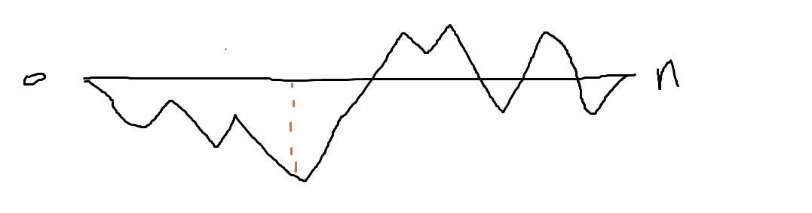

比如此图记录了从0的累积油，红线处为最低点。我们需要的就是从后往前看需要多少才能填补这个负数。

你可能会说红线处后面还是为负啊？但要知道这是全局最低点 也就是说从红线到结尾没有比这更低的点了，他们的累积效果是正的，油量有富余。如果把它能填平，又因为是唯一解，肯定是那个点了。

#### [135. 分发糖果 - 力扣（Leetcode）](https://leetcode.cn/problems/candy/)

找到低谷？这样太复杂

没想到解法

参考：

这道题目一定是要确定一边之后，再确定另一边，例如比较每一个孩子的左边，然后再比较右边，**如果两边一起考虑一定会顾此失彼**。

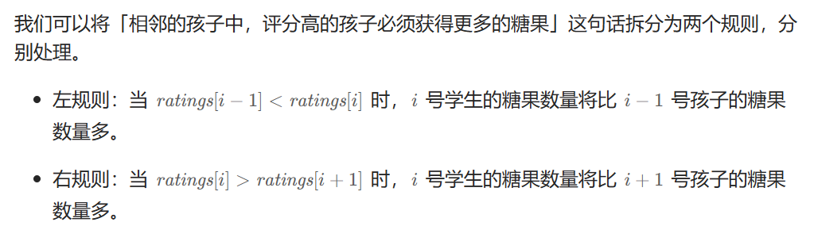

满足这两个规则就满足了总的规则。

```js
var candy = function (ratings) {
    // 记录每个位置分的糖果，糖果最少为1
    let candys = new Array(ratings.length).fill(1)

    // 规则拆分
    // 相邻的学生中，评分高的学生必须获得更多的糖果 等价于 所有学生满足左规则且满足右规则。
    for (let i = 1; i < ratings.length; i++) {
        // 左规则：若当前元素分数大于上一个 则糖果比上一个多1，否则置为1(这里本身就默认为1)
        if (ratings[i] > ratings[i - 1]) {
            candys[i] = candys[i - 1] + 1
        }
    }

    for (let i = ratings.length - 2; i >= 0; i--) {
        // 右规则：若当前元素大于后一个 则糖果比后一个多一个 但也要考虑左规则 取两者的大值
        if (ratings[i] > ratings[i + 1]) {
            candys[i] = Math.max(candys[i], candys[i + 1] + 1)
        }
    }

    let count = candys.reduce((a, b) => {
        return a + b
    })
    return count
};
```

#### [860. 柠檬水找零 - 力扣（Leetcode）](https://leetcode.cn/problems/lemonade-change/)

记录我们手里的现金就行 并与要找的金额对比

注意的是这里只能用5 10 20 你不能再让用户找钱，比如你有张10块，就不能返还5块，所以false

想了想找钱的情况还挺多的，先从大额找，比如找15 先搜索10 再搜索5

有如下三种情况：

- 情况一：账单是5，直接收下。
- 情况二：账单是10，消耗一个5，增加一个10
- 情况三：账单是20，优先消耗一个10和一个5，如果不够，再消耗三个5

#### [406. 根据身高重建队列 - 力扣（Leetcode）](https://leetcode.cn/problems/queue-reconstruction-by-height/)

毫无头绪

本题有两个维度，h和k，看到这种题目一定要想如何确定一个维度，然后再按照另一个维度重新排列。(类似于135左右规则？)

**如果两个维度一起考虑一定会顾此失彼**。

身高一定是从大到小排（身高相同的话则k小的站前面），让高个子在前面。因为k代表的是前面更高的有几个。

**此时我们可以确定一个维度了，就是身高，前面的节点一定都比本节点高！**

那么只需要按照k为下标重新插入队列就可以了

按照身高排序之后，优先按身高高的people的k来插入，后序插入节点也不会影响前面已经插入的节点，最终按照k的规则完成了队列。

```js
var reconstructQueue = function(people) {
    let queue = []
    people.sort((a, b ) => {
        // 先按照身高怕 降序
        if(b[0] !== a[0]) {
            return b[0] - a[0]
        } else {
            // 升高相同 按照k值 k大的在后面
            return a[1] - b[1]
        }
        
    })

    // 这时候按k值插入就能满足条件
    // 因为前面都是比item高的，k为几就插到序号几，即可满足条件
    // 而后续的插入不会影响前面的状态，因为后续插入都比前面的小
    // 不管插入多少，仍然满足大于他的只有k个的条件
    for(let i = 0; i < people.length; i++) {
        queue.splice(people[i][1], 0, people[i])
    }
    return queue
};
```

**很巧妙！**

**最重要的是一定要学会差分问题，否则会顾此失彼！**

#### [452. 用最少数量的箭引爆气球 - 力扣（Leetcode）](https://leetcode.cn/problems/minimum-number-of-arrows-to-burst-balloons/)

第一映像：这里其实只用关心x坐标，将其安xstart排序，看相邻points的交集。有交集则可以用一根箭 无则需要新的箭

```js
var findMinArrowShots = function(points) {
    // 按照xstart升序排列
    points.sort((a,b)=> a[0]-b[0])
    let count = 1
    let cover = [points[0][0], points[0][1]]
    for( let i=1; i<points.length; i++) {
        cover = [Math.max(points[i][0],cover[0]), Math.min(points[i][1],cover[1])]
        if( cover[0]>cover[1]) {
            count += 1
            cover = [...points[i]]
        }
    }
    return count
};
```

#### [435. 无重叠区间 - 力扣（Leetcode）](https://leetcode.cn/problems/non-overlapping-intervals/)

和上提类似，依然先排序。

重叠的条件: `x[i][0]<x[i-1][1]` （排序后`x[i][0]>x[i][0]`）

重叠了删除右边界大的？ 因为重叠部分肯定保留 我们应该尽量减少右边的后续可能重叠部分  贪心

```js
var eraseOverlapIntervals = function(intervals) {
    intervals.sort((a,b)=> a[0]-b[0])
    let count = 0;
    for(let i = 1; i < intervals.length; i++) {
        if(intervals[i][0]<intervals[i-1][1]) {
            count += 1
            intervals[i][1] = Math.min(intervals[i][1], intervals[i-1][1])
        }
    }
    return count
};
```

#### [763. 划分字母区间 - 力扣（Leetcode）](https://leetcode.cn/problems/partition-labels/)

要尽可能多的字符串，所以能分就分

找每个字母的右边界？  

第一次遍历记录每个字母的左，右边界  用数组记录

找出无重叠的个数

其实只需要统计右边界

#### [56. 合并区间 - 力扣（Leetcode）](https://leetcode.cn/problems/merge-intervals/)

首先按照start排序

若下一个的start小于当前的end 则可尝试合并  end取大值

```js
var merge = function(intervals) {
    intervals.sort((a,b)=> a[0]-b[0])
    let temStart = intervals[0][0]
    let temEnd = intervals[0][1]
    const res = []
    for(let i=1; i<intervals.length; i++) {
        if(intervals[i][0]<=temEnd) {
            temEnd = Math.max(temEnd, intervals[i][1])
            continue
        }
        res.push([temStart, temEnd])
        temStart = intervals[i][0]
        temEnd = intervals[i][1]
    }
    res.push([temStart, temEnd])
    return res
};
```

#### [738. 单调递增的数字 - 力扣（Leetcode）](https://leetcode.cn/problems/monotone-increasing-digits/)

~~首先确定最高位 因为找的数一定小于等于当前数的最高位~~

~~先尝试等于 判断当前数第二位是否大于第一位， 大于等于 继续判断下一位 小于 前一位-1  后面的全9~~

不对 比如332 会得到329  等于的情况会更复杂

12215

从尾部进行？若小于前一位则 前一位-1 找到最高需要-1的索引 后面的全变9

```js
var monotoneIncreasingDigits = function (n) {
    let n_s = []
    while (n) {
        let tmp = n % 10
        n_s.unshift(tmp)
        n = Math.floor(n / 10)
    }
    let Lindex
    let res = []
    for(let i = n_s.length - 1; i >= 1; i--) {
        if(n_s[i]>=n_s[i-1]) continue
        n_s[i-1]-=1
        Lindex = i
    }
    return Number(n_s.slice(0,Lindex).join('')+'9'.repeat(n_s.length-Lindex))
};
```

#### [968. 监控二叉树 - 力扣（Leetcode）](https://leetcode.cn/problems/binary-tree-cameras/)

~~前序遍历  记录上一个遍历节点的状态 与上一个相反~~

第一个的比较难确认

**头结点**放不放摄像头也就省下**一个摄像头**， **叶子节点**放不放摄像头省下了的摄像头数量是**指数阶别**的。

**所以我们要从下往上看，局部最优：让叶子节点的父节点安摄像头，所用摄像头最少，整体最优：全部摄像头数量所用最少！**

所以采用后续遍历，然后隔两个放置一个摄像头

需要判断节点的状态，有三种

- 该节点无覆盖
- 本节点有摄像头
- 本节点有覆盖

遍历的时候我们需要处理空节点的情况，我们认为空节点是覆盖状态。这样就可以在叶子节点的父节点放置摄像头。

>空节点不能是无覆盖的状态，这样叶子节点就要放摄像头了，空节点也不能是有摄像头的状态，这样叶子节点的父节点就没有必要放摄像头了，而是可以把摄像头放在叶子节点的爷爷节点上。

那么递归的终止条件应该是遇到了空节点，此时应该返回2（有覆盖）

然后单层根据左右节点状态返回状态。

- 情况1：左右节点都有覆盖		中间节点应该就是无覆盖(其父亲安装摄像头)
- 情况2：左右节点至少有一个无覆盖的情况       中间节点（父节点）应该放摄像头(否则无覆盖的无法被监控)
- 情况3：左右节点至少有一个有摄像头   中间结点   应该是2（覆盖的状态）
- 情况4：头结点没有覆盖        递归结束之后，可能头结点 还有一个无覆盖的情况，所以递归结束之后，还要判断根节点，如果没有覆盖则安装摄像头。

```js
var minCameraCover = function (root) {
    let result = 0
    // 节点的状态0无覆盖，1摄像头，2被覆盖
    const traverse = (root) => {
        // 空节点认为被覆盖 否则叶子节点就需要安装摄像头
        if(!root) return 2
        // 后序遍历  从头选择只能让头结点摄像头减少 而从尾开始  能让所有叶子节点减少
        let left = traverse(root.left)
        let right = traverse(root.right)

        // 情况1：左右节点都有覆盖		中间节点应该就是无覆盖(其父亲安装摄像头)
        if(left === 2 && right === 2) {
            return 0
        }
        // 情况2：左右节点至少有一个无覆盖的情况       中间节点（父节点）应该放摄像头(否则无覆盖的无法被监控)
        if(left === 0 || right === 0) {
            result++
            return 1
        }
        // 情况3：左右节点至少有一个有摄像头   中间结点   应该是2（覆盖的状态）
        if(left === 1 || right === 1) {
            return 2
        }

        return -1

    }
    if(!traverse(root)) result++
    return result
};
```

## 动态规划

**动态规划五步曲**

1. 确定dp数组（dp table）以及下标的含义
2. 确定递推公式
3. dp数组如何初始化
4. 确定遍历顺序
5. 举例推导dp数组

#### [509. 斐波那契数 - 力扣（Leetcode）](https://leetcode.cn/problems/fibonacci-number/)

这道题用递归是非常简单的，不过可以从此题体会动态规划转移方程的妙处。

递归：

```js
var fib = function(n) {
    if(n<2) return n

    return fib(n-1) + fib(n-2)
};
```

可以尾递归减少存储空间，就不写了。

动态规划：

首先确定转移方程：

dp[i]=do[i-1]+dp[i-2]

初始化：

dp[0]=0,dp[1]=[1]

其实每次只有两个数 不需要记录如此多转移状态

```js
var fib = function(n) {
    if(n<2) return n
    let dp=[0,1];
    for(let i=2; i<=n; i+=2) {
        dp[0] = dp[0]+dp[1]
        dp[1] = dp[1]+ dp[0]
    }
    if(n%2===0) return dp[0]
    return dp[1]
};
```

#### [70. 爬楼梯 - 力扣（Leetcode）](https://leetcode.cn/problems/climbing-stairs/)

假设你正在爬楼梯。需要 `n` 阶你才能到达楼顶。

每次你可以爬 `1` 或 `2` 个台阶。你有多少种不同的方法可以爬到楼顶呢？

 也能递归

```js
var climbStairs = function(n) {
    let count = 0;

    const traverse = (n)=> {
        if(n === 0) {
            count+=1
            return
        }
        if(n<0) return
        traverse(n-1);
        traverse(n-2)
    }
    traverse(n)
    return count
};
```

动态规划：

dp[i]记录到i的可能方法

一次到第i层的可能到达方法

从i-1跳一层或者i-2跳两层

所以dp[i] = dp[i-1]+dp[i-2]

初始状态dp[1]=1 dp[0]=1

```js
var climbStairs = function(n) {
    let dp= new Array(n+1)
    dp[0] = 1, dp[1] = 1
    for(let i=2; i<=n; i++) {
        dp[i] = dp[i-1] + dp[i-2]
    }
    return dp[n]
};
```

```js
var climbStairs = function(n) {
    let dp= [1, 1]
    for(let i=2; i<=n; i++) {
        let tmp = dp[1]
        dp[1] = dp[1] + dp[0] 
        dp[0] = tmp
    }
    return dp[1]
};

```

#### [746. 使用最小花费爬楼梯 - 力扣（Leetcode）](https://leetcode.cn/problems/min-cost-climbing-stairs/)

70的加强版，多了一个考虑条件。

也很简单

记录当前i的费用是i-1的费用与i-2的费用的最小者再加上本身的费用

```js
var minCostClimbingStairs = function(cost) {
    let dp=[cost[0],cost[1]];
    for (let i=2; i<cost.length; i++) {
        let tmp = dp[1];
        dp[1] = Math.min(dp[0], dp[1])+cost[i];
        dp[0] = tmp;
    }
    return Math.min(dp[0], dp[1]);
};
```

#### [62. 不同路径 - 力扣（Leetcode）](https://leetcode.cn/problems/unique-paths/)

简单，就两种走法

向下或者向右一步，区别就是2维需要限制下走法

到点[i,j]的走法可能是从[i-1,j]或者[i,j-1]到达

所以dp[i,j] = dp[i-1,j] + [i,j-1]

然后注意下边界就可

初始状态dp[0,0]=1

```js
var uniquePaths = function(m, n) {
    let dp = Array(m).fill(0).map(x => Array(n).fill(0))
    for(let i = 0; i < m; i++) {
        for(let j = 0; j < n; j++) {
            if(i===0 && j===0){
                dp[i][j] = 1
            }else if(i===0){
                dp[i][j] = dp[i][j-1]
            }else if(j===0) {
                dp[i][j] = dp[i-1][j]
            }else {
                dp[i][j] = dp[i][j-1] + dp[i-1][j]
            }
        }
    }
    return dp[m-1][n-1]
};
```

#### [63. 不同路径 II - 力扣（Leetcode）](https://leetcode.cn/problems/unique-paths-ii/)

与62相比，多了障碍物判断。

遇到障碍，做特殊标记，记为0  说明无法到达该点

```js
var uniquePathsWithObstacles = function(obstacleGrid) {
    let m = obstacleGrid.length, n = obstacleGrid[0].length
    let dp = Array(m).fill(0).map(x => Array(n).fill(0))
    for(let i = 0; i < m; i++) {
        for(let j = 0; j < n; j++) {
            if(obstacleGrid[i][j] === 1) {
                dp[i][j] = 0
                continue
            }
            if(i===0 && j===0){
                dp[i][j] = 1
            }else if(i===0){
                dp[i][j] = dp[i][j-1]
            }else if(j===0) {
                dp[i][j] = dp[i-1][j]
            }else {
                dp[i][j] = dp[i][j-1] + dp[i-1][j]
            }
        }
    }
    return dp[m-1][n-1]
};
```

#### [343. 整数拆分 - 力扣（Leetcode）](https://leetcode.cn/problems/integer-break/)

当前数满足最大值有个因子是前面的最大值

比如说n=10

最大值就是 3*dp[7]   

所以dp[i]最大值一定出现在 dp[j]\(i-j) 与 (i - j) * j中  

而且一旦没有递增了就可以退出 取最后一个j对应的为最大值？（还没推导）

```js
var integerBreak = function(n) {
    // 为了更直观 索引号与值对应
    let dp = new Array(n + 1).fill(0)
    dp[2] = 1

    for(let i = 3; i <= n; i++) {
        for(let j = 1; j <= i / 2; j++) {
            dp[i] = Math.max(dp[i], dp[i - j] * j, (i - j) * j)
        }
    }
    return dp[n]
};

```

#### [96. 不同的二叉搜索树 - 力扣（Leetcode）](https://leetcode.cn/problems/unique-binary-search-trees/)

条件 二叉搜索树

第一想法是回溯，先固定第一层   这样很麻烦，用不到这个n的条件

既然他与n有关，我们可以找n与n-1之间的关系。   没看出来


**这里的关键是看子树，看布局，不要看数值**，别忘了我们就是求不同树的数量，并不用把搜索树都列出来，所以不用关心其具体数值的差异。

dp[i] += dp[j - 1] * dp[i - j]; ，j-1 为j为头结点左子树节点数量，i-j 为以j为头结点右子树节点数量

```js
const numTrees =(n) => {
    let dp = new Array(n+1).fill(0);
    dp[0] = 1;
    dp[1] = 1;

    for(let i = 2; i <= n; i++) {
        for(let j = 1; j <= i; j++) {
            dp[i] += dp[j-1] * dp[i-j];
        }
    }

    return dp[n];
};
```

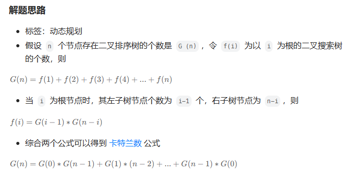

### 背包问题

#### 01 背包

有n件物品和一个最多能背重量为w 的背包。第i件物品的重量是weight[i]，得到的价值是value[i] 。**每件物品只能用一次**，求解将哪些物品装入背包里物品价值总和最大。

[leetcode-master/背包理论基础01背包-1.md at master · youngyangyang04/leetcode-master (github.com)](https://github.com/youngyangyang04/leetcode-master/blob/master/problems/背包理论基础01背包-1.md)

**一个商品如果可以重复多次放入是完全背包，而只能放入一次是01背包**

#### [416. 分割等和子集 - 力扣（Leetcode）](https://leetcode.cn/problems/partition-equal-subset-sum/)

最暴力 回溯  每次比较当前路径 与剩余路径是否相等。  而且若大于则直接剪枝

而且两个子集的元素和相等。那么只要找到集合里能够出现 sum / 2 的子集总和，就算是可以分割成两个相同元素和子集了。所以不需要计算剩余路径


因为是找总和为sum/2的子集(target)，其实就是背包问题。 

01背包中，dp[j] 表示： 容量为j的背包，所背的物品价值最大可以为dp[j]。

本题中每一个元素的数值既是重量，也是价值。

**套到本题，dp[j]表示 背包总容量（所能装的总重量）是j，放进物品后，背的最大重量为dp[j]**。

那么如果背包容量为target， dp[target]就是装满 背包之后的重量，所以 当 dp[target] == target 的时候，背包就装满了。

本题，相当于背包里放入数值，那么物品i的重量是nums[i]，其价值也是nums[i]。

所以递推公式：**dp[j] = max(dp[j], dp[j - nums[i]] + nums[i]);**

```js
var canPartition = function(nums) {
    const sum = (nums.reduce((p, v) => p + v));
    // 位运算判断是否为奇数
    if (sum & 1) return false;
    const dp = Array(sum / 2 + 1).fill(0);
    for(let i = 0; i < nums.length; i++) {
        for(let j = sum / 2; j >= nums[i]; j--) {
            dp[j] = Math.max(dp[j], dp[j - nums[i]] + nums[i]);
            if (dp[j] === sum / 2) {
                return true;
            }
        }
    }
    return dp[sum / 2] === sum / 2;
};
```

#### [1049. 最后一块石头的重量 II - 力扣（Leetcode）](https://leetcode.cn/problems/last-stone-weight-ii/)

背包

本题其实就是尽量让石头分成重量相同的两堆，相撞之后剩下的石头最小，**这样就化解成01背包问题了**。

这道题的关键就是要想到   目的是划分为重量相同的两堆，所以target就变成找总重量  而不是消除后的量 

这样问题就是经典的0-1问题

```js
var lastStoneWeightII = function (stones) {
    let sum = stones.reduce((s, n) => s + n);

    // 不一能完全消除，取floor得到的是能消除的两堆重量
    let dpLen = Math.floor(sum / 2);
    let dp = new Array(dpLen + 1).fill(0);

    for (let i = 0; i < stones.length; ++i) {
        for (let j = dpLen; j >= stones[i]; --j) {
            dp[j] = Math.max(dp[j], dp[j - stones[i]] + stones[i]);
        }
    }

    return sum - dp[dpLen] - dp[dpLen];
};
```

#### [494. 目标和 - 力扣（Leetcode）](https://leetcode.cn/problems/target-sum/)

每个数字选择一次

但这里每个值可能是+也可能是-  如何区分这两种？

既然为target，那么就一定有 left组合 - right组合 = target。left就是前面为+的数字集合，right是前面为-的数字组合

left + right = sum，而sum是固定的。right = sum - left

公式来了， left - (sum - left) = target 推导出 left = (target + sum)/2 。

target是固定的，sum是固定的，left就可以求出来。

此时问题就是在集合nums中找出和为left的组合。

这次和之前遇到的背包问题不一样了，之前都是求容量为j的背包，最多能装多少。

本题则是装满有几种方法。其实这就是一个组合问题了。

所以这里记录的不咋是质量，而是组合的种类数

只要搞到nums[i]），凑成dp[j]就有dp[j - nums[i]] 种方法。

例如：dp[j]，j 为5，

- 已经有一个1（nums[i]） 的话，有 dp[4]种方法 凑成 容量为5的背包。
- 已经有一个2（nums[i]） 的话，有 dp[3]种方法 凑成 容量为5的背包。
- 已经有一个3（nums[i]） 的话，有 dp[2]中方法 凑成 容量为5的背包
- 已经有一个4（nums[i]） 的话，有 dp[1]中方法 凑成 容量为5的背包
- 已经有一个5 （nums[i]）的话，有 dp[0]中方法 凑成 容量为5的背包

那么凑整dp[5]有多少方法呢，也就是把 所有的 dp[j - nums[i]] 累加起来。

所以求组合类问题的公式，都是类似这种：

```
dp[j] += dp[j - nums[i]]
```

```js
const findTargetSumWays = (nums, target) => {

    const sum = nums.reduce((a, b) => a+b);
    
    if(Math.abs(target) > sum) {
        return 0;
    }

    if((target + sum) % 2) {
        return 0;
    }

    const halfSum = (target + sum) / 2;

    let dp = new Array(halfSum+1).fill(0);
    dp[0] = 1;

    for(let i = 0; i < nums.length; i++) {
        for(let j = halfSum; j >= nums[i]; j--) {
            dp[j] += dp[j - nums[i]];
        }
    }

    return dp[halfSum];
};
```

#### [474. 一和零 - 力扣（Leetcode）](https://leetcode.cn/problems/ones-and-zeroes/)

当然可以回溯

但因为每个组只能有一次  是否能转换为0-1背包？

它的target又是什么呢？

关键是有m和n两个值

这里需要两个维度记录

**dp\[i][j]：最多有i个0和j个1的strs的最大子集的大小为dp\[i][j]**。记录的是子集的个数

```js
const findMaxForm = (strs, m, n) => {
    const dp = Array.from(Array(m+1), () => Array(n+1).fill(0));
    let numOfZeros, numOfOnes;

    for(let str of strs) {
        numOfZeros = 0;
        numOfOnes = 0;
    
        for(let c of str) {
            if (c === '0') {
                numOfZeros++;
            } else {
                numOfOnes++;
            }
        }

        for(let i = m; i >= numOfZeros; i--) {
            for(let j = n; j >= numOfOnes; j--) {
                dp[i][j] = Math.max(dp[i][j], dp[i - numOfZeros][j - numOfOnes] + 1);
            }
        }
    }

    return dp[m][n];
};
```

#### [518. 零钱兑换 II - 力扣（Leetcode）](https://leetcode.cn/problems/coin-change-ii/)

也可以回溯

dp\[i][j]代表用前i种硬币凑到j可能的方式

dp\[i][j] = dp\[i-1][j-value(i)] + dp\[i-1][j]

换为一维：dp[j] += dp[j-value(i)]

初始化dp[0]=1

```js
var change = function(amount, coins) {
    let dp = new Array(amount+1).fill(0);
    dp[0] = 1
    for(let i = 0; i< coins.length; i++){
        for(let j = coins[i]; j <= amount; j++) {
            dp[j] += dp[j-coins[i]]
        }
    }
    return dp[amount]
};
```

#### [377. 组合总和 Ⅳ - 力扣（Leetcode）](https://leetcode.cn/problems/combination-sum-iv/)

注意，顺序不同的序列被视作不同的组合。

可以回溯

这里用动态规划

**如果求组合数就是外层for循环遍历物品，内层for遍历背包**。

**如果求排列数就是外层for遍历背包，内层for循环遍历物品**。

如果把遍历nums（物品）放在外循环，遍历target的作为内循环的话，举一个例子：计算dp[4]的时候，结果集只有 {1,3} 这样的集合，不会有{3,1}这样的集合，因为nums遍历放在外层，3只能出现在1后面！

所以本题遍历顺序最终遍历顺序：**target（背包）放在外循环，将nums（物品）放在内循环，内循环从前到后遍历**。

这样才可以保证重复添加且顺序不同

因为先遍历物品，物品的防止放置顺序就被确定了 从0到i

所以先遍历target这样就能随时添加某个物品

```js
const combinationSum4 = (nums, target) => {

    let dp = Array(target + 1).fill(0);
    dp[0] = 1;

    for(let i = 0; i <= target; i++) {
        for(let j = 0; j < nums.length; j++) {
            if (i >= nums[j]) {
                dp[i] += dp[i - nums[j]];
            }
        }
    }

    return dp[target];
};

```

#### [70. 爬楼梯 - 力扣（Leetcode）](https://leetcode.cn/problems/climbing-stairs/)

也可以转换为背包问题

而且是排列

```js
var climbStairs = function(n) {
    let dp = new Array(n+1).fill(0)
    dp[0] = 1, dp[1] = 1
    let nums = [1, 2]
    for( let i=2; i<=n; i++) {
        for(let j=0; j<nums.length; j++) {
            dp[i] += dp[i-nums[j]]
        }
    }
    return dp[n]
};
```

#### [322. 零钱兑换 - 力扣（Leetcode）](https://leetcode.cn/problems/coin-change/)

与518类似，不过518求的是组合数，这里求得是最小硬笔数

dp[j]代表凑到j所需的最小硬币数

`  dp[j] = Math.min(dp[j], dp[j-coins[i]]+1)`

```js
var coinChange = function(coins, amount) {
    let dp = new Array(amount+1).fill(Infinity)
    dp[0] = 0
    for(let i = 0; i < coins.length; i++) {
        for(let j = coins[i]; j <= amount; j++) {
            dp[j] = Math.min(dp[j], dp[j-coins[i]]+1)
        }
    }
    if(dp[amount] ===  Infinity) return -1
    return dp[amount]
};
```

#### [279. 完全平方数 - 力扣（Leetcode）](https://leetcode.cn/problems/perfect-squares/)

第一印象是贪心，尽可能的大。

```js
var numSquares = function(n) {
    let count = 0;
    for (let i = n; i > 0; count++) {
        i -= Math.pow(Math.floor(Math.sqrt(i)), 2)
    }
    return count
};
```

但比如12会出现如9+1+1+1这种情况  比4+4+4多。 需要额外判断。


动态规划：

```js
var numSquares = function(n) {
    let num = Math.floor(Math.sqrt(n))
    let dp = new Array(n+1).fill(Infinity)
    dp[0] = 0
    for( let i = 1; i <= num; i++ ) {
        for( let j = i; j <= n; j++ ) {
            // 若小于则说明无法利用i  不用更新最小值
            if(j>=i*i)
                dp[j] = Math.min( dp[j], dp[j-(i*i)]+1)
        }
    }

    return dp[n]
};
```

优化  可以直接从i*2开始更新

`for( let j = i*i; j <= n; j++ ) `

#### [139. 单词拆分 - 力扣（Leetcode）](https://leetcode.cn/problems/word-break/)

**dp[i] : 字符串长度为i的话，dp[i]为true，表示可以拆分为一个或多个在字典中出现的单词**。

 

```js
const wordBreak = (s, wordDict) => {

    let dp = Array(s.length + 1).fill(false);
    dp[0] = true;

    for(let i = 0; i <= s.length; i++){
        for(let j = 0; j < wordDict.length; j++) {
            if(i >= wordDict[j].length) {
                if(s.slice(i - wordDict[j].length, i) === wordDict[j] && dp[i - wordDict[j].length]) {
                    dp[i] = true
                }
            }
        }
    }

    return dp[s.length];
}
```

#### [198. 打家劫舍 - 力扣（Leetcode）](https://leetcode.cn/problems/house-robber/description/)

一眼动态规划

dp[j]代表前j户所能偷到的最大金额

dp[j] = Math.max(dp[j-1],dp[j-2]+value(j))

```js
var rob = function(nums) {
    let dp_0 = 0, dp_1 = 0
    for(let i = 0; i < nums.length; i++) {
        let tmp = dp_1
        dp_1 = Math.max(dp_1, dp_0+nums[i])
        dp_0 = tmp
    }
    return dp_1
};
```

#### [213. 打家劫舍 II - 力扣（Leetcode）](https://leetcode.cn/problems/house-robber-ii/)

与198相比，增加了一个限制  围成了一圈  无法确定0 和 尾部 是否能使用

若进行记录太麻烦。

其实因为他们肯定不能同时被使用

我们可以把问题拆分为两种情况

- 一个是包含首部不包含尾部
- 一个是包含尾部不包含首部

这就和198一样，取两个的大值就行

```js
var rob = function(nums) {
    if(nums.length === 1) return nums[0]
    return Math.max(rob2(nums.slice(0,nums.length-1)), rob2(nums.slice(1)))
};

var rob2 = function(nums) {
    let dp_0 = 0, dp_1 = 0
    for(let i = 0; i < nums.length; i++) {
        let tmp = dp_1
        dp_1 = Math.max(dp_1, dp_0+nums[i])
        dp_0 = tmp
    }
    return dp_1
};
```

#### [337. 打家劫舍 III - 力扣（Leetcode）](https://leetcode.cn/problems/house-robber-iii/)

不再是数组，而是二叉树

很容易想到后续遍历

判断偷父亲节点和不偷两种情况，取他们的大值

```js
const rob = root => {
    // 后序遍历函数
    const postOrder = node => {
        // 递归出口
        if (!node) return [0, 0];
        // 遍历左子树
        const left = postOrder(node.left);
        // 遍历右子树
        const right = postOrder(node.right);
        // 不偷当前节点，左右子节点都可以偷或不偷，取最大值
        const DoNot = Math.max(left[0], left[1]) + Math.max(right[0], right[1]);
        // 偷当前节点，左右子节点只能不偷
        const Do = node.val + left[0] + right[0];
        // [不偷，偷]
        return [DoNot, Do];
    };
    const res = postOrder(root);
    // 返回最大值
    return Math.max(...res);
};
```

#### [121. 买卖股票的最佳时机 - 力扣（Leetcode）](https://leetcode.cn/problems/best-time-to-buy-and-sell-stock/)

贪心

```js
var maxProfit = function(prices) {
    let maxP = 0
    let min = prices[0]
    for(let i = 1; i < prices.length; i++) {
        maxP = prices[i]-min > maxP ? prices[i]-min : maxP
        min = prices[i]<min? prices[i]:min
    }
    return maxP
};
```

动态规划

dp\[i][0] 表示第i天持有股票所得最多现金

dp\[i][1] 表示第i天不持有股票所得最多现金

```js
const maxProfit = prices => {
    const len = prices.length;
    // 创建dp数组
    const dp = new Array(len).fill([0, 0]);
    // dp数组初始化
    dp[0] = [-prices[0], 0];
    for (let i = 1; i < len; i++) {
        // 更新dp[i]
        dp[i] = [
            Math.max(dp[i - 1][0], -prices[i]),
            Math.max(dp[i - 1][1], prices[i] + dp[i - 1][0]),
        ];
    }
    return dp[len - 1][1];
};
```

#### [122. 买卖股票的最佳时机 II - 力扣（Leetcode）](https://leetcode.cn/problems/best-time-to-buy-and-sell-stock-ii/)

以前用贪心做过，就是找出所有相邻两天正利润的可能  就是全局最大利润

现在试下动态规划：

```js
var maxProfit = function(prices) {
    const len = prices.length
    // dp[i][0]代表不持有股票的现金，dp[i][1]代表持有股票的现金
    let dp = new Array(len).fill([0,0])
    dp[0] = [0, -prices[0]]
    for (let i = 1; i < len; i++) {
        dp[i][0] = Math.max(dp[i-1][0], dp[i-1][1]+prices[i])
        dp[i][1] = Math.max(dp[i-1][1], dp[i-1][0]-prices[i])
    }

    return dp[len-1][0]
};
```

#### [123. 买卖股票的最佳时机 III - 力扣（Leetcode）](https://leetcode.cn/problems/best-time-to-buy-and-sell-stock-iii/)

限定最多两笔交易

1. 确定dp数组以及下标的含义

一天一共就有五个状态，

1. 没有操作 （其实我们也可以不设置这个状态）
2. 第一次持有股票
3. 第一次不持有股票
4. 第二次持有股票
5. 第二次不持有股票

dp\[i][j]中 i表示第i天，j为 [0 - 4] 五个状态，dp\[i][j]表示第i天状态j所剩最大现金。

需要注意：dp\[i][1]，**表示的是第i天，买入股票的状态，并不是说一定要第i天买入股票，这是很多同学容易陷入的误区**。

```js
达到dp[i][1]状态，有两个具体操作：

操作一：第i天买入股票了，那么dp[i][1] = dp[i-1][0] - prices[i]
操作二：第i天没有操作，而是沿用前一天买入的状态，即：dp[i][1] = dp[i - 1][1]
那么dp[i][1]究竟选 dp[i-1][0] - prices[i]，还是dp[i - 1][1]呢？

一定是选最大的，所以 dp[i][1] = max(dp[i-1][0] - prices[i], dp[i - 1][1]);

同理dp[i][2]也有两个操作：

操作一：第i天卖出股票了，那么dp[i][2] = dp[i - 1][1] + prices[i]
操作二：第i天没有操作，沿用前一天卖出股票的状态，即：dp[i][2] = dp[i - 1][2]
所以dp[i][2] = max(dp[i - 1][1] + prices[i], dp[i - 1][2])

同理可推出剩下状态部分：

dp[i][3] = max(dp[i - 1][3], dp[i - 1][2] - prices[i]);

dp[i][4] = max(dp[i - 1][4], dp[i - 1][3] + prices[i]);

const maxProfit = prices => {
    const len = prices.length;
    const dp = new Array(len).fill(0).map(x => new Array(5).fill(0));
    dp[0][1] = -prices[0];
    dp[0][3] = -prices[0];
    for (let i = 1; i < len; i++) {
        dp[i][0] = dp[i - 1][0];
        dp[i][1] = Math.max(dp[i - 1][1], dp[i - 1][0] - prices[i]);
        dp[i][2] = Math.max(dp[i - 1][2], dp[i - 1][1] + prices[i]);
        dp[i][3] = Math.max(dp[i - 1][3], dp[i - 1][2] - prices[i]);
        dp[i][4] = Math.max(dp[i - 1][4], dp[i - 1][3] + prices[i]);
    }
    return dp[len - 1][4];
};
```

#### [188. 买卖股票的最佳时机 IV - 力扣（Leetcode）](https://leetcode.cn/problems/best-time-to-buy-and-sell-stock-iv/)

123的升级，不再确定是2笔交易，而是k笔

```js
var maxProfit = function(k, prices) {
    const len = prices.length;
    const dp = new Array(len).fill(0).map(x => new Array(2*k+1).fill(0));
    for(let i = 1; i<2*k+1; i+=2) {
        dp[0][i] = -prices[0];
    }
    for(let i = 1; i< len; i++) {
        for(let j=1; j<2*k+1; j+=2) {
            dp[i][j] = Math.max(dp[i - 1][j], dp[i - 1][j-1] - prices[i]);
            dp[i][j+1] = Math.max(dp[i - 1][j+1], dp[i - 1][j] + prices[i]);
        }
    }
    return dp[len - 1][2*k];
};
```

#### [309. 最佳买卖股票时机含冷冻期 - 力扣（Leetcode）](https://leetcode.cn/problems/best-time-to-buy-and-sell-stock-with-cooldown/)

增加了一个冷冻期  用贪心不太方便了

具体可以区分出如下四个状态：

- 状态一：持有股票状态（今天买入股票，或者是之前就买入了股票然后没有操作，一直持有）
- 不持有股票状态，这里就有两种卖出股票状态
  - 状态二：保持卖出股票的状态（两天前就卖出了股票，度过一天冷冻期。或者是前一天就是卖出股票状态，一直没操作）
  - 状态三：今天卖出股票
- 状态四：今天为冷冻期状态，但冷冻期状态不可持续，只有一天！

```js
var maxProfit = function(prices) {
    let len = prices.length
    let dp = new Array(len).fill().map(()=>new Array(4).fill(0))
    dp[0][0] = -prices[0]
    for(let i = 1; i < len; i++) {
        dp[i][0] = Math.max(dp[i-1][0], dp[i-1][1]-prices[i], dp[i-1][3]-prices[i])
        dp[i][1] = Math.max(dp[i-1][1], dp[i-1][3])
        dp[i][2] = dp[i-1][0]+prices[i]
        dp[i][3] = dp[i-1][2]
    }
    return Math.max(dp[len-1][1], dp[len-1][2], dp[len-1][3])
};

```

#### [714. 买卖股票的最佳时机含手续费 - 力扣（Leetcode）](https://leetcode.cn/problems/best-time-to-buy-and-sell-stock-with-transaction-fee/)

动态规划ez

创造二维数组这两种填充会出问题`let dp = new Array(len).fill([0, 0])  let dp = new Array(len).fill(new Array(2).fill(0))`

因为每个填充的都是同一个数组的引用

修改一个会影响其他的

所以需要map对没一个进行填充

```js
var maxProfit = function(prices, fee) {
    let len = prices.length
    let dp = new Array(len).fill().map(()=>new Array(2).fill(0))
    dp[0][0] = -prices[0]
    for(let i = 1; i < len; i++) {
        dp[i][0] = Math.max(dp[i-1][0], dp[i-1][1]-prices[i])
        dp[i][1] = Math.max(dp[i-1][1], dp[i-1][0]+prices[i]-fee)
    }
    return dp[len - 1][1]
};
```

贪心算法并不好理解，也很容易出错

主要是卖出日期不好算了，但也没有必要算出准确的卖出日期，只要当前价格大于（最低价格+手续费），就可以收获利润，至于准确的卖出日期，就是连续收获利润区间里的最后一天（并不需要计算是具体哪一天）

#### [300. 最长递增子序列 - 力扣（Leetcode）](https://leetcode.cn/problems/longest-increasing-subsequence/)

值有记录以i结尾的最长递增子序列才好比较  若是前i个的最长子序列则不好比较。

```js
var lengthOfLIS = function(nums) {
    let len = nums.length
    const dp = new Array(len).fill(1)

    for(let i = 0; i < len; i++) {
        for(let j = 0; j <i; j++) {
            if(nums[i] > nums[j]) {
                dp[i] = Math.max(dp[i], dp[j]+1)
            }
        }
    }
    return Math.max(...dp)
};
```

#### [674. 最长连续递增序列 - 力扣（Leetcode）](https://leetcode.cn/problems/longest-continuous-increasing-subsequence/)

需要是连续的子序列，反而更简单了  之和前一位有关了

```js
var findLengthOfLCIS = function(nums) {
    const len = nums.length;
    let result = 1;
    const dp = new Array(len).fill(1);

    for(let i = 1; i < len; i++) {
        if(nums[i] > nums[i-1]) dp[i] = dp[i-1]+1;
        result = result>dp[i] ? result : dp[i];
    }
    return result;
};
```

也可以贪心

```js
const findLengthOfLCIS = (nums) => {
    if(nums.length === 1) {
        return 1;
    }

    let maxLen = 1;
    let curMax = 1;
    let cur = nums[0];

    for(let num of nums) {
        if(num > cur) {
            curMax += 1;   // 连续记录
            maxLen =  Math.max(maxLen, curMax);
        } else { // 不连续，count从头开始
            curMax = 1;
        }
        cur = num;
    }

    return maxLen;
};
```

#### [718. 最长重复子数组 - 力扣（Leetcode）](https://leetcode.cn/problems/maximum-length-of-repeated-subarray/)

本题其实是动规解决的经典题目，我们只要想到 用二维数组可以记录两个字符串的所有比较情况，这样就比较好推 递推公式了。

`dp[i][j] ：以下标i - 1为结尾的A，和以下标j - 1为结尾的B，最长重复子数组长度为dp[i][j]。 `

```js
const findLength = (A, B) => {
    // A、B数组的长度
    const [m, n] = [A.length, B.length];
    // dp数组初始化，都初始化为0
    const dp = new Array(m + 1).fill(0).map(x => new Array(n + 1).fill(0));
    // 初始化最大长度为0
    let res = 0;
    for (let i = 1; i <= m; i++) {
        for (let j = 1; j <= n; j++) {
            // 遇到A[i - 1] === B[j - 1]，则更新dp数组
            if (A[i - 1] === B[j - 1]) {
                dp[i][j] = dp[i - 1][j - 1] + 1;
            }
            // 更新res
            res = dp[i][j] > res ? dp[i][j] : res;
        }
    }
    // 遍历完成，返回res
    return res;
};
```

#### [1143. 最长公共子序列 - 力扣（Leetcode）](https://leetcode.cn/problems/longest-common-subsequence/)

依然选择动态规划算法

dp\[i][j]代表text1的前第i个字符和text2前j个字符的最长公共子序列

关键是处理text1[i - 1]与text2[j - 1]是否相等

```js
var longestCommonSubsequence = function(text1, text2) {
    const len = text1.length
    const len2 = text2.length
    const dp = new Array(len+1).fill().map(()=>new Array(len2+1).fill(0))

    for( let i = 1; i <= len; i++ ) {
        for( let j = 1; j <= len2; j++ ) {
            if ( text1[i-1] === text2[j-1] ) {
                dp[i][j] = dp[i-1][j-1] + 1
            } else {
                dp[i][j] = Math.max(dp[i - 1][j], dp[i][j - 1]);
            }
        }
    }
    return dp[len][len2]
};
```

#### [1035. 不相交的线 - 力扣（Leetcode）](https://leetcode.cn/problems/uncrossed-lines/)

其实是在找最长子序列

```js
var maxUncrossedLines = function(nums1, nums2) {
    const len1 = nums1.length, len2 = nums2.length
    const dp = new Array(len1+1).fill().map(()=>new Array(len2+1).fill(0))

    for(let i = 1; i <= len1; i++) {
        for(let j = 1; j <= len2; j++) {
            if(nums1[i-1] === nums2[j-1]) {
                dp[i][j] = dp[i-1][j-1] + 1
            } else {
                dp[i][j] = Math.max(dp[i-1][j], dp[i][j-1])
            }
        }
    }
    
    return dp[len1][len2]
};
```

#### [53. 最大子数组和 - 力扣（Leetcode）](https://leetcode.cn/problems/maximum-subarray/)

贪心做过，可以尝试分治法

```js
var maxSubArray = function(nums) {
    const len = nums.length;
    const dp = new Array(len).fill(0);
    dp[0] = nums[0]
    let res =  dp[0]
    for( let i = 1; i < len; i++) {
        dp[i] = Math.max(dp[i - 1] + nums[i], nums[i]);
        res = res > dp[i] ? res : dp[i];
    }
    return res
};
```

#### [392. 判断子序列 - 力扣（Leetcode）](https://leetcode.cn/problems/is-subsequence/)

双指针

```js
var isSubsequence = function(s, t) {
    let index1 = 0, index2 = 0

    while(index2 < t.length) {
        if(s[index1] === t[index2]) {
            index1++;
        }      
            index2++;
    }
    return index1 === s.length? true: false
};
```

动态规划：

```js
const isSubsequence = (s, t) => {
    // s、t的长度
    const [m, n] = [s.length, t.length];
    // dp全初始化为0
    const dp = new Array(m + 1).fill(0).map(x => new Array(n + 1).fill(0));
    for (let i = 1; i <= m; i++) {
        for (let j = 1; j <= n; j++) {
            // 更新dp[i][j]，两种情况
            if (s[i - 1] === t[j - 1]) {
                dp[i][j] = dp[i - 1][j - 1] + 1;
            } else {
                dp[i][j] = dp[i][j - 1];
            }
        }
    }
    // 遍历结束，判断dp右下角的数是否等于s的长度
    return dp[m][n] === m ? true : false;
};
```

#### [115. 不同的子序列 - 力扣（Leetcode）](https://leetcode.cn/problems/distinct-subsequences/)

记录t前j在s前i个子序列中出现的次数

```js
var numDistinct = function(s, t) {
    const [m, n] = [s.length, t.length]
    const dp = new Array(m+1).fill().map(()=>new Array(n+1).fill(0))
    // 从s前i个中取得空子序列的个数为1，即全部删除
    for(let i = 0; i< m; i++) dp[i][0] = 1

    for(let i = 1; i <= m; i++) {
        for(let j = 1; j <= n; j++) {
            if(s[i-1] === t[j-1]) {
                dp[i][j] = dp[i-1][j-1] + dp[i-1][j]
            } else {
                dp[i][j] = dp[i-1][j]
            }
        }
    }

    return dp[m][n]
};
```

#### [583. 两个字符串的删除操作 - 力扣（Leetcode）](https://leetcode.cn/problems/delete-operation-for-two-strings/)

通过删除使两个字符串相等，所以要照到最长公共子序列

然后计算删除了几个。

```js
var minDistance = function (word1, word2) {
    const [m, n] = [word1.length, word2.length]
    const dp = new Array(m + 1).fill().map(() => new Array(n + 1).fill(0))

    for (let i = 1; i <= m; i++) {
        for (let j = 1; j <= n; j++) {
            if (word1[i - 1] === word2[j - 1]) {
                dp[i][j] = dp[i-1][j-1]+1
            } else {
                dp[i][j] = Math.max(dp[i-1][j], dp[i][j-1])
            }
        }
    }

    return m+n-2*dp[m][n]
};
```

#### [72. 编辑距离 - 力扣（Leetcode）](https://leetcode.cn/problems/edit-distance/)

重点是理解word2添加一个元素，相当于word1删除一个元素，例如 word1 = "ad" ，word2 = "a"，word1删除元素'd' 和 word2添加一个元素'd'，变成word1="a", word2="ad"， 最终的操作数是一样！

```js
const minDistance = (word1, word2) => {
    let dp = Array.from(Array(word1.length + 1), () => Array(word2.length+1).fill(0));

    for(let i = 1; i <= word1.length; i++) {
        dp[i][0] = i; 
    }

    for(let j = 1; j <= word2.length; j++) {
        dp[0][j] = j;
    }

    for(let i = 1; i <= word1.length; i++) {
        for(let j = 1; j <= word2.length; j++) {
            if(word1[i-1] === word2[j-1]) {
                dp[i][j] = dp[i-1][j-1];
            } else {
                dp[i][j] = Math.min(dp[i-1][j] + 1, dp[i][j-1] + 1, dp[i-1][j-1] + 1);
            }
        }
    }
    
    return dp[word1.length][word2.length];
};
```

#### [647. 回文子串 - 力扣（Leetcode）](https://leetcode.cn/problems/palindromic-substrings/)

回文字符串可以先找到中心，然后扩散，这样不会重复。

分为奇偶两种情况

```js
function countSubstrings(s) {
    let count = 0;
    for (let i = 0; i < s.length; i++) {
        // 以s[i]为中心，查找奇数长度的回文子串
        count += countPalindromicSubstrings(s, i, i);
        // 以s[i]和s[i+1]为中心，查找偶数长度的回文子串
        count += countPalindromicSubstrings(s, i, i + 1);
    }
    return count;
}

function countPalindromicSubstrings(s, left, right) {
    let count = 0;
    while (left >= 0 && right < s.length && s[left] === s[right]) {
        count++;
        left--;
        right++;
    }
    return count;
}
```

动态规划：

一维dp难以描述，考虑二维ij描述区间

布尔类型的dp[i][j]：表示区间范围[i,j] （注意是左闭右闭）的子串是否是回文子串，如果是dp[i][j]为true，否则为false。

在确定递推公式时，就要分析如下几种情况。

整体上是两种，就是s[i]与s[j]相等，s[i]与s[j]不相等这两种。

当s[i]与s[j]不相等，那没啥好说的了，dp[i][j]一定是false。

当s[i]与s[j]相等时，这就复杂一些了，有如下三种情况

- 情况一：下标i 与 j相同，同一个字符例如a，当然是回文子串
- 情况二：下标i 与 j相差为1，例如aa，也是回文子串
- 情况三：下标：i 与 j相差大于1的时候，例如cabac，此时s[i]与s[j]已经相同了，我们看i到j区间是不是回文子串就看aba是不是回文就可以了，那么aba的区间就是 i+1 与 j-1区间，这个区间是不是回文就看dp\[i + 1][j - 1]是否为true。

这里的遍历顺序很重要，**一定要从下到上，从左到右遍历，这样保证dp[i + 1][j - 1]都是经过计算的**。

```js
function countSubstrings(s) {
    let count = 0;
    const len = s.length;
    let dp = new Array(len).fill().map(() => new Array(len).fill(false))

    for(let i = len-1; i >= 0; i--) {
        for(let j = i; j< len; j++) {
            if(s[i] === s[j]) {
                if(i === j) dp[i][j] = true;
                else if(i === j-1) dp[i][j] = true;
                else {
                    dp[i][j] = dp[i+1][j-1]
                }
                if(dp[i][j] === true) count++;
            }
        }
    }
    return count;
}
```

#### [516. 最长回文子序列 - 力扣（Leetcode）](https://leetcode.cn/problems/longest-palindromic-subsequence/)

可以两层for+判断是否回文暴力解答

回文字符串需要判断两边，所以二维dp

dp\[i][j]记录i到j的最长回文子序列

如果s[i] = s[j] dp\[i][j] =  dp\[i+1][j-1]+2

如果s[i]与s[j]不相同，说明s[i]和s[j]的同时加入 并不能增加[i,j]区间回文子序列的长度，那么分别加入s[i]、s[j]看看哪一个可以组成最长的回文子序列。

加入s[j]的回文子序列长度为dp\[i + 1][j]。

加入s[i]的回文子序列长度为dp\[i][j - 1]。

那么dp\[i][j]一定是取最大的，即：dp\[i][j] = max(dp\[i + 1][j], dp\[i][j - 1]);

```js
var longestPalindromeSubseq = function (s) {
    let len = s.length
    const dp = new Array(len).fill().map(() => new Array(len).fill(0))
    for (let i = len - 1; i >= 0; i--) {
        for (let j = i; j < len; j++) {
            if (s[i] === s[j]) {
                if(j === i) {
                    dp[i][j] = 1
                } else {
                    dp[i][j] = dp[i + 1][j - 1] + 2
                }
            } else {
                dp[i][j] = Math.max(dp[i+1][j], dp[i][j-1])
            }
        }
    }
    return dp[0][len - 1]
};
```

## 其他

#### [739. 每日温度 - 力扣（Leetcode）](https://leetcode.cn/problems/daily-temperatures/)

最简单两个for依次遍历，看下一个更高的位置

```js
var dailyTemperatures = function(temperatures) {
    const len = temperatures.length
    let res = new  Array(len).fill(0);

    for(let i = 0; i < len; i++) {
        for(let j = i+1; j < len; j++) {
            if(temperatures[j]>temperatures[i]) {
                res[i] = j-i;
                break;
            }
        }
    }

    return res;
};
```

虽然能过就，但两次遍历复杂度太高了

尝试优化

**通常是一维数组，要寻找任一个元素的右边或者左边第一个比自己大或者小的元素的位置，此时我们就要想到可以用单调栈了**。时间复杂度为O(n)。

用单调栈记录索引

```js
var dailyTemperatures2 = function (temperatures) {
    const len = temperatures.length
    let res = new Array(len).fill(0);
    let stack = [0];
    for (let i = 1; i < len; i++) {
        while (stack.length){
            let tmp = stack.pop()
            if (temperatures[i] > temperatures[tmp]) {
                res[tmp] = i - tmp
            } else {
                stack.push(tmp)
                break
            }
        }
        stack.push(i)
    }

    return res;
};
```

#### [496. 下一个更大元素 I - 力扣（Leetcode）](https://leetcode.cn/problems/next-greater-element-i/)

样本比较少，可以暴力

```js
var nextGreaterElement = function(nums1, nums2) {
    let res = new Array(nums1.length).fill(-1)

    for(let i = 0; i < nums1.length; i++) {
        let j = 0
        for(j; j < nums2.length; j++) {
            if(nums1[i] === nums2[j]) {
                break
            }
        }
        let k =j+1
        for(k; k<nums2.length; k++) {
            if(nums2[k] > nums2[j]) {
                res[i] = nums2[k]
                break
            }
        }
    }

    return res
};
```

单调栈优化：

先把nums2每个元素右侧第一个更大元素找到，和739一样。再用map记录。然后偏离nums1去map取值就可以了

```js
var nextGreaterElement = function(nums1, nums2) {
    const map = new Map();
    const stack = [];
    for (let i = nums2.length - 1; i >= 0; --i) {
        const num = nums2[i];
        while (stack.length && num >= stack[stack.length - 1]) {
            stack.pop();
        }
        map.set(num, stack.length ? stack[stack.length - 1] : -1);
        stack.push(num);
    }
    const res = new Array(nums1.length).fill(0).map((_, i) => 			map.get(nums1[i]));
    return res;
};
```

#### [503. 下一个更大元素 II - 力扣（Leetcode）](https://leetcode.cn/problems/next-greater-element-ii/)

和730一样，不过换成了循环数组

```js
var nextGreaterElements = function(nums) {
    let n = nums.length;
    let res = new Array(n).fill(-1);
    for(let i = 0; i < n; i++) {
        let j = (i+1)%n
        while(j !== i) {
            if(nums[j] > nums[i]) {
                res[i] = nums[j];
                break;
            }
            j = (j+1)%n
        }
    }
    return res;
};
```

单调栈：

可以帮两个数组拼接在一起计算单调栈

```js
var nextGreaterElements = function (nums) {
  const len = nums.length;
  let stack = [];
  let res = Array(len).fill(-1);
  for (let i = 0; i < len * 2; i++) {
    while (
      stack.length &&
      nums[i % len] > nums[stack[stack.length - 1]]
    ) {
      const index = stack.pop();
      res[index] = nums[i % len];
    }
    stack.push(i % len);
  }
  return res;
};
```

#### [42. 接雨水 - 力扣（Leetcode）](https://leetcode.cn/problems/trapping-rain-water/)

每个柱子水量以两端最小值为参考

```js
var trap = function(height) {
    const len = height.length;
    let sum = 0;
    for(let i = 0; i < len; i++){
        // 第一个柱子和最后一个柱子不接雨水
        if(i == 0 || i == len - 1) continue;
        let rHeight = height[i]; // 记录右边柱子的最高高度
        let lHeight = height[i]; // 记录左边柱子的最高高度
        for(let r = i + 1; r < len; r++){
            if(height[r] > rHeight) rHeight = height[r];
        }
        for(let l = i - 1; l >= 0; l--){
            if(height[l] > lHeight) lHeight = height[l];
        }
        let h = Math.min(lHeight, rHeight) - height[i];
        if(h > 0) sum += h;
    }
    return sum;
};
```

#### [84. 柱状图中最大的矩形 - 力扣（Leetcode）](https://leetcode.cn/problems/largest-rectangle-in-histogram/)

暴力 以一段i到j的最小值为基准  再乘以i-j

```js
var largestRectangleArea = function(heights) {
    let res = 0;
    for(let i = 0; i < heights.length; i++) {
        let min = heights[i];
        for(let j = i; j < heights.length; j++) {
            if(heights[j]<min) {
                min = heights[j];
            }
            res = Math.max(res, [j-i+1]*min)
        }
    }
    return res;
};
```

超时


单调栈

遍历每个高度，是要以当前高度为基准，寻找最大的宽度 组成最大的矩形面积那就是要找左边第一个小于当前高度的下标left，再找右边第一个小于当前高度的下标right 那宽度就是这两个下标之间的距离了 但是要排除这两个下标 所以是right-left-1 用单调栈就可以很方便确定这两个边界了

```js
var largestRectangleArea = function(heights) {
    let maxArea = 0;
    const stack = [];
    heights = [0,...heights,0]; // 数组头部加入元素0 数组尾部加入元素0
    for(let i = 0; i < heights.length; i++){ // 当前遍历的元素heights[i]小于栈顶元素heights[stack[stack.length-1]]]的情况
        while(heights[i] < heights[stack[stack.length-1]]){// 当前bar比栈顶bar矮
            const stackTopIndex = stack.pop();// 栈顶元素出栈，并保存栈顶bar的索引
            let w = i - stack[stack.length -1] - 1;
            let h = heights[stackTopIndex]
            // 计算面积，并取最大面积
            maxArea = Math.max(maxArea, w * h);
        }
        stack.push(i);// 当前bar比栈顶bar高了，入栈
    }
    return maxArea;
};
```

找当前高度所能到达的宽度

用单调栈记录高度  若持续增高则入栈，因为说明前面的高度还能支持

直到遇到小于的说明栈顶元素高度不能被支持了

栈顶元素的值 即高 乘以当前坐标i-栈顶元素坐标j 即宽  栈顶元素高度所能支持的最大面积

然后弹出栈顶，验证第二个栈顶元素是否能被支持，若不能，继续弹出，直到栈为空。

若可以支持了，则继续往下一个遍历，说面还能扩展。
