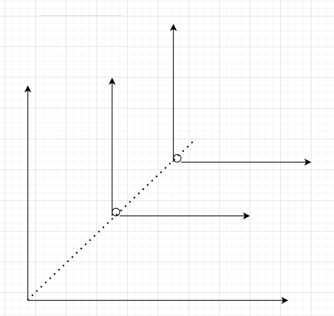
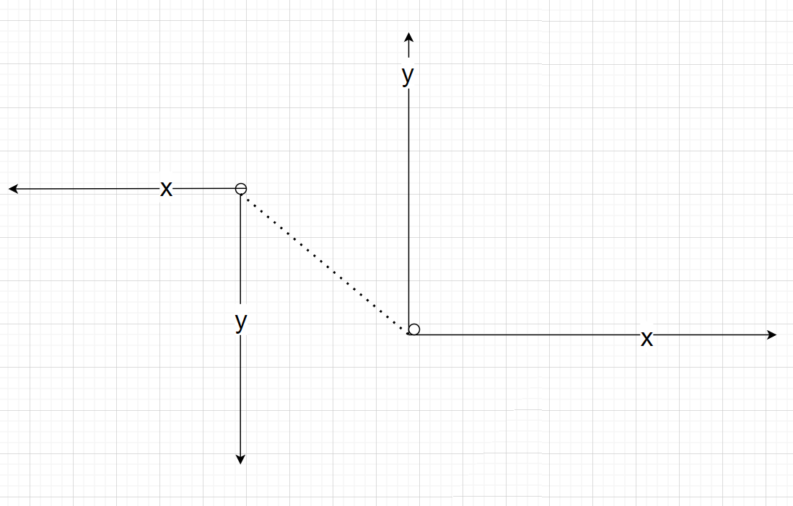
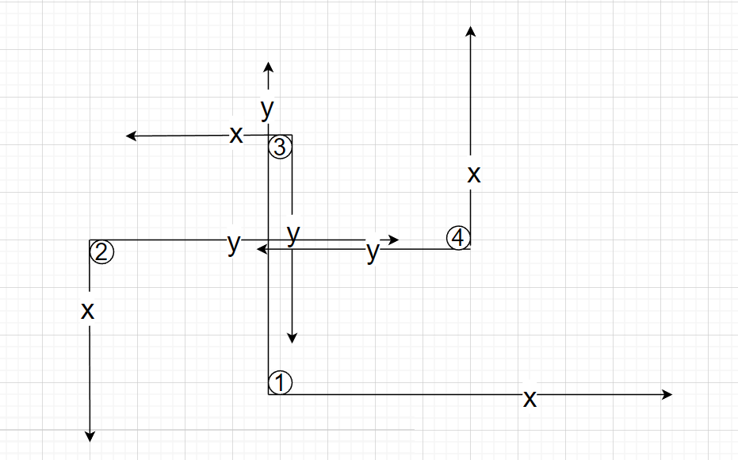

#### [1590. 使数组和能被 P 整除 - 力扣（Leetcode）](https://leetcode.cn/problems/make-sum-divisible-by-p/description/)


#### [2383. 赢得比赛需要的最少训练时长 - 力扣（Leetcode）](https://leetcode.cn/problems/minimum-hours-of-training-to-win-a-competition/)

返回击败全部 `n` 个对手需要训练的 **最少** 小时数目。

题目很长，看着吓人  但这个对手顺序是固定的，就简单了很多

首先 精力是一定会减少的  所以我们必须训练到  大于对手精力和

然后判断经验值

initialExperience记录当前经验，与对手相比，不大于 则训练，让它大于。

```js
var minNumberOfHours = function(initialEnergy, initialExperience, energy, experience) {
    let trainEnergy = energy.reduce((a,b) => a+b) - initialEnergy + 1;
    trainEnergy = trainEnergy > 0 ? trainEnergy : 0 
    let trainExperience = 0
    for(let i = 0; i < experience.length; i++) {
        if(initialExperience <= experience[i]) {
            trainExperience += experience[i] - initialExperience + 1
            initialExperience += experience[i] - initialExperience + 1
        }
        initialExperience += experience[i]
    }
    return trainExperience+ trainEnergy
};
```

#### [1605. 给定行和列的和求可行矩阵 - 力扣（Leetcode）](https://leetcode.cn/problems/find-valid-matrix-given-row-and-column-sums/)

暴力枚举  过于暴力

没想到其它方法  感觉应该是数学推导

这道题可以使用贪心算法来解决。我们可以从左上角开始构建矩阵，依次填充每个格子。每次我们需要填充的格子是当前行和当前列中剩余未填充的格子中，值最小的格子。

具体来说，假设当前需要填充的格子是第 i 行、第 j 列的格子，那么我们可以将它的值设为 min(rowSum[i], colSum[j])。填充完这个格子后，我们将 rowSum[i] 和 colSum[j] 减去相应的值，表示第 i 行和第 j 列已经被填充了。

当我们填充完最后一个格子时，就构建出了一个符合要求的矩阵。具体实现过程可以参考下面的代码：

```js
function restoreMatrix(rowSum, colSum) {
  const n = rowSum.length;
  const m = colSum.length;
  const matrix = new Array(n).fill().map(() => new Array(m).fill(0));
  for (let i = 0, j = 0; i < n && j < m;) {
    const val = Math.min(rowSum[i], colSum[j]);
    matrix[i][j] = val;
    rowSum[i] -= val;
    colSum[j] -= val;
    if (rowSum[i] === 0) i++;
    if (colSum[j] === 0) j++;
  }
  return matrix;
}
```

时间复杂度为 O(nm)，其中 n 和 m 分别是 rowSum 和 colSum 的长度。

不要想得太复杂，因为有很多种解法。贪心即可。

竟可能的消耗行和，列和。

且被消耗完就可以换行或列，因为其它肯定为0。

#### [1615. 最大网络秩 - 力扣（Leetcode）](https://leetcode.cn/problems/maximal-network-rank/)

求两个节点的最大秩

~~统计每个节点出现的次数，然后前两名相加就可得到~~

这样会重复计算边  需要去重

```js
var maximalNetworkRank = function (n, roads) {
    // 初始化城市网络秩数组
    const cityRank = new Array(n).fill(0);

    // 遍历所有的道路，记录城市的网络秩
    for (const [a, b] of roads) {
        cityRank[a]++;
        cityRank[b]++;
    }

    // 计算最大网络秩
    let maxRank = 0;
    for (let i = 0; i < n; i++) {
        for (let j = i + 1; j < n; j++) {
            let rank = cityRank[i] + cityRank[j];
            // 两城市之间的直线只记录一次
            if (roads.some(([a, b]) => a === i && b === j || a === j && b === i)) {
                rank--;
            }
            maxRank = Math.max(maxRank, rank);
        }
    }

    return maxRank;
};
```

在这个实现中，我们首先创建了一个长度为 `n` 的数组 `cityRank`，用于记录每个城市的网络秩。然后遍历所有的道路，更新相应的城市网络秩。

接下来，我们使用两个嵌套的循环来遍历所有的不同城市对。对于每对城市，我们计算它们的网络秩，同时检查它们之间是否有直接的道路。如果有，我们需要减去其中一个道路的贡献，以避免重复计算。最后，我们返回所有城市对的最大网络秩。

这个实现的时间复杂度为 $O(n^2)$，其中 $n$ 是城市的数量。

上述代码可以在遍历道路的时候直接记录两点之间是否相连，减少some操作

```js
var maximalNetworkRank = function (n, roads) {
    // 初始化城市网络秩数组
    const cityRank = new Array(n).fill(0);
    // 初始化记录两城市是否直接相连
    const connerct = new Array(n).fill().map(()=> new Array(n).fill(0))

    // 遍历所有的道路，记录城市的网络秩
    for (const [a, b] of roads) {
        connerct[a][b] = true
        connerct[b][a] = true
        cityRank[a]++
        cityRank[b]++
    }

    // 计算最大网络秩
    let maxRank = 0;
    for (let i = 0; i < n; i++) {
        for (let j = i + 1; j < n; j++) {
            let rank = cityRank[i] + cityRank[j];
            // 两城市之间的直线只记录一次
            if (connerct[i][j]) {
                rank--;
            }
            maxRank = Math.max(maxRank, rank);
        }
    }

    return maxRank;
};
```

#### [2488. 统计中位数为 K 的子数组 - 力扣（Leetcode）](https://leetcode.cn/problems/count-subarrays-with-median-k/)

中位数为k  所以首先一定会包含k

然后根据k来扩张其它结果

偶数扩张 需要满足新增元素大于k，这样才能保持偶数数组中位数位于左边

奇数扩张 需要满足小于

回溯？  会重复回溯  导致无法结束

不会

前缀和：

```js
var countSubarrays = function(nums, k) {
    const n = nums.length;
    let kIndex = nums.indexOf(k);

    let ans = 0;
    const counts = new Map();
    counts.set(0, 1);
    let sum = 0;
    for (let i = 0; i < n; i++) {
        sum += sign(nums[i] - k);
        if (i < kIndex) {
            counts.set(sum, (counts.get(sum) || 0) + 1);
        } else {
            // 要满足[i,j]子数组中位数为k  则前j个数组中大于k的 - 前i个数组中大于k的应该为0或者1
            const prev0 = (counts.get(sum) || 0);  // sum[i] = sum[j]
            const prev1 = (counts.get(sum - 1) || 0);   // sum[i] = sum[j]+1
            ans += prev0 + prev1;
        }
    }
    return ans;
}

const sign = (num) => {
    if (num === 0) {
        return 0;
    }
    return num > 0 ? 1 : -1;
};
```

#### [2389. 和有限的最长子序列 - 力扣（Leetcode）](https://leetcode.cn/problems/longest-subsequence-with-limited-sum/)

第一印象：前缀和

索然子序列意思是不改变元素顺序，因为不需要连续，改变了对本题没有影响。然后是最大长度，所以使用排序后的前缀和，然后在里面查找q值，就能得到最大长度。

```js
var answerQueries = function(nums, queries) {
    nums.sort((a,b)=> a-b)
    const n = nums.length;
    const m = queries.length;
    const presum = new Array(n).fill(0);
    const ans = new Array(m).fill(0);
    presum[0] = nums[0]
    for (let i = 1; i < n; i++) {
      presum[i] = presum[i - 1] + nums[i];
    }
    
    for (let i = 0; i < m; i++) {
      const q = queries[i];
      if(q<presum[0]) {
        ans.push[0]
        continue
      }
      let left = 0;
      let right = n;
      
      while (left < right) {
        const mid = Math.floor((left + right + 1) / 2);
        if (presum[mid] <= q) {
          left = mid;
        } else {
          right = mid - 1;
        }
      }
      
      ans[i] = left+1;
    }
    
    return ans;
};
```

#### [1616. 分割两个字符串得到回文串 - 力扣（Leetcode）](https://leetcode.cn/problems/split-two-strings-to-make-palindrome/)

```js
var checkPalindromeFormation = function(a, b) {
    return checkConcatenation(a, b) || checkConcatenation(b, a);
}

const checkConcatenation = (a, b) => {
    const n = a.length;
    let left = 0, right = n - 1;
    while (left < right && a[left] === b[right]) {
        left++;
        right--;
    }
    if (left >= right) {
        return true;
    }
    return checkSelfPalindrome(a, left, right) || checkSelfPalindrome(b, left, right);
}

const checkSelfPalindrome = (a, left, right) => {
    while (left < right && a[left] === a[right]) {
        left++;
        right--;
    }
    return left >= right;
};
```

#### [1012. 至少有 1 位重复的数字 - 力扣（Leetcode）](https://leetcode.cn/problems/numbers-with-repeated-digits/)

最简单暴力 😄

该函数使用了一个循环，遍历了从 1 到 n 的所有正整数，并对于每个正整数检查是否有重复数字。在内部，它使用了一个集合来存储当前数字的各个位数，如果发现重复的数字，就将计数器加一，并跳出内部循环。最后，该函数返回计数器的值，即在 [1, n] 范围内至少有一位重复数字的正整数的个数。

```js
var numDupDigitsAtMostN = function(n) {
    let count = 0;
    for (let i = 1; i <= n; i++) {
      let digits = new Set();
      let num = i;
      while (num > 0) {
        let digit = num % 10;
        if (digits.has(digit)) {
          count++;
          break;
        }
        digits.add(digit);
        num = Math.floor(num / 10);
      }
    }
    return count;
};
```

果然超时了

#### [1625. 执行操作后字典序最小的字符串 - 力扣（Leetcode）](https://leetcode.cn/problems/lexicographically-smallest-string-after-applying-operations/description/)

BFS遍历每次累加或者轮换，直到所有可能情况都遍历过

```js
var findLexSmallestString = function (s, a, b) {
    let ans = s, queue = [s], visited = new Set().add(s);

    while (queue.length) {
        const next = [];

        for (const q of queue) {
            // 是否最小
            if (q < ans) ans = q;

            // 轮转
            const rs = q.slice(q.length - b) + q.slice(0, q.length - b);
            if (!visited.has(rs)) visited.add(rs), next.push(rs);

            // 累加
            const arr = [...q];
            for (let i = 1; i < q.length; i += 2) {
                arr[i] = `${(+q[i] + a) % 10}`;
            }
            const as = arr.join('');
            if (!visited.has(as)) visited.add(as), next.push(as);
        }

        queue = next;
    }

    return ans;
}
```

#### [2469. 温度转换 - 力扣（Leetcode）](https://leetcode.cn/problems/convert-the-temperature/)

```js
var convertTemperature = function(celsius) {
    return [celsius+273.15, celsius*1.8+32]
};
```

#### [1626. 无矛盾的最佳球队 - 力扣（Leetcode）](https://leetcode.cn/problems/best-team-with-no-conflicts/)

年龄小的分数大于年龄大的会有矛盾，要无矛盾且得分最高。

先将运动员按年龄排序？年龄相同的按照分数升序排序，然后遍历。

用动态规划记录以第 i 名球员为最后一名球员的最大得分。

```js
var bestTeamScore = function (scores, ages) {
    const n = scores.length;
    const players = new Array(n);
    for (let i = 0; i < n; i++) {
        players[i] = { score: scores[i], age: ages[i] };
    }
    // 按照年龄升序排序，年龄相同的按照分数升序排序
    players.sort((a, b) => {
        if (a.age !== b.age) {
            return a.age - b.age;
        }
        return a.score - b.score;
    });
    // dp[i] 表示以第 i 名球员为最后一名球员的最大得分
    const dp = new Array(n).fill(0);
    let maxScore = 0;
    for (let i = 0; i < n; i++) {
        dp[i] = players[i].score;
        for (let j = 0; j < i; j++) {
            // 满足无矛盾条件
            if (players[i].score >= players[j].score || players[i].age === players[j].age) {
                dp[i] = Math.max(dp[i], dp[j] + players[i].score);
            }
        }
        maxScore = Math.max(maxScore, dp[i]);
    }
    return maxScore;
};
```

#### [1630. 等差子数组 - 力扣（Leetcode）](https://leetcode.cn/problems/arithmetic-subarrays/)

最简答的方法  遍历每个查询范围 然后排序 遍历 看是否是等差数列

```js
var checkArithmeticSubarrays = function(nums, l, r) {
    const len  = nums.length
    const lLen = l.length
    const ans = []
    for(let i = 0; i < lLen; i++) {
        ans.push(nums.slice(l[i],r[i]+1).sort((a,b) =>a-b))
    }
    return ans.map((value)=>isArithmetic(value))
};

var isArithmetic = (nums) => {
    if(nums.length<2) return false
    let ari = nums[1]-nums[0]
    for(let i = 2; i < nums.length; i++) {
        if(nums[i]-nums[i-1] !== ari) return false
    }
    return true
}
```

#### [1574. 删除最短的子数组使剩余数组有序 - 力扣（Leetcode）](https://leetcode.cn/problems/shortest-subarray-to-be-removed-to-make-array-sorted/)

```js
var findLengthOfShortestSubarray = function(arr) {
    let n = arr.length, j = n - 1;
    while (j > 0 && arr[j - 1] <= arr[j]) {
        j--;
    }
    if (j === 0) {
        return 0;
    }
    let res = j;
    for (let i = 0; i < n; i++) {
        while (j < n && arr[j] < arr[i]) {
            j++;
        }
        res = Math.min(res, j - i - 1);
        if (i + 1 < n && arr[i] > arr[i + 1]) {
            break;
        }
    }
    return res;
};
```

双指针先找到尾部不符合规则的第一个元素j  把前j个去掉一定和规则 所以结果暂时设为j

然后从左边遍历  看从中间删除需要删除多少个 同时前i个也要满足非递减

#### [2395. 和相等的子数组 - 力扣（Leetcode）](https://leetcode.cn/problems/find-subarrays-with-equal-sum/)

滑动窗口 并用set记录值

```js
var findSubarrays = function(nums) {
    let sum = new Set()
    for(let i = 1; i < nums.length; i++) {
        let tmp = nums[i] + nums[i-1]
        if(sum.has(tmp)) return true
        sum.add(tmp)
    }
    return false
};
```

#### [1638. 统计只差一个字符的子串数目 - 力扣（Leetcode）](https://leetcode.cn/problems/count-substrings-that-differ-by-one-character/)

枚举所有可能

```js
var countSubstrings = function(s, t) {
    let res = 0;

    // len 记录当前子串长度
    for (let len = 1; len <= s.length; len++) {
      for (let i = 0; i + len - 1 < s.length; i++) {
        let sStr = s.substring(i, i + len);
  
        for (let j = 0; j + len - 1 < t.length; j++) {
          let tStr = t.substring(j, j + len);
          let diffCount = 0;
  
          for (let k = 0; k < len; k++) {
            if (sStr[k] !== tStr[k]) {
              diffCount++;
            }
          }
  
          if (diffCount === 1) {
            res++;
          }
        }
      }
    }
  
    return res;
};
```

#### [1092. 最短公共超序列 - 力扣（Leetcode）](https://leetcode.cn/problems/shortest-common-supersequence/)

```js
var shortestCommonSupersequence = function (str1, str2) {
    let m = str1.length, n = str2.length;
    // dp记录最长公共子序列长度
    const dp = new Array(m + 1).fill().map(() => new Array(n + 1).fill(0))

    for (let i = 1; i <= m; i++) {
        for (let j = 1; j <= n; j++) {
            // 若相等则+1
            if (str1[i - 1] === str2[j - 1]) {
                dp[i][j] = dp[i - 1][j - 1] + 1
            } else {
                dp[i][j] = Math.max(dp[i - 1][j], dp[i][j - 1]);
            }
        }
    }

    let i = m, j = n;
    const result = [];
    while (i > 0 && j > 0) {
        if (str1[i - 1] === str2[j - 1]) {
            result.unshift(str1[i - 1]);
            i--;
            j--;
        } else if (dp[i - 1][j] > dp[i][j - 1]) {
            // 说明在正向迭代dp的时候，str1[i-1]并未作出贡献，也就是说 str1[i-1] 属于 str1 特有的字符 直接插入
            result.unshift(str1[i - 1]);
            i--;
        } else {
            result.unshift(str2[j - 1]);
            j--;
        }
    }
    while (i > 0) {
        result.unshift(str1[i - 1]);
        i--;
    }
    while (j > 0) {
        result.unshift(str2[j - 1]);
        j--;
    }
    return result.join('');
};
```

#### [1039. 多边形三角剖分的最低得分 - 力扣（Leetcode）](https://leetcode.cn/problems/minimum-score-triangulation-of-polygon/)

毫无思路,GG

动态规划：

- 由于每个三角形的值是其三个顶点的值的乘积，因此我们需要计算每个三角形的值，并将其存储在一个二维数组 dp 中。 dp[i][j] 表示从第 i 个顶点到第 j 个顶点之间的多边形的最低得分。
- 我们使用动态规划来计算 dp 数组。 首先，对于每个长度为 3 的子多边形，其得分就是它的三个顶点之间的乘积。 然后，对于每个长度大于 3 的子多边形，我们可以将其分成两个子多边形，然后计算它们的得分，并将它们的得分相加再加上三个划分点构成三角形的大小，以得到这个多边形的得分。

```js
var minScoreTriangulation = function (values) {
    const n = values.length;
    const dp = new Array(n).fill(null).map(() => new Array(n).fill(0));

    for (let len = 3; len <= n; len++) {
        for (let i = 0; i <= n - len; i++) {
            const j = i + len - 1;
            dp[i][j] = Number.MAX_SAFE_INTEGER;
            for (let k = i + 1; k < j; k++) {
                dp[i][j] = Math.min(dp[i][j], dp[i][k] + dp[k][j] + values[i] * values[k] * values[j]);
            }
        }
    }

    return dp[0][n - 1];
};
```

递归与记忆化搜索：

- 我们使用递归和记忆化搜索来计算多边形的最低得分。 dfs(i, j) 函数返回从第 i 个顶点到第 j 个顶点之间的多边形的最低得分。
- 首先，如果 j - i < 2，则多边形不存在，其得分为 0。
- 然后，我们使用 memo 数组来存储计算过的值。如果 memo[i][j] 不为空，则我们已经计算过从第 i 个顶点到第 j 个顶点之间的多边形的最低得分，并可以直接返回 memo[i][j]。
- 否则，我们使用一个循环遍历所有可能的三角形，并计算它们的得分。 对于每个三角形，我们计算分数，并使用 Math.min() 函数来找到分数最低的三角形。
- 最后，我们将计算得到的最低得分存储在 memo[i][j] 中，并返回该值。

```js
var minScoreTriangulation = function(values) {
    const n = values.length;
    const memo = new Array(n).fill(null).map(() => new Array(n).fill(null));
    
    const dfs = (i, j) => {
        if (j - i < 2) {
            return 0;
        }
        if (memo[i][j] !== null) {
            return memo[i][j];
        }
        let ans = Number.MAX_SAFE_INTEGER;
        for (let k = i + 1; k < j; k++) {
            ans = Math.min(ans, dfs(i, k) + dfs(k, j) + values[i] * values[k] * values[j]);
        }
        memo[i][j] = ans;
        return ans;
    };
    
    return dfs(0, n-1);
};
```

第二种更好理解

#### [2367. 算术三元组的数目 - 力扣（Leetcode）](https://leetcode.cn/problems/number-of-arithmetic-triplets/)

最简单三段for

```js
var arithmeticTriplets = function(nums, diff) {
    let ans = 0;
    const n = nums.length;
    for (let i = 0; i < n; i++) {
        for (let j = i + 1; j < n; j++) {
            if (nums[j] - nums[i] !== diff) {
                continue;
            }
            for (let k = j + 1; k < n; k++) {
                if (nums[k] - nums[j] === diff) {
                    ans++;
                }
            }
        }
    }
    return ans;
};
```

哈希：

因为是严格递增，则不存在重复的

```js
var arithmeticTriplets = function(nums, diff) {
    const set = new Set();
    for (const x of nums) {
        set.add(x);
    }
    let ans = 0;
    for (const x of nums) {
        if (set.has(x + diff) && set.has(x + 2 * diff)) {
            ans++;
        }
    }
    return ans;
};
```

#### [1053. 交换一次的先前排列 - 力扣（Leetcode）](https://leetcode.cn/problems/previous-permutation-with-one-swap/)

贪心尽量动后面的？

```js
var prevPermOpt1 = function (arr) {
    // 从右往左找到第一个降序的数
    let i = arr.length - 2;
    while (i >= 0 && arr[i] <= arr[i + 1]) {
        i--;
    }

    if (i < 0) {
        // 数组已经是最小排列，无法进行交换
        return arr;
    }

    // 从右往左找到第一个小于 arr[i] 的数  因为后面都是升序 最先找到的就是最大的数
    let j = arr.length - 1;
    while (j > i && arr[j] >= arr[i]) {
        j--;
    }

    // 交换 arr[i] 和 arr[j]
    [arr[i], arr[j]] = [arr[j], arr[i]];

    return arr;
};
```

忘了考虑数组可能重复 重复的在获取j的索引时候需要取前面的  

```js
var prevPermOpt1 = function (arr) {
    // 从右往左找到第一个降序的数
    let i = arr.length - 2;
    while (i >= 0 && arr[i] <= arr[i + 1]) {
        i--;
    }

    if (i < 0) {
        // 数组已经是最小排列，无法进行交换
        return arr;
    }

    // 从右往左找到第一个小于 arr[i] 的数  因为后面都是升序 最先找到的就是最大的数
    let j = arr.length - 1;
    // arr[j] === arr[j-1] 重复元素取前面的 交换后才是最大
    while (j > i && arr[j] >= arr[i] || arr[j] === arr[j-1]) {
        j--;
    }

    // 交换 arr[i] 和 arr[j]
    [arr[i], arr[j]] = [arr[j], arr[i]];

    return arr;
};
```

#### [1000. 合并石头的最低成本 - 力扣（Leetcode）](https://leetcode.cn/problems/minimum-cost-to-merge-stones/)

滑动窗口，每次选择最小的k个？

不一定，比如[6,4,4,6]  选择  64结合会更小

#### [剑指 Offer 19. 正则表达式匹配 - 力扣（Leetcode）](https://leetcode.cn/problems/zheng-ze-biao-da-shi-pi-pei-lcof/?favorite=xb9nqhhg)

从左到右扫描，因为*的存在，不好控制

选择从右到左

遇到*参考它前面的字符

[10. 正则表达式匹配 - 力扣（Leetcode）](https://leetcode.cn/problems/regular-expression-matching/solutions/296114/shou-hui-tu-jie-wo-tai-nan-liao-by-hyj8/)

```js
const isMatch = (s, p) => {
    if (s == null || p == null) return false;
  
    const sLen = s.length, pLen = p.length;
  
    const dp = new Array(sLen + 1);
    for (let i = 0; i < dp.length; i++) {
      dp[i] = new Array(pLen + 1).fill(false); // 将项默认为false
    }
    // base case
    dp[0][0] = true;
    for (let j = 1; j < pLen + 1; j++) {
      if (p[j - 1] == "*") dp[0][j] = dp[0][j - 2];
    }
    // 迭代
    for (let i = 1; i < sLen + 1; i++) {
      for (let j = 1; j < pLen + 1; j++) {
  
        if (s[i - 1] == p[j - 1] || p[j - 1] == ".") {
          dp[i][j] = dp[i - 1][j - 1];
        } else if (p[j - 1] == "*") {
          if (s[i - 1] == p[j - 2] || p[j - 2] == ".") {
            dp[i][j] = dp[i][j - 2] || dp[i - 1][j - 2] || dp[i - 1][j];
          } else {
            dp[i][j] = dp[i][j - 2];
          }
        }
      }
    }
    return dp[sLen][pLen]; // 长sLen的s串 是否匹配 长pLen的p串
  };
```

#### [1017. 负二进制转换 - 力扣（Leetcode）](https://leetcode.cn/problems/convert-to-base-2/description/)

```js
var baseNeg2 = function(n) {
    if(n === 0) return '0';
    // k标志正负
    let k = 1;
    const res = [];
    while(n) {
        if(n%2) {
            res.unshift('1');
            // 为1时需要考虑对n的影响 若指数为偶数为正减去1 否则+1 由高位补偿这个-1。
            n -= k;
        } else {
            res.unshift('0');
        }
        // 幂指数为-2 所以一次正 一次符
        k *= -1;
        n /= 2;
    }
    return res.join('');
};
```

#### [1040. 移动石子直到连续 II - 力扣（Leetcode）](https://leetcode.cn/problems/moving-stones-until-consecutive-ii/)

每回合可以移动一个端点石头，并使它不再是一颗端点石头。最终使得所有石头位置连续。

只与位置有关，与索引无关。进行排序。

排序后尝试移动数组头或者尾

不会，有点难

```js
var numMovesStonesII = function (stones) {
    stones.sort((a, b) => a - b);
    let n = stones.length;
    let res = new Array(2);
    // 最大值即最多多少空位  一次次跳
    let m1 = stones[n - 2] - stones[0] - n + 2;
    let m2 = stones[n - 1] - stones[1] - n + 2;
    res[1] = Math.max(m1, m2)
    
    // 特殊情况处理 窗口n内部没有空位 只有端口有
    // 这时候需要县移动另一个端口 再移动它 需要2次
    if(!m1 || !m2) {
        res[0] = Math.min(2, res[1])
        return res
    }

    // 最小值为长度为n的窗口最少有多少空位  也就是n-max
    let left = 0, max = 0;
    for(let right = 0; right < n; right++) {
        // 窗口大于n 
        while(stones[right] - stones[left] + 1 > n) {
            left += 1;
        }
        // 窗口n内最多的石头数
        max = Math.max(max, right - left + 1);
    }
    res[0] = n - max;
    return res
};
```

[1040. 移动石子直到连续 II - 力扣（Leetcode）](https://leetcode.cn/problems/moving-stones-until-consecutive-ii/solutions/2212638/tu-jie-xia-tiao-qi-pythonjavacgo-by-endl-r1eb/)

这篇解析很好，生动形象。

#### [1019. 链表中的下一个更大节点 - 力扣（Leetcode）](https://leetcode.cn/problems/next-greater-node-in-linked-list/)

最简单，依次寻找

```js
var nextLargerNodes = function (head) {
    let res = [];
    while (head) {
        let tmp = head.next
        while (tmp) {
            if (tmp.val > head.val) {
                res.push(tmp.val);
                head = head.next;
                break;
            }
            tmp = tmp.next;
        }
        if (!tmp) {
            res.push(0);
            head = head.next;
        }
    }
    return res;
};
```

o(n2)

单调栈：

遍历一次 构造一个单调递减的单调栈

```js
var nextLargerNodes = function (head) {
    let nodeValues = [];
    // 用数组记录，方便取索引
    while (head !== null) {
      nodeValues.push(head.val);
      head = head.next;
    }
    
    let answer = new Array(nodeValues.length).fill(0);
    let stack = [];
    for (let i = 0; i < nodeValues.length; i++) {
      while (stack.length && nodeValues[i] > nodeValues[stack[stack.length - 1]]) {
        answer[stack.pop()] = nodeValues[i];
      }
      stack.push(i);
    }
    
    return answer;
};
```

**凡是遇到链表或者数组中右边或者左边第一个比当前索引位置的数字大或者小的说法都需要考虑到单调栈的基本解法**

#### [1041. 困于环中的机器人 - 力扣（Leetcode）](https://leetcode.cn/problems/robot-bounded-in-circle/)

很明显，**一次指令回到原点一定能成环**。

但是一次没回到原点也可能成环，比如"GL"。

所以，怎么确定不能成环？

一次指令后：

**不在原点且面向北方，一定不能成环**。新的点就可以看做新的原点，每次都在远离原点。



如果朝向南方在位置(x, y)，执行第二次指令，会与第一次相反。以(x, y)为新原点，建立坐标系，移动后相对于新原点的坐标是(x, y),也就是回到了原坐标系的点(0, 0) 且面向北方，回到了最初的状态，形成了环。



如果朝向东



可以看到 2, 4在x，y轴上的位移抵消，1，3也抵消，经过四次指令回到最终回到原点最初状态。向西也同理。

**综上所述：**

**只有不在原点且面向北方，才不能成环**

```js
var isRobotBounded = function (instructions) {
    // 分别代表 北 东 南 西
    let dir = [[0, 1], [1, 0], [0, -1], [-1, 0]]
    let tmpD = 0
    let tmpI = [0, 0]
    for (let item of instructions) {
        if (item === 'G') {
            tmpI[0] = tmpI[0] + dir[tmpD][0]
            tmpI[1] = tmpI[1] + dir[tmpD][1]
        } else if (item === 'L') {
            tmpD = tmpD - 1 >= 0 ? tmpD - 1 : 3
        } else if (item === 'R') {
            tmpD = tmpD + 1 <= 3 ? tmpD + 1 : 0
        }
    }
    if((tmpI[0] !== 0 || tmpI[1] !== 0) && tmpD === 0) return false
    return true
};
```

#### [1147. 段式回文 - 力扣（Leetcode）](https://leetcode.cn/problems/longest-chunked-palindrome-decomposition/)

返回k的最大值 贪心+ 双指针

```js
var longestDecomposition = function (text) {
        let ans = 0;
        for (let i = 0, j = text.length - 1; i <= j;) {
            let ok = false;
            // k控制子字符串的长度 贪心选取i开头对应最小的尾字符
            for (let k = 1; i + k - 1 < j - k + 1; ++k) {
                if (text.slice(i, i + k) === text.slice(j - k + 1, j + 1)) {
                    ans += 2;
                    i += k;
                    j -= k;
                    ok = true;
                    break;
                }
            }
            // 没找到 则说明无法再细分
            if (!ok) {
                ++ans;
                break;
            }
        }
        return ans;
};
```

#### [2404. 出现最频繁的偶数元素 - 力扣（Leetcode）](https://leetcode.cn/problems/most-frequent-even-element/)

hash

```js
var mostFrequentEven = function(nums) {
    let map = new Map();

    for(let item of nums) {
        if(item%2 === 0) {
            if(map.has(item)) {
                map.set(item, map.get(item) + 1);
            } else {
                map.set(item, 1)
            }
        }
    }
    if(map.size === 0) {
        return -1;
    }
    let res = 0;
    let max = 0;
    map.forEach((value, key) => {
        if(value > max) {
            res = key;
            max = value;
        } else if(value === max && key < res ) {
             res = key;
        }
    })
    return res;
};
```

写的不够简洁，有些判断可以简化下

```
 map.set(item, (map.get(item)||0)+1);
```

#### [1042. 不邻接植花 - 力扣（Leetcode）](https://leetcode.cn/problems/flower-planting-with-no-adjacent/)

着色问题

```js
var gardenNoAdj = function (n, paths) {
    let ans = new Array(n).fill(0);
    const G = new Map();
    // 先记录所有节点的邻居节点
    for (let [u, v] of paths) {
        if (!G.has(u)) G.set(u, []);
        if (!G.has(v)) G.set(v, []);
        G.get(u).push(v);
        G.get(v).push(u);
    }
    for (let u = 1; u <= n; u++) {
        // 最多三条路径  四种颜色就够了
        const colors = new Set([1, 2, 3, 4]);
        // 遍历邻居节点的颜色  不能相同
        if(G.get(u)) {
            for (const v of G.get(u)) {
                colors.delete(ans[v-1]);
              }
        }
        ans[u-1] = colors.values().next().value;
      }
      return ans;
};
```

#### [1023. 驼峰式匹配 - 力扣（Leetcode）](https://leetcode.cn/problems/camelcase-matching/)

双指针

```js
var camelMatch = function(queries, pattern) {
    let n = queries.length
    let res = new Array(n)
    for (let i = 0; i < n; i++) {
        res[i] = true
        // p指向模式串
        let p = 0
        for (let j = 0; j < queries[i].length; j++) {
            // j指向查询串
            let c = queries[i][j]
            if (p < pattern.length && pattern[p] === c) {
                p++
            } else if (c.toUpperCase() === c) {
                // 不匹配且是大写字母 则不可能添加得到 置为flase
                res[i] = false
                break
            }
        }
        // 字符串匹配完  而模式串还有未被匹配的
        if (p < pattern.length) {
            res[i] = false
        }
    }
    return res
};
```

#### [1157. 子数组中占绝大多数的元素 - 力扣（Leetcode）](https://leetcode.cn/problems/online-majority-element-in-subarray/)

map记录 超时

```js
/**
 * @param {number[]} arr
 */
var MajorityChecker = function(arr) {
    this.arr = arr || [];
};

/** 
 * @param {number} left 
 * @param {number} right 
 * @param {number} threshold
 * @return {number}
 */
MajorityChecker.prototype.query = function(left, right, threshold) {
    let map = new Map();
    for(let i = left; i <= right; i++) {
        if(!map.has(this.arr[i])) {
            map.set(this.arr[i], 1)
        } else {
            map.set(this.arr[i], map.get(this.arr[i])+1)
        }
    }
    let res = [] 
    map.forEach((value, key) => {
        if(value >= threshold) {
            res.push(key)
        }
    })
    return res.length? res : -1
};
```

#### [2409. 统计共同度过的日子数 - 力扣（Leetcode）](https://leetcode.cn/problems/count-days-spent-together/)

```js
var countDaysTogether = function(arriveAlice, leaveAlice, arriveBob, leaveBob) {
    // 记录每个月第一天是一年的多少天 因为同一个自然年，可以直接这样处理  第一个代表2月
    const days = [31, 59, 90, 120, 151, 181, 212, 243, 273, 304, 334, 365];
    const s = arriveAlice <= arriveBob ? arriveBob : arriveAlice, e = leaveAlice <= leaveBob ? leaveAlice : leaveBob;
    if (e < s) return 0;

    const d1 = (days[+s.slice(0, 2) - 2] || 0) + +s.slice(3);
    const d2 = (days[+e.slice(0, 2) - 2] || 0) + +e.slice(3);

    return d2 - d1 + 1;
};
```

#### [1043. 分隔数组以得到最大和 - 力扣（Leetcode）](https://leetcode.cn/problems/partition-array-for-maximum-sum/)

划分连续子数组，最长k个

切这k个的值都变为它们的最大值

怎么划分使得结果元素和最大？

动态规划

可以先求解前k项和的最大值，作为初始条件

转移方程：dp[i] = dp[i-j-1] + max(arr(i-j),...,arr(i+1))*(j+1)

```js
var maxSumAfterPartitioning = function (arr, k) {
    const n = arr.length;
    // 转移方程记录前i个的最大值
    const dp = new Array(n).fill(0);

    // 初始化 前k个的最大值为 区间最大值乘以区间长度
    for (let i = 0; i < k; i++) {
        dp[i] = Math.max(...arr.slice(0, i + 1)) * (i + 1);
    }

    for (let i = k; i < n; i++) {
        let maxVal = 0;
        // 子数组不超过k个 所以i所处的可能性也就只有k种
        for (let j = 0; j < k; j++) {
            maxVal = Math.max(maxVal, arr[i - j]);
            dp[i] = Math.max(dp[i], dp[i - j - 1] + maxVal * (j + 1));
        }
    }
    return dp[n - 1];
};
```

#### [1105. 填充书架 - 力扣（Leetcode）](https://leetcode.cn/problems/filling-bookcase-shelves/)

动态规划？

放置每本书的时候：

~~若放在当前层小于宽度shelfwidth，直接放置，并判断是否需要调整层高~~

~~若大雨了宽度shelfwidth，则需要新加一层~~

~~并且还要尝试将小于等于他的上一层数据移动到它这层，看是否能减小上一层的高度~~

太复杂了

状态转移方程为 `dp[i] = min(dp[i] , dp[j - 1] + h)`，其中 `j` 表示最后一层所能容下书籍的索引，`h` 表示最后一层最大高度。

初始化条件dp[0] = 0;  

其它为1000000

遍历每一本书，把当前这本书作为书架最后一层的最后一本书，将这本书之前的书向后调整，看看是否可以减少之前的书架高度。

当我们要放置前 i本书时候，假定前 j本书放在上面的书架上，其中 j<i ，前 j本书放好后剩余的书放在最后一层书架上, 这一层书架的高度是这部分书的高度最大值

```js
var minHeightShelves = function (books, shelfWidth) {
    const n = books.length;
    const dp = new Array(n + 1).fill(1000000);
    dp[0] = 0;
    for (let i = 1; i <= n; i++) {
        let tmp_width = 0,
            j = i,
            h = 0;
            // j到i的书籍放最后一层  高度为他们的最大高度
        while (j > 0) {
            tmp_width += books[j - 1][0];
            if (tmp_width > shelf_width) {
                break;
            }
            h = Math.max(h, books[j - 1][1]);
            dp[i] = Math.min(dp[i], dp[j - 1] + h);
            j -= 1;
        }
    }
    return dp[n];
};
```

#### [2418. 按身高排序](https://leetcode.cn/problems/sort-the-people/description/)

```js
/**
 * @param {string[]} names
 * @param {number[]} heights
 * @return {string[]}
 */
var sortPeople = function(names, heights) {
    const n = names.length;
    const ind = Array.from({length:n}, (_, i) => i);
    ind.sort((a, b) => heights[b] - heights[a])
    const res = []
    for(let i = 0; i< n; i++) {
        res.push(names[ind[i]])
    }
    return res
};
```

#### [1163. 按字典序排在最后的子串 - 力扣（Leetcode）](https://leetcode.cn/problems/last-substring-in-lexicographical-order/)

首先一定是最大的字母，而且一定在末尾，是后缀字符串

因为对于一个非后缀字符串，其延伸到末尾的后缀字符串一定大于它本身																		

双指针？ 左指针确定开头位置，右指针遍历后续

若右指针大于左  则更新  左指针变为右指针位置，右指针+1

小于 右指针继续走

等于，需要比下一位

[1163. 按字典序排在最后的子串 - 力扣（Leetcode）](https://leetcode.cn/problems/last-substring-in-lexicographical-order/solutions/2242562/python3javacgotypescript-yi-ti-yi-jie-sh-3amj/)

```js
var lastSubstring = function (s) {
    const n = s.length;
    let i = 0;
    for (let j = 1, k = 0; j + k < n; ) {
        if (s[i + k] === s[j + k]) {
            ++k;
        } else if (s[i + k] < s[j + k]) {
            i = Math.max(i+k+1, j)
            k=0
            j = i + 1;
        } else {
            j += k + 1;
            k = 0;
        }
    }
    return s.slice(i);
};
```

#### [1031. 两个非重叠子数组的最大和 - 力扣（Leetcode）](https://leetcode.cn/problems/maximum-sum-of-two-non-overlapping-subarrays/)

前缀后和遍历左a右b和右a左b两种情况

```js
var maxSumTwoNoOverlap = function (nums, firstLen, secondLen) {
    const n = nums.length;
    const s = new Array(n + 1).fill(0);
    for (let i = 1; i <= n; i++) {
        s[i] = s[i - 1] + nums[i - 1];
    }
    let ans = 0, maxSumA = 0, maxSumB = 0;
    for (let i = firstLen + secondLen; i <= n; ++i) {
        maxSumA = Math.max(maxSumA, s[i - secondLen] - s[i - secondLen - firstLen]);
        maxSumB = Math.max(maxSumB, s[i - firstLen] - s[i - firstLen - secondLen]);
        ans = Math.max(ans, Math.max(maxSumA + s[i] - s[i - secondLen],  // 左 a 右 b
            maxSumB + s[i] - s[i - firstLen])); // 左 b 右 a
    }
    return ans;
};
```

#### [1048. 最长字符串链 - 力扣（Leetcode）](https://leetcode.cn/problems/longest-string-chain/)

先按长度排序

计算以单词s为磁链结尾的最长长度，并记录

每次要找的就是s去掉一个字母单词的最大长度，在它上面+1

```js
var longestStrChain = function (words) {
    words.sort((a, b) => a.length - b.length);
    let f = {};
    for (let s of words) {
        let res = 0;
        // 计算以单词s为磁链结尾的最长长度就是s去掉一个字母单词的最大长度，在它上面+1
        for (let i = 0; i < s.length; i++) {
            res = Math.max(res, f[s.slice(0, i) + s.slice(i + 1)] || 0);
        }
        f[s] = res + 1;
    }
    return Math.max(...Object.values(f));
};
```

#### [2432. 处理用时最长的那个任务的员工 - 力扣（Leetcode）](https://leetcode.cn/problems/the-employee-that-worked-on-the-longest-task/)

```js
var hardestWorker = function(n, logs) {
    let ans = logs[0][0], maxCost = logs[0][1];
    for (let i = 1; i < logs.length; i++) {
        const idx = logs[i][0];
        const cost = logs[i][1] - logs[i - 1][1];
        if (cost > maxCost || (cost === maxCost && idx < ans)) {
            ans = idx;
            maxCost = cost;
        }
    }
    return ans;
};
```

#### [1015. 可被 K 整除的最小整数 - 力扣（Leetcode）](https://leetcode.cn/problems/smallest-integer-divisible-by-k/)


#### [1016. 子串能表示从 1 到 N 数字的二进制串 - 力扣（Leetcode）](https://leetcode.cn/problems/binary-string-with-substrings-representing-1-to-n/description/)

暴力，依次判断是否在s中

```js
var queryString = function (s, n) {
    for (let i = 1; i <= n; i++) {
        if (!s.includes((i).toString(2))) {
            return false;
        }
    }
    return true;
};
```


#### [1072. 按列翻转得到最大值等行数 - 力扣（Leetcode）](https://leetcode.cn/problems/flip-columns-for-maximum-number-of-equal-rows/solutions/)

hash？

假如翻转最后一列，000000000 变成 001001001，111111111 变成 110110110。从这个例子可以发现，对于相同的行，或者「互补」的行，一定存在一种翻转方式，可以使这些行最终全为 000 或者全为 111。

实际是找互补和相同的行。互补和相同的行翻转后相同，所以我们将第一个字母为1的行进行翻转统计

```js
var maxEqualRowsAfterFlips = function(matrix) {
    let cnt = new Map(); 
    for (let row of matrix) {
        if (row[0]) { // 翻转第一个数为 1 的行
            for (let j = 0; j < row.length; j++) {
                row[j] ^= 1;
            }
        }
        cnt.set(JSON.stringify(row), (cnt.get(JSON.stringify(row)) || 0) + 1);
    }
    return Math.max(...cnt.values());
};
```

#### [1080. 根到叶路径上的不足节点 - 力扣（Leetcode）](https://leetcode.cn/problems/insufficient-nodes-in-root-to-leaf-paths/description/)

dfs

```js
var sufficientSubset = function(root, limit) {
    const haveSufficient = checkSufficientLeaf(root, 0, limit);
    return haveSufficient ? root : null;
};

var checkSufficientLeaf = function(node, sum, limit) {
    if (node == null) {
        return false;
    }
    if (node.left == null && node.right == null) {
        return node.val + sum >= limit;
    }
    const haveSufficientLeft = checkSufficientLeaf(node.left, sum + node.val, limit);
    const haveSufficientRight = checkSufficientLeaf(node.right, sum + node.val, limit);
    if (!haveSufficientLeft) {
        node.left = null;
    }
    if (!haveSufficientRight) {
        node.right = null;
    }
    return haveSufficientLeft || haveSufficientRight;
};
```

#### [1090. 受标签影响的最大值 - 力扣（Leetcode）](https://leetcode.cn/problems/largest-values-from-labels/description/)

贪心：排序+hash

排序  values和labels都得改变，所以对values的索引排序

```js
var largestValsFromLabels = function(values, labels, numWanted, useLimit) {
    const n = values.length;
    const idx = Array.from(Array(n), (_, i) => i);
    idx.sort((i, j) => values[j] - values[i]);

    let ans = 0, choose = 0;
    const cnt = new Map();
    for (let i = 0; i < n; i++) {
        const label = labels[idx[i]];
        if (cnt.get(label) === useLimit) {
            continue;
        }
        choose++;
        ans += values[idx[i]];
        cnt.set(label, (cnt.get(label) || 0) + 1);
        if (choose === numWanted) {
            break;
        }
    }
    return ans;
};
```

#### [2455. 可被三整除的偶数的平均值 - 力扣（Leetcode）](https://leetcode.cn/problems/average-value-of-even-numbers-that-are-divisible-by-three/)

```js
var averageValue = function(nums) {
    let k = 0;
    let total = 0;
    for(let item of nums) {
        if(item %6 === 0) {
           total += item
            k++
        }
    }
    return k>0? Math.floor(total/k): 0
};
```

#### [1110. 删点成林 - 力扣（Leetcode）](https://leetcode.cn/problems/delete-nodes-and-return-forest/description/)

```js
var delNodes = function(root, to_delete) {
    const to_deleteSet = new Set(to_delete);
    const roots = [];

    function dfs(root, isRoot) {
        if(!root) return null;
        const deleted = to_deleteSet.has(root.val);
        root.left = dfs(root.left, deleted);
        root.right = dfs(root.right, deleted);
        if(deleted) {
            return null
        } else {
            if(isRoot) {
                roots.push(root)
            }
            return root
        }
    }
    dfs(root, true);
    return roots;
};
```

#### [2475. 数组中不等三元组的数目 - 力扣（Leetcode）](https://leetcode.cn/problems/number-of-unequal-triplets-in-array/)

最简单：

```js
var unequalTriplets = function (nums) {
    let count = 0;
    for (let i = 0; i < nums.length - 1; i++) {
        for (let j = i + 1; j < nums.length; j++) {
            if(nums[i] === nums[j]) {
                continue;
            }
            for(let k = j + 1; k < nums.length; k++) {
                if(nums[k] !== nums[j] && nums[k] !== nums[i]) {
                    count++;
                }
            }
        }
    }
    return count;
};
```

排序后选择中间元素

```js
var unequalTriplets = function(nums) {
    nums.sort();
    let res = 0, n = nums.length;
    for (let i = 0, j = 0; i < n; i = j) {
        while (j < n && nums[j] == nums[i]) {
            j++;
        }
        res += i * (j - i) * (n - j);
    }
    return res;
};
```

#### [1375. 二进制字符串前缀一致的次数 - 力扣（Leetcode）](https://leetcode.cn/problems/number-of-times-binary-string-is-prefix-aligned/description/)

在第i次翻转之后,我们希望[1,i] 内的所有位都是1,这等价于「前i次翻转中下标的最大值等于i」。

比如现在最大值为4，但i为3，翻转了三次，但4被翻转了。说明前3项肯定有没被反转的，所以不可能全为1。只有等于才会全为1

因此，我们对数组flip 进行遍历，同时记录翻转下标的最大值。当遍历到位置i时，如果最大值恰好等于i,那么答案加1。

```js
var numTimesAllBlue = function(flips) {
    const n = flips.length;
    let ans = 0, right = 0;
    for (let i = 0; i < n; ++i) {
        right = Math.max(right, flips[i]);
        if (right === i + 1) {
            ++ans;
        }
    }
    return ans;
};
```

#### [1262. 可被三整除的最大和 - 力扣（Leetcode）](https://leetcode.cn/problems/greatest-sum-divisible-by-three/)

能被3整除的元素直接加

关键是不能的如何组合

动态规划：f(i, j )代表  前i个数  模3余j 的最大和。

```js
var maxSumDivThree = function(nums) {
    let f = [0, Number.MIN_SAFE_INTEGER, Number.MIN_SAFE_INTEGER];
    for (const num of nums) {
        const g = [...f];
        for (let i = 0; i < 3; ++i) {
            g[(i + num % 3) % 3] = Math.max(g[(i + num % 3) % 3], f[i] + num);
        }
        f = g;
    }
    return f[0];
};
```

#### [1401. 圆和矩形是否有重叠 - 力扣（Leetcode）](https://leetcode.cn/problems/circle-and-rectangle-overlapping/)

考虑边界条件。

在左侧需要满足半径+圆心 在x方向> X1  且  圆形-半径<X2

在y方向同理

还有正方形比圆小等情况

求圆心到矩形区域的最短距离，应该小于半径

```js
var checkOverlap = function(radius, xCenter, yCenter, x1, y1, x2, y2) {
    let dist = 0;
    if (xCenter < x1 || xCenter > x2) {
        dist += Math.min(Math.pow(x1 - xCenter, 2), Math.pow(x2 - xCenter, 2));
    }
    if (yCenter < y1 || yCenter > y2) {
        dist += Math.min(Math.pow(y1 - yCenter, 2), Math.pow(y2 - yCenter, 2));
    }
    return dist <= radius ** 2;
};
```

#### [1186. 删除一次得到子数组最大和 - 力扣（Leetcode）](https://leetcode.cn/problems/maximum-subarray-sum-with-one-deletion/description/)

动态规划    首先满足子数组，然后从子数组中可以选择删除1个，是得到的和最大

```js
var maximumSum = function(arr) {
    // dp0代表以i结尾未删除，dp1代表以i结尾删除1次
    let dp0 = arr[0], dp1 = 0, res = arr[0];
    for (let i = 1; i < arr.length; i++) {
        dp1 = Math.max(dp0, dp1 + arr[i]);
        dp0 = Math.max(dp0, 0) + arr[i];
        res = Math.max(res, Math.max(dp0, dp1));
    }
    return res;
};
```

代码中的变量解释如下：

- `arr`: 输入的数组
- `dp0`: 以当前元素结尾的子数组的最大和（不删除任何元素）
- `dp1`: 以当前元素结尾的子数组的最大和（删除一个元素）
- `res`: 最终结果，记录全局最大和

代码逻辑如下：

1. 初始化变量`dp0`、`dp1`和`res`为第一个元素`arr[0]`。
2. 从数组的第二个元素开始循环遍历，遍历范围为`i = 1`到`arr.length - 1`。
3. 在每次循环中，更新`dp1`的值为`dp0`和`dp1 + arr[i]`的较大值，表示选择删除当前元素或者不删除当前元素。
4. 更新`dp0`的值为`Math.max(dp0, 0) + arr[i]`，表示以当前元素结尾的子数组的最大和，要么是前一个元素结尾的子数组最大和加上当前元素，要么是当前元素本身。
5. 更新`res`的值为`Math.max(res, Math.max(dp0, dp1))`，表示选择当前子数组的最大和和之前的结果的较大值作为最终结果。
6. 循环结束后，返回`res`作为结果。

总体来说，这段代码通过动态规划的思想，利用两个变量`dp0`和`dp1`分别记录删除一个元素和不删除元素的情况下的最大和，然后通过不断更新最终结果`res`来得到最大的子数组和。


#### [2679. 矩阵中的和 - 力扣（Leetcode）](https://leetcode.cn/problems/sum-in-a-matrix/description/)

先每行排序 然后找每列最大值

```js
var matrixSum = function(nums) {
    nums.map((num) => num.sort((a,b)=>b-a))
    let res = 0;
    for(let j = 0; j < nums[0].length; j++) {
        let max = nums[0][j]
        for(let i = 1; i < nums.length; i++ ) {
            if (nums[i][j] > max) {
                max = nums[i][j]
            }
        }
        res += max
    }
    return res
};
```


#### [2600. K 件物品的最大和 - 力扣（Leetcode）](https://leetcode.cn/problems/k-items-with-the-maximum-sum/)

贪心

```js
var kItemsWithMaximumSum = function(numOnes, numZeros, numNegOnes, k) {
    let res = 0;
    if(k-numOnes <= 0) {
        return k;
    }
    res += numOnes;
    k -= numOnes;
    if(k-numZeros <= 0) {
        return res;
    }
    k -= numZeros;
    return res - k;
};
```

#### [16. 最接近的三数之和 - 力扣（Leetcode）](https://leetcode.cn/problems/3sum-closest/)

排序+双指针

```js
var threeSumClosest = function (nums, target) {
    nums.sort((a, b) => a - b);
    const n = nums.length;
    let ans = 0;
    let minDiff = Number.MAX_SAFE_INTEGER;
    for (let i = 0; i < n - 2; i++) {
        const x = nums[i];
        if (i > 0 && x === nums[i - 1]) {
            continue; // 优化三
        }

        // 优化一
        let s = x + nums[i + 1] + nums[i + 2];
        if (s > target) { // 后面无论怎么选，选出的三个数的和不会比 s 还小
            if (s - target < minDiff) {
                ans = s;
            }
            break;
        }

        // 优化二
        s = x + nums[n - 2] + nums[n - 1];
        if (s < target) { // x 加上后面任意两个数都不超过 s，所以下面的双指针就不需要跑了
            if (target - s < minDiff) {
                minDiff = target - s;
                ans = s;
            }
            continue;
        }

        // 双指针
        let j = i + 1, k = n - 1;
        while (j < k) {
            s = x + nums[j] + nums[k];
            if (s === target) {
                return target;
            }
            if (s > target) {
                if (s - target < minDiff) { // s 与 target 更近
                    minDiff = s - target;
                    ans = s;
                }
                k--;
            } else { // s < target
                if (target - s < minDiff) { // s 与 target 更近
                    minDiff = target - s;
                    ans = s;
                }
                j++;
            }
        }
    }
    return ans;
};
```


#### [1911. 最大子序列交替和 - 力扣（Leetcode）](https://leetcode.cn/problems/maximum-alternating-subsequence-sum/description/)

动态规划

```js
var maxAlternatingSum = function(nums) {
    let even = nums[0], odd = 0;
    for (let i = 1; i < nums.length; i++) {
        even = Math.max(even, odd + nums[i]);
        odd = Math.max(odd, even - nums[i]);
    }
    return even;
};
```

